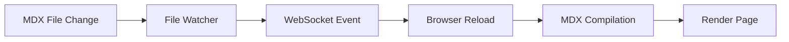
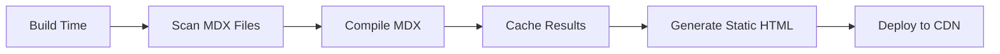
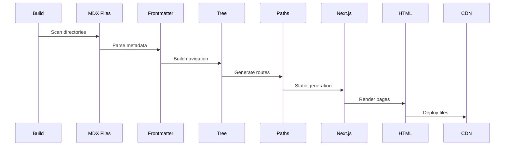

# APP.md

This file documents the end-to-end rendering pipeline and page building process for the Sentry documentation application, covering both development and production environments.

## Architecture Overview

The Sentry docs is a Next.js 15 application using the App Router with a sophisticated MDX-based content system. It serves both user-facing documentation and internal developer documentation through a single codebase with environment-based routing.

```mermaid
graph TD
    A[Request] --> B[Middleware]
    B --> C{Route Type}
    C -->|Static Asset| D[CDN/Public]
    C -->|API Route| E[API Handler]
    C -->|Doc Page| F[[[...path]]/page.tsx]
    F --> G[Document Tree]
    F --> H[MDX Processing]
    H --> I[React Server Components]
    I --> J[HTML Response]
```

## Request Flow

### 1. Middleware Layer (`src/middleware.ts`)

Every request (except static assets) passes through middleware:

```typescript
// Middleware handles:
- URL redirects (301/302)
- Platform-specific routing (:guide placeholders)
- Path normalization
- Development vs production redirect behavior
```

**Redirect Strategy:**
- **Production**: Permanent 301 redirects for SEO
- **Development**: Temporary 302 redirects to prevent caching issues

### 2. Dynamic Catch-All Route (`app/[[...path]]/page.tsx`)

The main route handler uses Next.js's catch-all pattern:

```typescript
// Route: /[[...path]]/page.tsx
- Handles all documentation paths
- Forces static generation: dynamic = 'force-static'
- Pre-generates paths via generateStaticParams()
- Disabled dynamic params: dynamicParams = false
```

**Path Resolution:**
1. Home page → No path segments
2. API docs → `/api/*` paths
3. Developer docs → When `NEXT_PUBLIC_DEVELOPER_DOCS=1`
4. Regular docs → All other paths

## Document Tree System

### Structure (`src/docTree.ts`)

The document tree creates a hierarchical navigation structure:

```typescript
type DocNode = {
  slug: string
  title: string
  children: DocNode[]
  frontmatter: FrontMatter
  missing?: boolean // Placeholder nodes
}
```

**Tree Building Process:**
1. Collect all MDX files from `docs/` or `develop-docs/`
2. Parse frontmatter for metadata and `sidebar_order`
3. Build hierarchical tree based on file paths
4. Create placeholder nodes for missing intermediates
5. Sort by: depth → sidebar_order → title

### Navigation Context

The tree enables:
- Sidebar generation with nested categories
- Breadcrumb navigation
- Previous/Next page links
- Platform-specific navigation paths

## MDX Processing Pipeline

### Development Mode



**Hot Reload System (`src/hotReloadWatcher.mjs`):**
- Watches `docs/`, `includes/`, `platform-includes/`
- WebSocket server on port 8080
- Throttled updates (1 second delay)
- Triggers page refresh on content changes

**Development Compilation:**
- On-demand MDX compilation
- No build-time caching
- Faster iteration but slower page loads
- Source maps enabled for debugging

### Production Mode



**Build-Time Processing:**
1. **Discovery**: Find all MDX files
2. **Compilation**: Process with mdx-bundler
3. **Caching**: Brotli-compressed cache files
4. **Optimization**: Minified HTML output
5. **Asset Processing**: Images, SVGs optimized

### MDX Compilation Steps

```typescript
// src/mdx.ts processing pipeline:
1. Gray Matter parsing (frontmatter extraction)
2. Variable substitution (@@variables@@)
3. Remark plugins (Markdown → MDAST)
4. Rehype plugins (MDAST → HAST → HTML)
5. Component bundling
6. Cache storage
```

**Remark Plugins (Markdown):**
- `remarkGfm` - Tables, strikethrough, task lists
- `remarkCodeTabs` - Tabbed code blocks
- `remarkCodeTitles` - Code block titles
- `remarkTocHeadings` - Table of contents extraction
- `remarkVariables` - Variable replacement
- `remarkComponentSpacing` - Component layout fixes

**Rehype Plugins (HTML):**
- `rehypeSlug` - Heading IDs for anchors
- `rehypeAutolinkHeadings` - Clickable heading links
- `rehypePrismPlus` - Syntax highlighting
- `rehypeOnboardingLines` - Line highlighting
- `rehypePresetMinify` - HTML optimization

## Component Rendering

### Server Components Architecture

```typescript
// Page Component Flow:
export default async function Page({ params }) {
  // 1. Resolve path from params
  const path = getPath(params)
  
  // 2. Get document node from tree
  const node = nodeForPath(rootNode, path)
  
  // 3. Load and compile MDX
  const mdxSource = await getMdxSource(node)
  
  // 4. Render with layout
  return (
    <DocPage>
      <MDXContent source={mdxSource} />
    </DocPage>
  )
}
```

### Layout Structure

```
┌─────────────────────────────────────┐
│            Header/Nav               │
├──────┬──────────────────┬──────────┤
│      │                  │          │
│ Side │   Main Content   │   TOC    │
│ bar  │     (MDX)        │ & SDK    │
│      │                  │ Details  │
└──────┴──────────────────┴──────────┘
```

**Components:**
- `DocPage` - Main layout wrapper
- `Sidebar` - Navigation tree
- `Prose` - Content typography
- `TableOfContents` - Page sections
- `PlatformSdkDetail` - SDK information
- `Pagination` - Prev/Next navigation

### MDX Component Mapping

Over 50 custom components are available in MDX:

```typescript
// src/mdxComponents.ts
{
  // Documentation
  Alert, Note, Expandable, 
  
  // Code
  CodeTabs, CodeSnippet, ConfigKey,
  
  // Platform
  PlatformContent, PlatformSection,
  PlatformSdkPackageName,
  
  // Interactive
  OnboardingOptionButtons,
  SignInNote, GitHubCTA
}
```

## Static Generation Process

### Build-Time Path Generation

```typescript
// generateStaticParams() creates all routes:
export async function generateStaticParams() {
  const docs = await getDocsFrontmatter()
  return docs.map(doc => ({
    path: doc.slug.split('/')
  }))
}
```

**Process:**
1. Scan all MDX files
2. Extract slugs from file paths
3. Generate route parameters
4. Next.js pre-renders each path
5. Output static HTML files

### Page Generation Flow



## Development vs Production

### Development Environment

**Characteristics:**
- Dynamic MDX compilation on each request
- WebSocket-based hot reload
- No pre-generation of pages
- Temporary redirects (302)
- Verbose logging and debugging
- Source maps enabled

**Commands:**
```bash
yarn dev              # User docs on http://localhost:3000
yarn dev:developer-docs  # Dev docs with env flag
```

**Performance:**
- Slower initial page loads (MDX compilation)
- Fast content updates (hot reload)
- No build step required
- Memory-intensive (no disk caching)

### Production Environment

**Characteristics:**
- Pre-compiled MDX at build time
- Static HTML generation
- Aggressive caching strategies
- Permanent redirects (301)
- Minified and optimized output
- Sentry error tracking enabled

**Build Process:**
```bash
yarn build  # Triggers:
├── MDX compilation
├── Static generation (8900+ pages)
├── Asset optimization
├── Source map generation
└── Markdown export creation
```

**Performance:**
- Instant page loads (pre-generated)
- CDN-cached static assets
- Optimized bundle sizes
- Low server resource usage

## Caching Strategies

### Multi-Layer Cache System

1. **MDX Compilation Cache**
   - Location: `.next/cache/mdx-bundler/`
   - Format: Brotli-compressed JSON
   - Key: MD5 hash of content + dependencies
   - Invalidation: Content change detection

2. **Document Tree Cache**
   - Type: In-memory during build
   - Scope: Process lifetime
   - Purpose: Avoid repeated file system reads

3. **Next.js Static Cache**
   - Location: `.next/static/`
   - Contents: Generated HTML pages
   - Served directly by CDN in production

4. **CloudFlare R2 Cache** (Markdown exports)
   - Remote cache for CI/CD
   - Persistent across deployments
   - MD5-based change detection

## Platform-Specific Rendering

### Platform Context

The app supports platform-specific content rendering:

```typescript
// Platform detection flow:
1. URL parsing (/platforms/javascript/guides/react/)
2. Context creation (platform: 'javascript', guide: 'react')
3. Content filtering (supported platforms)
4. Component rendering (PlatformContent)
```

### Conditional Content

```mdx
<PlatformContent includedPlatforms={['javascript', 'python']}>
  Platform-specific content here
</PlatformContent>
```

**Rendering Logic:**
- Build time: All platform content included
- Runtime: Context-based filtering
- SEO: All content in HTML, hidden via CSS

## Performance Optimizations

### Build Optimizations

1. **Parallel Processing**
   - File concurrency limit: 200
   - Worker threads for markdown export
   - Parallel MDX compilation

2. **Asset Optimization**
   - SVG inlining for small icons
   - Image optimization with Next.js Image
   - Font subsetting and preloading

3. **Bundle Splitting**
   - Route-based code splitting
   - Dynamic imports for heavy components
   - Shared chunks for common dependencies

### Runtime Optimizations

1. **React Server Components**
   - Zero client-side JavaScript for static content
   - Streaming HTML responses
   - Selective hydration for interactive parts

2. **Edge Caching**
   - Static pages cached at edge locations
   - Immutable asset caching (1 year)
   - Stale-while-revalidate for dynamic content

3. **Resource Hints**
   - DNS prefetch for external domains
   - Preconnect to API endpoints
   - Prefetch critical resources

## Monitoring and Analytics

### Build Monitoring
- Codecov bundle analysis
- Build time metrics in Vercel
- Source map upload confirmations

### Runtime Monitoring
- Sentry error tracking
- Vercel Analytics
- Core Web Vitals tracking
- Custom performance marks

## Troubleshooting

### Common Development Issues

1. **Hot reload not working**
   - Check WebSocket connection (port 8080)
   - Verify file watcher is running
   - Clear `.next` cache directory

2. **MDX compilation errors**
   - Check frontmatter YAML syntax
   - Verify component imports
   - Review remark/rehype plugin errors

3. **Platform content not showing**
   - Verify platform context
   - Check supported platforms list
   - Review content conditionals

### Common Production Issues

1. **Build timeouts**
   - Pages taking >60s are retried
   - Reduce compilation complexity
   - Check external API calls

2. **Cache invalidation**
   - Clear `.next/cache` directory
   - Bump version in package.json
   - Force rebuild in Vercel

3. **Missing pages**
   - Check generateStaticParams output
   - Verify frontmatter slug field
   - Review build logs for errors