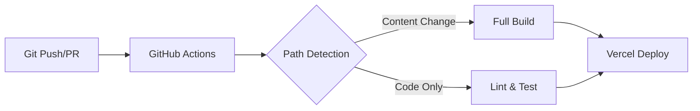

# BUILD.md

This file documents the build and deployment pipeline for the Sentry documentation repository, detailing what happens when changes are made and pushed.

## Overview

The Sentry docs build pipeline is a sophisticated multi-stage process that transforms MDX content into a static Next.js site, validates content quality, generates downloadable markdown files, and deploys to Vercel. The pipeline leverages GitHub Actions for CI/CD, Vercel for hosting, and CloudFlare R2 for build caching.

## Build Pipeline Stages

### 1. Git Push/PR Trigger

When code is pushed to master or a PR is opened:



### 2. GitHub Actions Workflows

#### Primary CI/CD (`.github/workflows/test.yml`)

**Lint Job:**
1. Sets up Node.js environment (version from package.json)
2. Restores cached dependencies and build artifacts
3. Runs TypeScript type checking (`yarn lint:ts`)
4. Executes ESLint and Prettier with auto-fix
5. For internal PRs: Auto-commits lint fixes via Sentry GitHub App
6. For forks: Fails if lint produces changes

**Test Job:**
- Runs Vitest unit tests (`yarn test`)
- Generates code coverage reports

#### Search Indexing (`.github/workflows/algolia-index.yml`)

Triggered on master branch pushes when documentation content changes:
1. Builds appropriate docs version (user or developer)
2. Runs TypeScript script to extract content
3. Uploads indexed content to Algolia for search

#### Link Validation (`.github/workflows/lint-404s.yml`)

Validates internal links on content changes:
1. Builds the static site
2. Starts local HTTP server (port 3000)
3. Crawls sitemap.xml and validates all internal links
4. Reports broken links as failures

### 3. Vercel Build Process

The Vercel build follows this sequence:

```
14:47:31 - Clone repository
14:48:56 - Run skip-build.sh (determine if build needed)
14:49:42 - yarn install (with dependency caching)
14:49:43 - yarn enforce-redirects (validate redirect configuration)
14:49:44 - next build (Next.js static generation)
14:58:52 - Upload source maps to Sentry (Node.js)
14:59:17 - Upload source maps to Sentry (Edge)
14:59:54 - Upload source maps to Sentry (Client)
15:06:14 - Generate static pages (8934 pages)
15:06:15 - yarn generate-md-exports (convert HTML to markdown)
15:14:53 - Deploy outputs
```

#### Skip Build Logic (`skip-build.sh`)

Intelligently determines whether to skip builds based on changed files:
- **Developer docs mode**: Only builds if `develop-docs/` changed
- **User docs mode**: Only builds if `docs/`, `includes/`, or `platform-includes/` changed
- **Always builds**: If infrastructure files changed (`src/`, `app/`, `scripts/`, etc.)

### 4. Registry Data Fetching

During build, external data is fetched from Sentry's release registry:

```typescript
// src/build/fetchCache.ts
- Retry logic: Up to 5 attempts with exponential backoff
- Single-fetch caching: Subsequent calls return cached data
- Network resilience: Handles CI environment connection issues
```

**Registry Types:**
- **Package Registry** (`https://release-registry.services.sentry.io/sdks`): SDK versions, checksums, docs URLs
- **App Registry** (`https://release-registry.services.sentry.io/apps`): Integration metadata
- **AWS Lambda Layers** (`https://release-registry.services.sentry.io/aws-lambda-layers`): Regional layer ARNs

### 5. Next.js Static Generation

The Next.js build process (`next build`):

1. **Redirect Validation**: Ensures redirects are in `redirects.js` or middleware, not `vercel.json`
2. **MDX Processing**: Transforms MDX files with custom components
3. **Platform-Specific Content**: Resolves platform includes dynamically
4. **Static Page Generation**: Renders 8934+ pages at build time
5. **Bundle Optimization**: Code splitting and tree shaking
6. **Telemetry & Monitoring**: Codecov bundle analysis, Sentry integration

**Performance Optimizations:**
- Pages timing out after 60 seconds are retried (up to 3 attempts)
- Webpack caching for faster rebuilds
- Parallel page generation with worker threads

### 6. Markdown Export Generation

The `generate-md-exports.mjs` script converts built HTML to downloadable markdown:

```javascript
// Process flow:
1. Discover HTML files in .next/server/app
2. Split workload across worker threads (2 workers)
3. For each file:
   - Strip JavaScript for stability
   - Convert HTML to markdown via rehype/remark
   - Fix internal links and add canonical URLs
   - Process images and clean empty elements
4. Cache results locally (Brotli compression)
5. Sync changed files to CloudFlare R2 (based on MD5 hashes)
```

**Caching Strategy:**
- **Local cache**: `.next/cache/md-exports/` (Brotli compressed)
- **Cloud cache**: CloudFlare R2 for cross-deployment persistence
- **Cache invalidation**: Based on content MD5 hashes

### 7. Source Map Management

Sentry source maps are uploaded in three phases:
1. **Node.js maps**: Server-side rendering code
2. **Edge maps**: Edge runtime/middleware code  
3. **Client maps**: Browser JavaScript bundles

Each upload includes debug IDs for precise error tracking.

### 8. Deployment & CDN

**Vercel Deployment:**
- Static files uploaded to Vercel's CDN
- Edge functions deployed globally
- Automatic SSL and domain management

**Security Headers (from `vercel.json`):**
```json
{
  "Content-Security-Policy": "...",
  "X-Frame-Options": "DENY",
  "X-Content-Type-Options": "nosniff",
  "Strict-Transport-Security": "max-age=63072000"
}
```

### 9. Post-Deployment

**Master Branch Only:**
- Algolia search index updated with new content
- Preview deployments cleaned up (older than 30 days)
- Release notes prepared if version tags present

## Build Artifacts

### Generated Files
- `.next/` - Next.js build output
- `public/md-exports/` - Downloadable markdown files
- `.next/cache/` - Build caches (webpack, md-exports)

### External Dependencies
- Sentry Release Registry (SDK versions)
- CloudFlare R2 (markdown export cache)
- Algolia (search index)
- Vercel (hosting and CDN)

## Performance Metrics

### Typical Build Times (26-minute build)
From Vercel logs:
- **Total build time**: ~26 minutes
- **Dependencies install**: 45 seconds
- **Next.js build**: ~10 minutes
- **Static generation**: ~6 minutes (8934 pages)
- **Markdown export**: ~8 minutes
- **Deployment**: ~2.5 minutes

### Optimized Build Times (20-minute build)
When cache is fully utilized:
- **Total build time**: ~15 minutes
- **Dependencies install**: 0.5 seconds (cached)
- **Next.js build**: ~7 minutes
- **Static generation**: ~5 minutes (8899 pages)
- **Markdown export**: 30 seconds (R2 cache hit)
- **Deployment**: ~2 minutes
- **Build cache creation**: 22 minutes (async)
- **Build cache upload**: 870MB in 12 seconds

### Key Performance Factors

**1. Build Cache Impact**
- Without cache: Full installation and compilation
- With cache: Restored from previous deployment (saves ~10 minutes)
- Cache size: ~870MB containing dependencies and build artifacts

**2. Markdown Export Optimization**
- Without R2 cache: Processes all 8900+ files
- With R2 cache: Only processes changed files (24 files vs 8900)
- R2 lookup: Retrieves MD5 hashes for 9024 existing files

**3. Page Generation Timeouts**
Both builds experienced timeouts for similar pages:
- Java platform enriching-events pages
- Unity platform pages
- JavaScript Hono integration pages
These pages consistently take >60 seconds and require retries

**4. Registry Fetching**
Registry data is fetched and cached immediately:
- First fetch happens early in static generation
- Subsequent calls use in-memory cache
- No performance difference between builds

## Troubleshooting Build Issues

### Common Issues

1. **Page generation timeout**: Pages taking >60 seconds are automatically retried
2. **Registry fetch failures**: Automatic retry with exponential backoff
3. **Cache miss warnings**: Normal during major updates (>10% cache miss)
4. **Webpack serialization warnings**: Large strings impact performance

### Build Commands

```bash
# Local development
yarn dev                    # User docs development
yarn dev:developer-docs     # Developer docs development

# Build commands
yarn build                  # Full production build
yarn lint                   # Run all linting
yarn test                   # Run unit tests

# Validation
yarn enforce-redirects      # Check redirect configuration
yarn lint:404s             # Validate internal links
```

## Environment Variables

Key environment variables affecting builds:
- `NEXT_PUBLIC_DEVELOPER_DOCS`: Toggle developer docs mode
- `SENTRY_DSN`: Error monitoring configuration
- `VERCEL_ENV`: Deployment environment (production/preview)
- `CI`: Indicates CI environment for optimizations

## Monitoring & Observability

The build pipeline includes comprehensive monitoring:
- **Sentry**: JavaScript errors and performance monitoring
- **Codecov**: Bundle size analysis and code coverage
- **Vercel Analytics**: Build performance metrics
- **GitHub Actions**: Workflow run logs and artifacts