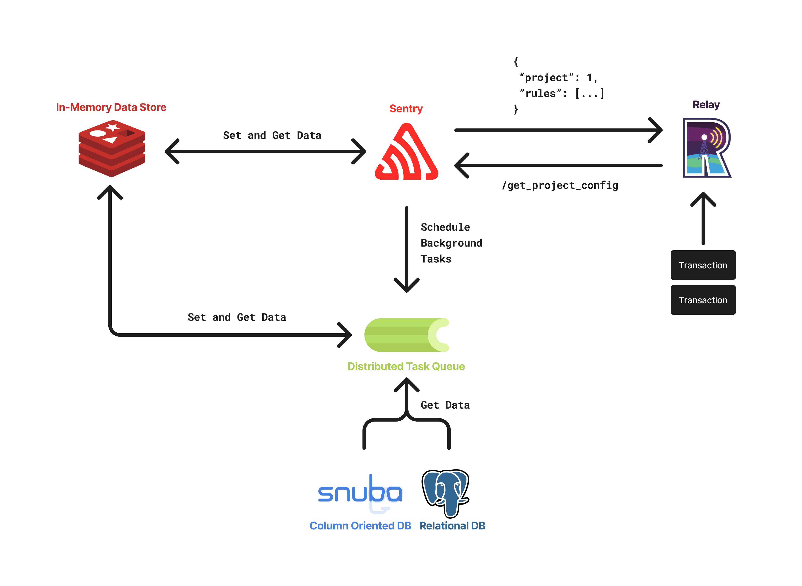
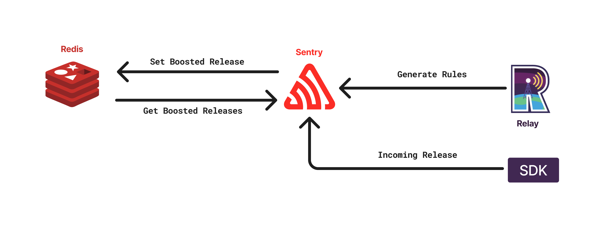
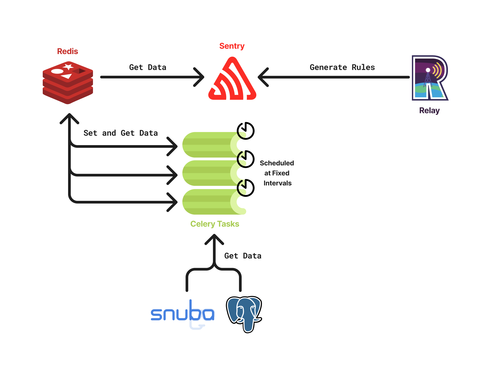

The architecture that powers Dynamic Sampling is composed of several components that work together to get the organization's sample rate closer to the target fidelity.

The two main components of the architecture are [Sentry](https://github.com/getsentry/sentry) and [Relay](https://github.com/getsentry/relay), but there are several other sub-components that are used to achieve the desired result, such as Redis, Celery, PostgreSQL, and Snuba.



## Sampling in Relay

Relay is the first component involved in the Dynamic Sampling pipeline. It is responsible for receiving events from SDKs, sampling them, and forwarding them to the Sentry backend. _In reality, Relay does much more than that. If you want to learn more about it, you can look at Relay docs [here](https://docs.sentry.io/product/relay/)._

In order for Relay to perform sampling, it needs to be able to **compute the sample rate** for each incoming event. The configuration of sampling can be done via a **rule-based system** that enables the definition of complex sampling behaviors by combining simple rules. These rules are embedded into the **project configuration**, which is computed and cached in Sentry. This configuration contains a series of fields that Relay uses to perform many of its tasks, including sampling.

### Trace and Transaction Sampling

Sentry supports **two fundamentally different types of sampling**, that are described in more detail [here](/dynamic-sampling/fidelity-and-biases/#trace-and-transaction-sampling).

### Sampling Configuration

Inside the project configuration there is a field dedicated to sampling, named `dynamicSampling`. This field contains a list of **sampling rules** that are used to calculate the sample rate for each incoming event. The rules will be defined in the `rulesV2` field, inside the `dynamicSampling` object.

#### The Rule Definition

A **rule** is the core component of the sampling configuration and is defined as [SamplingRule](https://getsentry.github.io/relay/relay_sampling/config/struct.SamplingRule.html) in Relay.

An example of rule encoded in JSON is the following:

```json
{
  "id": 1000,
  "type": "trace",
  "samplingValue": {
    "type": "sampleRate",
    "value": 0.5
  },
  "condition": {
    "inner": [],
    "op": "and"
  },
  "timeRange": {
    "start": "2022-10-21 18:50:25+00:00",
    "end": "2022-10-21 19:50:25+00:00"
  },
  "decayingFn": {
    "type": "linear",
    "decayedValue": 0.2
  }
}
```

#### Fetching the Sampling Configuration

The sampling configuration is fetched by Relay from Sentry in a pull fashion. This is done by sending a request to the `/api/0/relays/projectconfigs/` endpoint periodically (defined [here](https://github.com/getsentry/sentry/blob/master/src/sentry/api/endpoints/relay/project_configs.py#L34-L34)).

On the Sentry side, the configuration will be computed in case of a cache miss and then cached in Redis. The cache is invalidated every time the configuration changes, but more details on that will be provided later.

### Sampling Decision

A sampling decision involves:

1. Matching the incoming event and/or DSC against the configuration.
2. Deriving a sample rate from the combination of `factor` and `sampleRate` rules.
3. Making the sampling decision using a random number generator.

In case no match is found, or if there are problems during matching, Relay will accept the event under the assumption that it's preferable to oversample rather than drop potentially important events.

Relay samples using two [SamplingConfig](https://getsentry.github.io/relay/relay_sampling/config/struct.SamplingConfig.html) instances: the **non-root sampling configuration** and the **root sampling configuration**. The non-root config belongs to the project of the incoming event, while the root config belongs to the project of the head transaction of the trace. If no root sampling configuration is available, only transaction sampling will be performed.

With both configurations ready, Relay will attempt to match the transaction rules of the non-root config and then the trace rules of the root config. If both root and non-root configs are the same, Relay will perform the matching in the same manner.

The payloads inspected for matching vary based on the type of rule being matched:
- `transaction`: a transaction rule will match against the [Event](https://getsentry.github.io/relay/relay_event_schema/protocol/struct.Event.html) payload itself.
- `trace`: a trace rule will match against the [Dynamic Sampling Context](https://getsentry.github.io/relay/relay_sampling/dsc/struct.DynamicSamplingContext.html), which remains consistent across all transactions of the trace.

The matching that Relay performs is based on the `samplingValue` of the encountered rules. As specified earlier, depending on the type of `samplingValue`, Relay will either immediately return a result or continue matching other rules. More details about the matching algorithm can be found in the implementation [here](https://getsentry.github.io/relay/relay_sampling/evaluation/struct.SamplingEvaluator.html#method.match_rules).

#### Example of Sampling Decision

Suppose Relay receives an incoming transaction with the following data:

```json
{
  "dsc": {
    # This is the transaction of the head of the trace.
    "transaction": "/hello"
  },
  # This is the transaction of the incoming event.
  "transaction": "/world",
  "environment": "prod",
  "release": "1.0.0"
}
```

And suppose this is the merged configuration from the non-root and root project:

```json
{
  "rules": [
    {
      "id": 1,
      "type": "transaction",
      "samplingValue": {
        "type": "factor",
        "value": 2.0
      },
      "condition": {
        # Not the actual syntax, just a simplified example.
        "trace.transaction": "/world"
      }
    },
    {
      "id": 2,
      "type": "trace",
      "samplingValue": {
        "type": "sampleRate",
        "value": 0.5
      },
      "condition": {
        # Not the actual syntax, just a simplified example.
        "trace.transaction": "/hello"
      }
    }
  ]
}
```

In this case, the matching will happen from **top to bottom** and the following will occur:

1. Rule `1` is matched against the event payload, since it is of type `transaction`. The `samplingValue` is a `factor`, thus the accumulated factors will now be `2.0 * 1.0`, where `1.0` is the identity for the multiplication.
2. Because rule `1` was a factor rule, the matching continues and rule `2` will be matched against the DSC, since it is of type `trace`. The `samplingValue` is a `sampleRate`, thus the matching will stop and the sample rate will be computed as `2.0 * 0.5 = 1.0`, where `2.0` is the factor accumulated from the previous rule and `0.5` is the sample rate of the current rule.

<Alert title="✨ Note">

It is important to note that a `sampleRate` rule must match in order for a sampling decision to be made; in case this condition is not met, the event will be kept. In practice, each project will have a uniform trace rule which will always match and contain the base sample rate of the organization.

</Alert>

## Rules Generation in Sentry

Sentry is the second component involved in the Dynamic Sampling pipeline. It is responsible for generating the rules used by Relay to perform sampling.

Generating rules is the most complicated step of the pipeline, since rules and their sampling values directly impact how far off the system is from the target fidelity rate.

### Generation of the Rules

The generation of rules is performed as part of the **project configuration recomputation**, which happens:

1. Whenever Relay requests the configuration and it is not cached in Redis;
2. Whenever the configuration is manually invalidated.

The invalidation of the configuration can happen under **several circumstances**, by calling the [following function](https://github.com/getsentry/sentry/blob/master/src/sentry/tasks/relay.py#L244-L244). Some examples of cases when the recomputation happens are when a new release is detected, when some project settings change, or when the Celery tasks for computing the variable sample rates are finished executing.

The generation of the rules that will be part of the project configuration recalculation is defined [here](https://github.com/getsentry/sentry/blob/master/src/sentry/dynamic_sampling/rules/base.py#L72-L72) and works by performing the following steps:

1. Fetching the list of active biases, since some of them can be enabled or disabled by the user in the Sentry UI;
2. Determining the base sample rate specific for each project.
3. Computing the rules for each bias by using all the information available at the time (e.g., in memory, fetched from Redis);
4. Packing the rules into the `dynamicSampling.rulesV2` field of the project configuration;
5. Returning all the set of rules that will be stored in the project configuration.

#### Redis for Shared State

Certain biases require data that **must be computed from other parts of the system** (e.g., when a new release is created) or by background tasks that are run asynchronously.

For such use cases, we decided to use a separate Redis instance, which is used to store many kinds of information, such as sample rates and boosted releases. During rule generation, we connect to this Redis instance and fetch the necessary data to compute the rules.

An illustration on how Redis is used for tracking boosted releases (which are used by the [boost new releases bias](/dynamic-sampling/fidelity-and-biases/#boost-new-releases)):



#### Celery Tasks for Asynchronous Processing

Certain biases require data that **must be computed asynchronously by background tasks** due to the complexity of the computation (e.g., running cross-org queries on Snuba). This is the case for the [boost low-volume projects bias](/dynamic-sampling/fidelity-and-biases/#boost-low-volume-projects) and [boost low-volume transactions bias](/dynamic-sampling/fidelity-and-biases/#boost-low-volume-transactions), which need expensive queries to obtain all the necessary data to run the rebalancing algorithms. These tasks are handled by Celery workers, that are scheduled automatically by cron jobs configured in Sentry.

_The data computed by these tasks could theoretically be computed sequentially during rules generation but for scalability reasons we opted to use Celery tasks instead. This way, the computation of the data can be parallelized and the rules generation can be performed faster._

An illustration on how multiple Celery tasks are scheduled for computing data required for rule generation:


