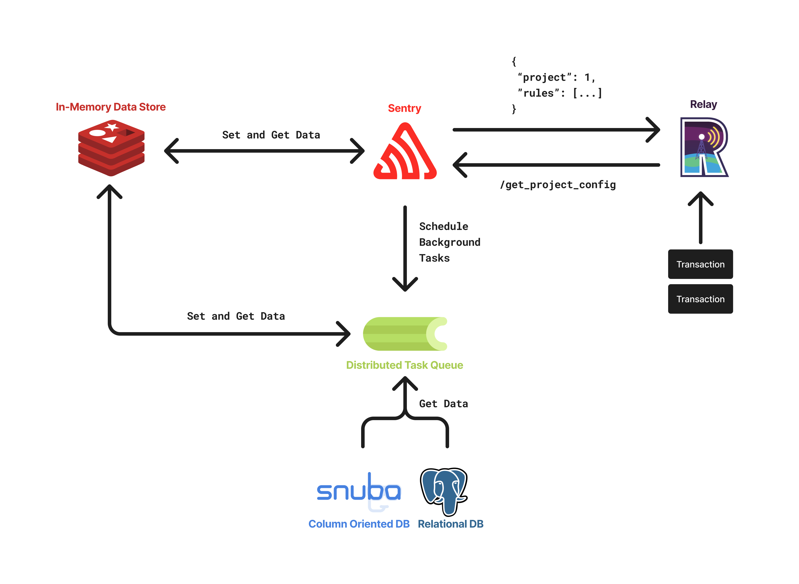

The architecture that powers Dynamic Sampling is composed of several components that work together to achieve the organization's target sample rate. The two main components of the architecture are [Sentry](https://github.com/getsentry/sentry) and [Relay](https://github.com/getsentry/relay).



## Sampling in Relay

Relay is responsible for receiving events from SDKs, sampling them, and forwarding them to the Sentry ingestion pipeline. In order for Relay to perform sampling, it needs to be able to **compute the sample rate** for each incoming event. Sample rates are calulcated using a **rule-based system** that enables the definition of complex sampling behaviors by combining simple rules. These rules are embedded into the **project configuration**, which is computed and cached in Sentry, and fetched by Relay when needed.

### Sampling Configuration

The project configuration has a `dynamicSampling` field for sampling, which holds a list of **sampling rules** used to calculate the sample rate for each incoming event. These rules are defined in the `rulesV2` field within the `dynamicSampling` object.

#### The Rule Definition

A **rule** is the core component of the sampling configuration and is defined as [SamplingRule](https://getsentry.github.io/relay/relay_sampling/config/struct.SamplingRule.html) in Relay.

An example of rule encoded in JSON is the following:

```json
{
  "id": 1000,
  "type": "trace",
  "samplingValue": {
    "type": "sampleRate",
    "value": 0.5
  },
  "condition": {
    "inner": [],
    "op": "and"
  },
  "timeRange": {
    "start": "2022-10-21 18:50:25+00:00",
    "end": "2022-10-21 19:50:25+00:00"
  },
  "decayingFn": {
    "type": "linear",
    "decayedValue": 0.2
  }
}
```

<Alert title="✨ Note">
Dynamic sampling rules must always include a `condition` field, otherwise the entire dynamic sampling ruleset will be ignored by Relay. If you want a rule to match every event, set the condition as follows:
```json
{
  "condition": {
    "inner": [],
    "op": "and"
  }
}
```
</Alert>

#### Fetching the Sampling Configuration

The sampling configuration is fetched by Relay from Sentry by sending a request to the `/api/0/relays/projectconfigs/` endpoint periodically (defined [here](https://github.com/getsentry/sentry/blob/master/src/sentry/api/endpoints/relay/project_configs.py#L32-L32)). When this endpoint is called, the Sentry backend will attempt to retrieve the configuration from the cache, and if the configuration is not found, it will be computed and then cached in Redis.

### Sampling Decision

In order to arrive at a sampling decision, Relay matches the incoming event and/or DSC against the configuration, derives a sample rate from the combination of `factor` and `sampleRate` rules, and uses a random number generator to make the decision. In case there are problems during the matching process, Relay will accept the event under the assumption that it's preferable to oversample rather than drop potentially important events.

In order to make the sampling decisions, Relay samples using a [SamplingConfig](https://getsentry.github.io/relay/relay_sampling/config/struct.SamplingConfig.html) that belongs to the project of the head transaction of the trace.
The payloads inspected for matching vary based on the type of rule being matched
- `trace`: a trace rule will match against the [Dynamic Sampling Context](https://getsentry.github.io/relay/relay_sampling/dsc/struct.DynamicSamplingContext.html), which remains consistent across all transactions of the trace.
- `project`: a project rule will also match against the [Dynamic Sampling Context](https://getsentry.github.io/relay/relay_sampling/dsc/struct.DynamicSamplingContext.html)

The matching that Relay performs is based on the `samplingValue` of the encountered rules. As specified earlier, depending on the type of `samplingValue`, Relay will either immediately return a result or continue matching other rules. More details about the matching algorithm can be found in the implementation [here](https://getsentry.github.io/relay/relay_sampling/evaluation/struct.SamplingEvaluator.html#method.match_rules).

#### Example of Sampling Decision

Suppose Relay receives an incoming transaction with the following data:

```json
{
  "dsc": {
    # This is the transaction of the head of the trace.
    "transaction": "/hello"
  },
  # This is the transaction of the incoming event.
  "transaction": "/world",
  "environment": "prod",
  "release": "1.0.0"
}
```

And suppose this is the configuration:

```json
{
  "rules": [
    {
      "id": 1,
      "type": "trace",
      "samplingValue": {
        "type": "factor",
        "value": 2.0
      },
      "condition": {
        # Not the actual syntax, just a simplified example.
        "trace.transaction": "/world"
      }
    },
    {
      "id": 2,
      "type": "trace",
      "samplingValue": {
        "type": "sampleRate",
        "value": 0.5
      },
      "condition": {
        # Not the actual syntax, just a simplified example.
        "trace.transaction": "/hello"
      }
    }
  ]
}
```

In this case, the matching will happen from **top to bottom** and the following will occur:

1. Rule `1` is matched against the DSC, since it is of type `trace`. The `samplingValue` is a `factor` with value `2.0`.
2. Because rule `1` was a factor rule, the matching continues and rule `2` will again be matched against the DSC, since it is of type `trace`. The `samplingValue` is a `sampleRate`, thus the matching will stop and the sample rate will be computed as `2.0 * 0.5 = 1.0`, where `2.0` is the factor accumulated from the previous rule and `0.5` is the sample rate of the current rule.

### Interpreting the Dynamic Sampling Context

Before sampling, Relay validates the incoming DSC and, in some cases, reconstructs it. Relay differentiates between the following cases:

1. **DSC originating from a project within the same organization**

    - **Transactions and spans**: The DSC is treated as valid and the sampling rules from the root project are applied as described in the previous section.

2. **Missing DSC**

    - **Transactions**: The DSC is reconstructed using event fields like `release`, `environment`, and `transaction`, and scoped to the transaction's project. If reconstruction fails, for example, due to the public key being missing, the DSC is removed and the item is guaranteed to be sampled.

    - **Spans**: The spans are rejected - unless they are from the OTel integration, in which case a missing DSC is allowed and the sample rate is 100%.

3. **DSC originating from an unknown project or another organization**

    - **Transactions**: The DSC is treated as missing (see point 2 above).

    - **Spans**: The DSC is reconstructed, but minimally so; it only contains public key and trace id. Span attributes like `release`, `environment`, and `segment.name` are not used because there is no guarantee that an envelope's spans all share the same value for these attributes. The reconstructed DSC is scoped to the spans' project.


## Rules Generation in Sentry

Sentry is responsible for generating the rules used by Relay to perform sampling.

### Generation of the Rules

The generation of rules is performed as part of the **project configuration recomputation**, which happens:

1. When Relay requests the configuration and it is not cached in Redis.
2. When the configuration is invalidated on demand by calling [this function](https://github.com/getsentry/sentry/blob/master/src/sentry/tasks/relay.py#L244-L244). This happens when a new release is detected, when certain project settings change, the dynamic sampling tasks for computing sample rates are finished executing, and more.

The rules are generated [here](https://github.com/getsentry/sentry/blob/master/src/sentry/dynamic_sampling/rules/base.py#L126-L143) by performing the following steps:

1. Fetch the list of active biases (since some of them can be enabled or disabled by the user in the Sentry UI)
2. Determine the base sample rate for each project.
3. Compute the rules for each bias.

Data underlying the rules is computed asynchronously for scalability reasons. Multiple biases require data that must be computed from incoming volume data for the org in question. These biases are calculated asynchronously by background tasks that are executed by Celery and write results to Redis.
