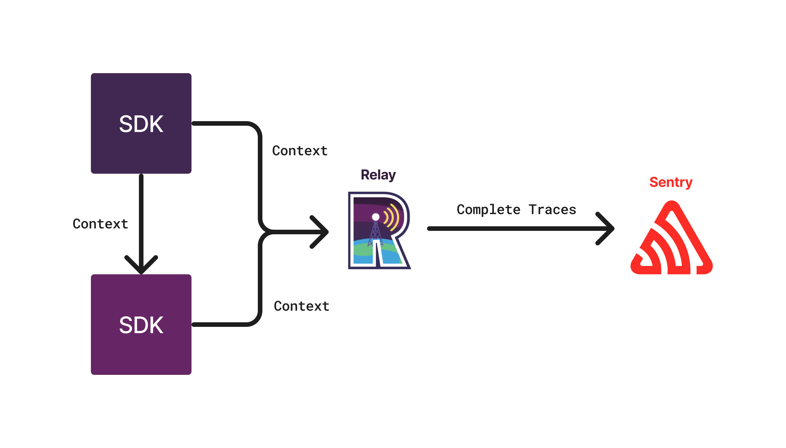
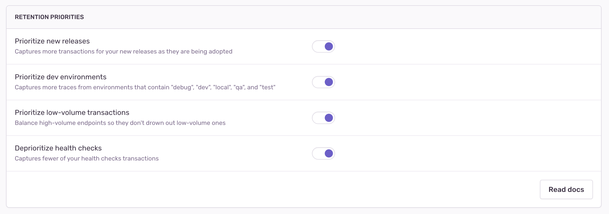
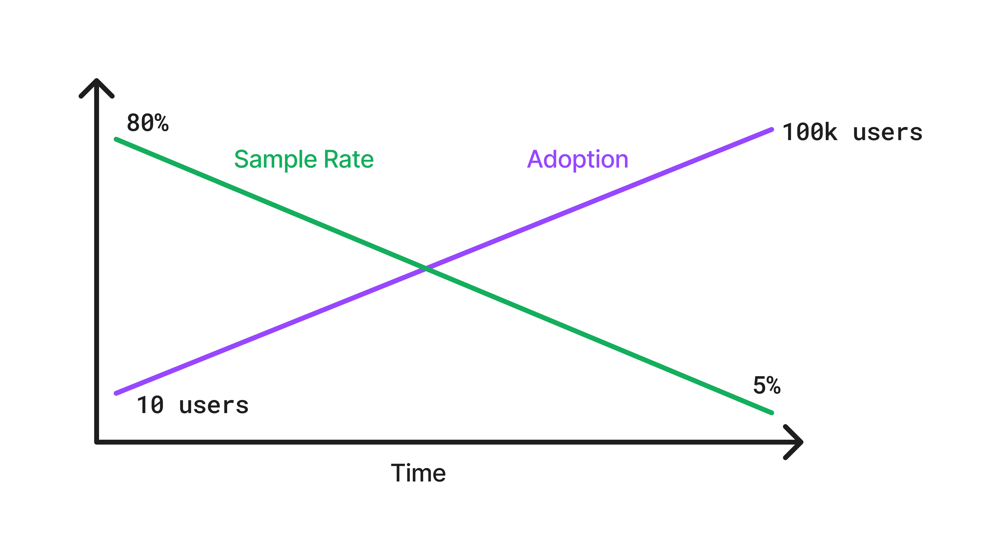

Dynamic Sampling allows Sentry to automatically adjust the amount of data retained based on how valuable the data is to the user. This is technically achieved by applying a **sample rate** to every event, which is determined by a **set of rules** that are evaluated for each event.

### Target Sample Rate
Dynamic Sampling defines a target sample rate for each project that specifies the amount of data to retain. This target sample rate is a number between 0 and 1 and is used to calculate the sample rate for each event, based on the project and transaction that the trace started from rather than the project and transaction of the event itself. This is because traces should be sampled or discarded in their entirety, not partially sampled. To keep that consistent, sampling decisions can only use information available at the start of the trace.


### Dynamic Sampling Modes
There are two available modes to govern the target sample rates for Dynamic Sampling. The definition of both the mode and the target sample rates are implemented using the organization options `sentry:sampling_mode` and `sentry:target_sample_rate` as well as the project option `sentry:target_sample_rate`.

- **Automatic Mode** dynamically manages the target sample rate for each project based on the target sample rate for the organization, prioritizing lower volume projects to increase visibility. Automatic Mode is active if the organization option `sentry:sampling_mode` is set to `organization`. The target sample rate for the organization is stored in the **organization** option `sentry:target_sample_rate`, and project target sample rates are calculated based on the organization target sample rate.
- **Manual Mode** allows the user to set static target sample rates on a per-project basis that serve as the baseline sample rate before applying the dynamic biases outlined below. Target sample rates are not adjusted by the system. Manual Mode is active if the organization option `sentry:sampling_mode` is set to `project`. The target sample rates for projects are stored in the **project** option `sentry:target_sample_rate`.

All functionality defaults to Automatic Mode if the option `sentry:sampling_mode` is not set, and all target sample rates default to 1 if the option `sentry:target_sample_rate` is not set.

When the user switches between modes, target sample rates are transferred unless changed explicitly. For example, if the user switches from Automatic Mode to Manual Mode, the sample rates calculated during Automatic Mode are persisted in the project option `sentry:target_sample_rate`. Conversely, if the user switches from Manual Mode to Automatic Mode, the project target sample rates are recalculated based on the overall organization target sample rate.

The [sample rates are periodically recalibrated](https://github.com/getsentry/sentry/blob/9b98be6b97323a78809a829e06dcbef26a16365c/src/sentry/dynamic_sampling/rules/biases/recalibration_bias.py#L11-L44) to ensure that the overall target sample rate is met. This recalibration is done on a project level or organization level, depending on the dynamic sampling mode. Within the target sample rate, Dynamic Sampling **biases towards more meaningful data**. This is achieved by constantly updating and communicating special rules to Relay, via a project configuration, which then applies targeted sampling to every event.

<Alert title="✨ Note">
For orgs under AM2, Dynamic sampling uses a [sliding window function](https://github.com/getsentry/sentry/blob/cc8cc38c8a108719d068e5622b24a8d0c744e84c/src/sentry/dynamic_sampling/tasks/sliding_window_org.py#L37-L61) over the incoming volume to calculate the target sample rate.
</Alert>

The purpose of dynamic sampling is to achieve the target sample rate across all projects and transactions, while weighting the data based on the value of the data. These weights are applied on top of the base sample rate for each project.

### How traces are sampled

A trace is a **collection of events that are related to each other**. For example, a trace could contain events started from your frontend that are then generating events in your backend.

Trace sampling ensures that **either all events of a trace are sampled, or none**. That is, these rules **always yield the same sampling decision** for every event in the same trace. This requires the cooperation of SDKs and thus allows sampling only by `project`, `release`, `environment`, and `transaction` name.

To achieve trace sampling, SDKs pass all fields that can be sampled by [Dynamic Sampling Context (DSC)](/sdk/foundations/trace-propagation/dynamic-sampling-context/) (defined [here](https://getsentry.github.io/relay/relay_sampling/dsc/struct.DynamicSamplingContext.html)) as they propagate traces. _This ensures that every event from the same trace comes with the same DSC._



<Alert title="✨ Note">

In order to achieve full trace sampling, the random number generator used by Relay is seeded with the trace ID inside of the DSC sent by the SDK. This ensures that traces with the same trace ID will always yield the same sampling decision.

</Alert>

## Biases for Sampling

Dynamic Sampling uses biases to adjust how many events matching certain conditions are sampled. These biases are defined as a set of rules that Relay checks for each event. Learn more about these rules [on the architecture page](/application-architecture/dynamic-sampling/architecture/).

Sentry defines a set of biases that are available to all customers. Some of the biases defined by Sentry can be enabled or disabled in the UI under **Project Settings -> Performance**, while others are enabled by default and cannot be disabled. See this example of the UI (the content of this screenshot is subject to change):




### Prioritize New Releases

This bias is used to prioritize traces that come from a new release. The goal is to increase the sample rate in the time window between the creation of a release and its adoption by users. _New releases are identified in the `event_manager` defined [here](https://github.com/getsentry/sentry/blob/43d7c41aee2b22ca9f51916afac40f6cbdcd2b15/src/sentry/event_manager.py#L739-L773)._

Because release adoption varies over time, a system of _decaying_ rules interpolates between two sample rates within a specified time window and using a specified interpolation function (e.g. `linear`). The sample rate is gradually lowered as user adoption increases and the volume of samples grows.



The latest release bias uses a decaying rule to interpolate between a starting and ending sample rate over a time window that is statically defined for each platform. The list of adoption times is defined [here](https://github.com/getsentry/sentry/blob/9b98be6b97323a78809a829e06dcbef26a16365c/src/sentry/dynamic_sampling/rules/helpers/time_to_adoptions.py#L25). For example, Android has a longer time window than JavaScript because Android apps generally take more time to be adopted by users.

### Prioritize Dev Environments

This bias increases the sampling rate for traces from development environments, since this data is often more valuable for debugging. Sentry identifies development environments using a regularly maintained and updated list of known environment patterns. For these environments, the sample rate is set to 100%, so all traces are sampled.


```python
ENVIRONMENT_GLOBS = [
    "*debug*",
    "*dev*",
    "*local*",
    "*qa*",
    "*test*",
    # ...
]
```

The list of development environments is available [here](https://github.com/getsentry/sentry/blob/4cb0d863de1ef8e3440153cb440eaca8025dee0d/src/sentry/dynamic_sampling/rules/biases/boost_environments_bias.py#L7).


### Prioritize Low Volume Projects
<Alert title="✨ Note">
This bias is only active in Automatic Mode (and not in Manual Mode). It applies to any incoming trace and is defined on a per-project basis.
</Alert>

This bias uses an algorithm to increase the sample rate for low-volume projects, which might otherwise be overshadowed by high-volume projects. It calculates a new sample rate for each project based on the organization’s overall sample rate and the number of transactions each project receives, aiming for a more balanced distribution. The algorithm dynamically adjusts these rates by measuring _the volume of incoming transactions over a sliding time window_. At regular intervals, the system calls the `get_sampling_tier_for_volume` function (defined [here](https://github.com/getsentry/sentry/blob/f3a2220ccd3a2118a1255a4c96a9ec2010dab0d8/src/sentry/quotas/base.py#L481)) to determine the appropriate sample rate for each project.


### Prioritize Low Volume Transactions
Different transactions have different volumes, and this bias is used to prioritize low-volume transactions that can be drowned out by high-volume transactions. The goal is to rebalance sample rates of the individual transactions so that low-volume transactions are more likely to have representative samples. The transaction considered for rebalancing will be the root transaction of the trace.

Prioritization of low volume transactions works slightly differently depending on the dynamic sampling mode:
- In **Automatic Mode** (`sentry:sampling_mode` == `organization`), the output of the [boost_low_volume_projects](https://github.com/getsentry/sentry/blob/dee539472e999bf590cfc4e99b9b12981963defb/src/sentry/dynamic_sampling/tasks/boost_low_volume_transactions.py#L183) task is used as the base sample rate for the balancing algorithm.
- In **Manual Mode** (`sentry:sampling_mode` == `project`), the project target sample rate is used as the base sample rate for the balancing algorithm.

In order to rebalance transactions, the system retrieves the counts of the transactions for each project and calculates a new sample rate for each transaction.

<Alert title="✨ Note">

The algorithms for boosting low volume events are run periodically (with cron jobs) with a sliding window to account for changes in the incoming volume.

</Alert>

### Deprioritize Health Checks

This bias reduces the sampling rate for transactions identified as health checks, since these transactions typically provide little value for debugging. Sentry maintains and regularly updates a list of known health check endpoints to identify such transactions and deprioritize them accordingly.

```python
HEALTH_CHECK_GLOBS = [
    "*healthcheck*",
    "*healthy*",
    "*live*",
    "*ready*",
    "*heartbeat*",
    "*/health",
    "*/healthz",
    # ...
]
```

The list of health check endpoints is available [here](https://github.com/getsentry/sentry/blob/4cb0d863de1ef8e3440153cb440eaca8025dee0d/src/sentry/dynamic_sampling/rules/biases/ignore_health_checks_bias.py#L14).

For deprioritizing health checks, we compute a new sample rate by dividing the base sample rate of the project by a factor, which is defined [here](https://github.com/getsentry/sentry/blob/master/src/sentry/dynamic_sampling/rules/utils.py#L13-L13).


If you want to learn more about the architecture behind Dynamic Sampling, continue to the [next page](/application-architecture/dynamic-sampling/architecture/).

