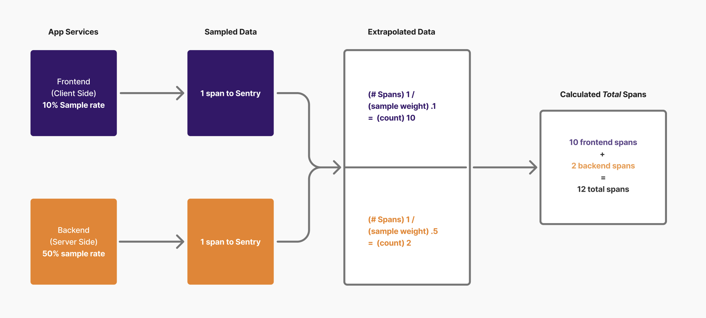

Client and server-side sampling reduces the amount of data ingested, to help with both performance and cost. When configured, a fraction of the data is ingested according to the specified sample rates within a project. For example, if you sample 10% of 1000 requests to your site in a given timeframe, you will see 100 spans in Sentry. 

Without accounting for the lower request volume due to the sample rate, any metrics derived from these spans will misrepresent the true volume of the application. Perhaps more importantly, when different parts of your application have different sample rates, attention may be skewed with a bias towards parts with higher sample rates. This bias especially impacts numerical attributes like latency, reducing their accuracy. To account for this, Sentry uses extrapolation to a) derive a "true" volume of each part of your application and b) combine the extrapolated data from different parts of the application to provide a more wholistic view of the application's performance.

### Benefits of Extrapolation
For high-volume organizations, sampling is a way to control costs and reduce volume, as well as reduce the amount of redundant data sent to Sentry. Extrapolation is a way to account for the lower request volume due to the sample rate, and to provide a more wholistic view of the application's performance. Here are some of the benefits of extrapolation:

- **The numbers correspond to the real world**: When data is sampled, there is some math you need to do to infer what the real numbers are, e.g., when you have 1000 samples at 10% sample rate, there are 10000 requests to your application. With extrapolation, you don't have to know your sample rate to understand what your application is actually doing. Instead, while viewing charts, you see the real behavior without additional knowledge or math required on your end.

- **Steady timeseries when sample rates change**: Whenever you change sample rates, both the count and possibly the distribution of the values will change in some way. When you switch the sample rate from 10% to 1% for whatever reason, there will be a sudden change in all associated metrics. Extrapolation corrects for this, so your graphs are steady, and your alerts track on the same data, regardless of the sample rate.

- **Combining different sample rates**: When your endpoints don't have the same sample rate, how are you supposed to know the true p90 when one of your endpoints is sampled at 1% and another at 100%, but all you get is the aggregate of the samples? Extrapolation calculates the true p90 by combining the data from all endpoints, weighted by the sample rate.

**Note:** When a sample rate is too low, there may be a low confidence in the extrapolated data. When this is the case, you should consider increasing the sample rate, widening your time range or filter, or turning off extrapolation.  

## How Does Extrapolation Work?

### Aggregates

Sentry allows you to aggregate data in different ways - the following aggregates are generally available, along with whether they are extrapolatable or not:

| **Aggregate** | **Can be extrapolated?** |
| --- | --- |
| count | yes |
| avg | yes |
| sum | yes |
| percentiles | yes |
| min | no |
| max | no |
| count_unique | no |

Each of these aggregates has its own way of dealing with extrapolation, due to the fact that, for example, counts have to be extrapolated in a slightly different way from percentiles. While `min` and `max` are technically percentiles, we currently do not offer extrapolation due to the decreased stability of extreme aggregates when sampling. For example, the `p50` will also be more stable than the `p99`; the `min` and `max` are just extreme cases.

### Extrapolation for different aggregates
To extrapolate, sampling weights are calculated as `1/sample rate`. The sampling weights of each row are then used in the following ways:

- **Count**: Calculate a sum of the sampling weight.
Example: the query `count()` becomes `round(sum(sampling_weight))`.
- **Sum**: Multiply each value with `sampling_weight`.
Example: the query `sum(foo)` becomes `sum(foo * sampling_weight)`
- **Average**: Calculate the weighted average with sampling weight.
Example: the query `avg(foo)` becomes `avgWeighted(foo, sampling_weight)`
- **Percentiles**: Calculate the weighted percentiles with sampling weight.
Example: the query `percentile(0.95)(foo)` becomes `weightedPercentile(0.95)(foo, sampling_weight)`.

As long as there are sufficient samples, the sample rate itself does not matter as much, but due to the extrapolation mechanism, a fluctuation of a few samples in a small sample set may turn into a much larger absolute impact. When a site gets billions of visits, a fluctuation of 100,000 via the noise introduced by a sample rate of 0.00001 is not as critical.

## How to deal with extrapolation in the product?

### General Approach
In new product surfaces, the question of whether to use extrapolated vs. non-extrapolated data is a delicate one, and it needs to be deliberated with care. The extrapolation mode setting should generally be a transient view option that resets to default mode when the user opens the page the next time. In the end, it's a judgment call on the person implementing the feature, but these questions may be a guide on the way to a decision:

- What should be the default, and how should the switch between modes work?
    - In most scenarios, extrapolation should be on by default when looking at aggregates, and off when looking at samples. Switching, in most cases, should be a very conscious operation that users should be aware they are taking, and not an implicit switch that just happens to trigger when users navigate the UI.
- Does it make sense to mix extrapolated data with non-extrapolated data?
    - In most cases, mixing the two will be a recipe for confusion. For example, offering two functions to compute an aggregate, like p90_raw and p90_extrapolated in a query interface, will be very confusing to most users. Therefore, in most cases, we should refrain from mixing this data implicitly.
- When sample rates change over time, is consistency of data points over time important?
    - In alerts, for example, consistency is very important because noise affects the trust users have in the alerting system. A system that alerts every time users switch sample rates is not very convenient to use, especially in larger teams.
- Does the user care more about a truthful estimate of the aggregate data or about the actual events that happened?
    - Some scenarios, like visualizing metrics over time, are based on aggregates, whereas a case of debugging a specific user's problem hinges on actually seeing the specific events. The best mode depends on the intended usage of the product.

### When to Turn Off Extrapolation
While extrapolation is usually helpful, if you are exclusively looking to confirm your sampling usage or look exclusively at sampled data, you can turn off extrapolation.

You can always increase your sample rate to 100% to examine all events if traffic is too low to be otherwise useful via extrapolation or sampling.

### Confidence
When there is not enough data to properly extrapolate, Sentry will indicate low confidence in the data. If this message is not present, Sentry has a high confidence in the data.

## **Conclusion**

- Extrapolation offers benefits in many parts of the product but brings some inherent complexity.
- Some aggregates can be extrapolated, others cannot.
- A lot of care should be taken about how to expose extrapolation in the product, and especially in offering switching modes to a user.
