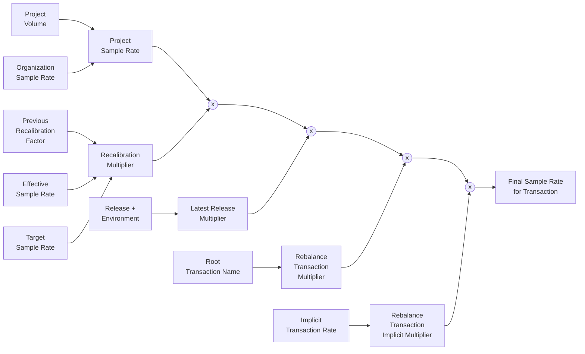

Dynamic Sampling's transaction sample rates are calculated using a few pieces of data and some fairly simple logic, but due to the complexity of the data and the logic, it is a bit unintuitive to understand unless explained in detail. This document aims to explain the process in detail.

## Overview

For transactions that are not affected by any of the hard-coded sample rates (health checks, traces with replays, certain environments), the final sample rate is calculated using a set of rules that stack on top of each other. The following rules are applied:

1. Project Sample Rate: the sample rate of the project, which is calculated based on the organization target sample rate and the number of transactions in the project compared to other projects in the organization.
1. Recalibration Rule: a multiplier that accounts for drift of the effective sample rate from the target sample rate. This may happen due to changes in the incoming volume, or as an effect of the hard coded biases, and ensures that the total org sample rate meets the target sample rate. This factor is between 0.1 and 10.0.
2. Boost Latest Releases Rule: a multiplier that increases the sample rate for transactions that are part of a new release. This factor is betweeen 1.0 and 1.5.
3. Rebalance Transactions Rule: a multiplier that decreases the sample rate for transactions that have high volume. This rule is not bounded by a minimum or maximum value.
4. Rebalance Transactions Implicit Rule: a multiplier that increases the sample rate for all transactions in a project. This is used to signal-boost transactions that have low volume. This is a factor generally larger than 1.0. 

## Calculation of the Recalibration multiplier

The recalibration multiplier is calculated using the following formula:

```
effective_sample_rate = sampled_transactions / total_transactions
multiplier = previous_factor * target_sample_rate / effective_sample_rate
```

The entire calculation can be modeled as a filter-style pipeline. The project sample rate is the base signal, and each bias contributes a multiplier that is applied to that base. The recalibration multiplier is the feedback term: it uses the previous recalibration factor, the current effective sample rate, and the target sample rate to produce the next factor.



At a high level, the resulting sample rate is:

```
final_sample_rate =
    project_sample_rate
    * recalibration_multiplier
    * latest_release_multiplier
    * rebalance_transactions_multiplier
    * rebalance_transactions_implicit_multiplier
```

## Calculation of the Boost Latest Releases multiplier

The Boost Latest Releases multiplier is calculated when Sentry generates the latest release bias rules in [`BoostLatestReleasesBias`](https://github.com/getsentry/sentry/blob/master/src/sentry/dynamic_sampling/rules/biases/boost_latest_releases_bias.py). The rule starts with the constant `LATEST_RELEASES_BOOST_FACTOR`, which is currently `1.5`, and then applies the dynamic factor function:

```
boost_latest_releases_multiplier = boost_factor**(1 - base_sample_rate)
```

As the base sample rate decreases, the boost factor is increased to compensate and ensure that there is a higher likelihood of transactions being sampled. 
Sentry only emits these rules for releases that are currently in the boosted release set for a project. Releases are boosted at 1.5x the base sample rate and then decay back to `1.0` over the platform-specific time-to-adoption window (see [time-to-adoption implementation](https://github.com/getsentry/sentry/blob/master/src/sentry/dynamic_sampling/rules/helpers/time_to_adoptions.py#L25-L26)).

## Calculation of the Rebalance Transactions multiplier

The Rebalance Transactions multiplier is calculated by the `boost_low_volume_transactions` task and consumed by [`BoostLowVolumeTransactionsBias`](https://github.com/getsentry/sentry/blob/master/src/sentry/dynamic_sampling/rules/biases/boost_low_volume_transactions_bias.py).

The task queries the recent transaction volume for each project, including the largest and smallest transaction names and the total number of transaction classes. It then runs the [`TransactionsRebalancingModel`](https://github.com/getsentry/sentry/blob/master/src/sentry/dynamic_sampling/models/transactions_rebalancing.py), whose goal is to keep the overall project sample rate stable while moving each transaction class closer to the same number of kept samples.

For each explicitly rebalanced transaction, the task stores a target transaction sample rate. During rule generation, this target rate is converted into a multiplier relative to the implicit transaction rate:

```
rebalance_transactions_multiplier = transaction_sample_rate / implicit_transaction_sample_rate
```

This rule matches `trace.transaction`, so it applies to the root transaction name in the Dynamic Sampling Context.

## Calculation of the Rebalance Transactions Implicit multiplier

The Rebalance Transactions Implicit multiplier is the companion rule to the explicit transaction rules. It applies to all transactions in the project and establishes the sample rate for transaction names that were not explicitly rebalanced.

The `boost_low_volume_transactions` task stores both the explicit transaction rates and one implicit transaction rate. During rule generation, Sentry converts the implicit rate into a factor relative to the base project sample rate:

```
rebalance_transactions_implicit_multiplier = implicit_transaction_sample_rate / base_sample_rate
```

For transactions without an explicit rule, the resulting sample rate is:

```
final_sample_rate = base_sample_rate * rebalance_transactions_implicit_multiplier
```

For transactions with an explicit rule, Relay applies both transaction factors:

```
final_sample_rate =
    base_sample_rate
    * rebalance_transactions_implicit_multiplier
    * rebalance_transactions_multiplier
```

This simplifies back to the explicit `transaction_sample_rate` calculated by the rebalancing model.

## Calculation of the Boost Low Volume Projects multiplier

The Boost Low Volume Projects step is slightly different from the other steps in this document: it produces the base project sample rate, not a `factor` multiplier. The generated rule is a `sampleRate` rule, implemented in [`BoostLowVolumeProjectsBias`](https://github.com/getsentry/sentry/blob/master/src/sentry/dynamic_sampling/rules/biases/boost_low_volume_projects_bias.py).

In Automatic Mode, the [`boost_low_volume_projects`](https://github.com/getsentry/sentry/blob/master/src/sentry/dynamic_sampling/tasks/boost_low_volume_projects.py) task calculates a sample rate for each project in an organization. It starts with the organization sample rate, compares recent root transaction volume across projects, and runs the [`ProjectsRebalancingModel`](https://github.com/getsentry/sentry/blob/master/src/sentry/dynamic_sampling/models/projects_rebalancing.py) to give lower-volume projects a higher sample rate and higher-volume projects a lower one.

The resulting value is stored in Redis per organization and project. When Sentry generates the project configuration, `get_guarded_project_sample_rate` reads that value and emits it as the base `sampleRate` rule:

```
project_sample_rate = boost_low_volume_projects_sample_rate
```

All factor rules matched before this rule are multiplied into this base sample rate by Relay.

## Calculation of the Project Sample Rate

Sentry sets sample rates at the project level, even when the organization-level target is the starting point. This is because Relay evaluates a project configuration and needs a concrete `sampleRate` rule for the project that owns the head transaction of the trace.

The project sample rate is selected in [`get_guarded_project_sample_rate`](https://github.com/getsentry/sentry/blob/master/src/sentry/dynamic_sampling/rules/base.py). In Manual Mode, Sentry uses the project option `sentry:target_sample_rate`. In Automatic Mode, Sentry starts from the organization target sample rate if custom dynamic sampling is enabled, otherwise it falls back to the blended sample rate.

If the project or organization was recently created, Sentry temporarily returns `1.0` to avoid dropping early onboarding traffic. Otherwise, Sentry reads the project-specific sample rate written by the low-volume-projects task. If that value is not available because the sliding window task ran and found no recent traffic, Sentry returns `1.0`; if the value is unavailable because the sliding window task did not run or the cached value is invalid, Sentry falls back to the blended sample rate.

The sliding window sample rate is calculated by [`sliding_window_org`](https://github.com/getsentry/sentry/blob/master/src/sentry/dynamic_sampling/tasks/sliding_window_org.py). The task counts recent root transactions for the organization, extrapolates that traffic to a monthly volume, and asks the quota system for the matching transaction sampling tier:

```
extrapolated_monthly_volume = total_root_count * hours_in_month / window_size
sliding_window_sample_rate = sample_rate_for_sampling_tier(extrapolated_monthly_volume)
```

The result is stored in Redis as the organization sample rate. The low-volume-projects task then distributes that organization sample rate across projects based on recent project volume.

The blended sample rate is used as the fallback sample rate for the project if the volume-based calculations fail. It calculates the sample rate using the sampling tier and different inputs:

- The number of transactions in the current period according to the subscription's metric history.
- The reserved monthly quota for the project for accounts on MMx plans.
- The transaction usage of the current period according to the subscription's usage metric history.
