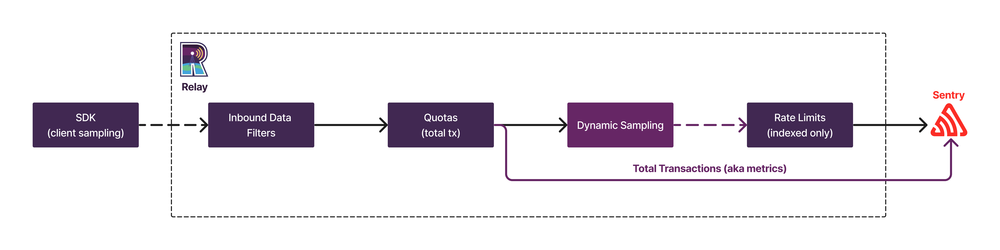
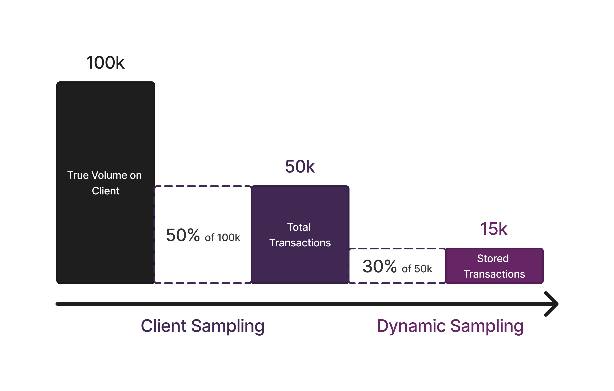

<Alert title="💡 Note">

Dynamic Sampling currently operates on either spans or transactions to measure data throughput. This is controlled by the feature flag `organizations:dynamic-sampling-spans` and usually set to what the organization's subscription is metered by. In development, this currently defaults to transactions.
The logic between the two data categories is identical, so most of this documentation is kept at a generic level and important differences are pointed out explicitly.

</Alert>

## Sequencing

Dynamic Sampling occurs at the edge of our ingestion pipeline, precisely in [Relay](https://github.com/getsentry/relay).

When events arrive, in a simplified model, they go through the following steps:

1. **Inbound data filters**: every event runs through inbound data filters as configured in project settings, such as legacy browsers or denied releases. Events dropped here are not counted towards quota and are not included in "total events" data.
2. **Quota enforcement**: Sentry charges for all further events sent in, before they are passed on to dynamic sampling.
3. **Metrics extraction**: after passing quotas, Sentry extracts metrics from the total incoming events. These metrics provide granular numbers for the performance and frequency of every event.
4. **Dynamic Sampling**: based on an internal set of rules, Relay determines a sample rate for every incoming event. A random number generator finally decides whether a payload should be kept or dropped.
5. **Rate limiting**: events that are sampled by Dynamic Sampling will be stored and indexed. To protect the infrastructure, internal rate limits apply at this point. Under normal operation, this **rate limit is never reached** since dynamic sampling already reduces the volume of events stored.

<Alert title="💡 Example">

A client is sending 1000 events per second to Sentry:
1. 100 events per second are from old browsers and get dropped through an inbound data filter.
2. The remaining 900 events per second show up as total events in Sentry.
3. Their current overall sample rate is at 20%, which statistically samples 180 events per second.
4. Since this is above the 100/s limit, about 80 events per second are randomly dropped, and the rest is stored.

</Alert>

## Rate Limiting and Total Events

The ingestion pipeline has two kinds of rate limits that  behave differently compared to organizations without dynamic sampling:

1. **High-level request limits on load balancers**: these limits do not differentiate which data is sent by clients and drop requests as soon as the throughput from clients reaches the limit.
2. **Specific limits per data category in Relay**: these limits apply once requests have been parsed and have gone through basic handling (see [Sequencing](#sequencing) above).

<Alert title="✨️ Note">

There is a dedicated rate limit for stored events after inbound filters and dynamic sampling. However, it does not affect total events since the fidelity decreases with higher total event volumes and this rate limit is not expected to trigger since Dynamic Sampling already reduces the stored event throughput.

</Alert>

## Rate Limiting and Trace Completeness

Dynamic sampling ensures complete traces by retaining all events associated with a trace if the head event is preserved.

Despite dynamic sampling providing trace completeness, events or other items (errors, replays, ...) may still be missing from a trace when rate limiting drops one or more of them. Rate limiting drops items without regard for the trace, making each decision independently and potentially resulting in broken traces.

<Alert title="💡 Example">

For example, if there is a trace from `Project A` to `Project B` and `Project B` is subject to rate limiting or quota enforcement, events of `Project B` from the trace initiated by `Project A` are lost.

</Alert>

## Client Side Sampling and Dynamic Sampling

Clients have their own [traces sample rate](https://docs.sentry.io/platforms/javascript/tracing/#configure). The client sample rate is a number in the range `[0.0, 1.0]` (from 0% to 100%) that controls **how many events arrive at Sentry**. While documentation will generally suggest a sample rate of `1.0`, for some use cases it might be better to reduce it.

Dynamic Sampling further reduces how many events get stored internally. **While most graphs and numbers in Sentry are based on metrics**, accessing spans and tags requires stored events. The sample rates apply on top of each other.

An example of client side sampling and Dynamic Sampling starting from 100k events which results in 15k stored events is shown below:

## Total Transactions

To collect unsampled information for “total” transactions in Performance, Alerts, and Dashboards, Relay extracts [metrics](https://getsentry.github.io/relay/relay_metrics/index.html) from spans and transactions. In short, these metrics comprise:

- Counts and durations for all events.
- A distribution (histogram) for all measurements, most notably the web vitals.
- The number of unique users (set).

Each of these metrics can be filtered and grouped by a number of predefined tags, [implemented in Relay](https://github.com/getsentry/relay/blob/master/relay-server/src/metrics_extraction/transactions/types.rs#L142-L157).

For more granular queries, **stored events are needed**. _The purpose of dynamic sampling here is to ensure that there are always sufficient representative sample events._

<Alert title="💡 Example">

If Sentry applies a 1% dynamic sample rate, you can still receive accurate events per minute (SPM or TPM, depending on event type) and web vital quantiles through total event data backed by metrics. There is also a listing of each of these numbers by the transaction.

When you go into the trace explorer or Discover, you might want to now split the data by a custom tag you’ve added to your events. This granularity is not offered by metrics, so **these queries need to use stored events**.

</Alert>

If you want to learn more about Dynamic Sampling, continue to the [next page](/dynamic-sampling/fidelity-and-biases/).
