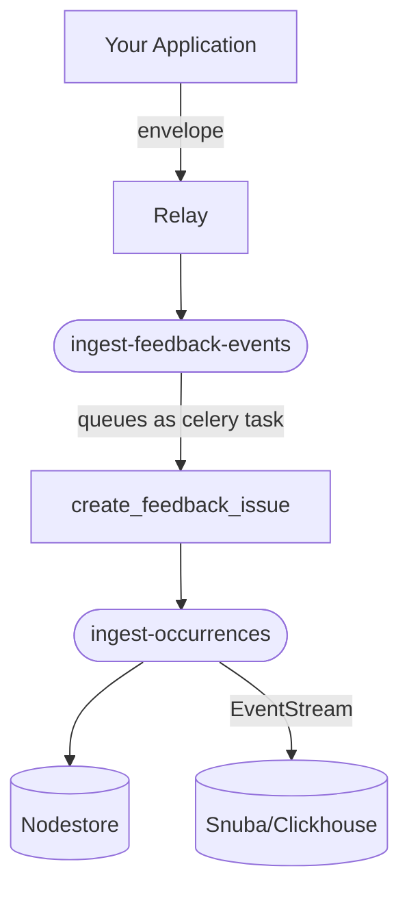
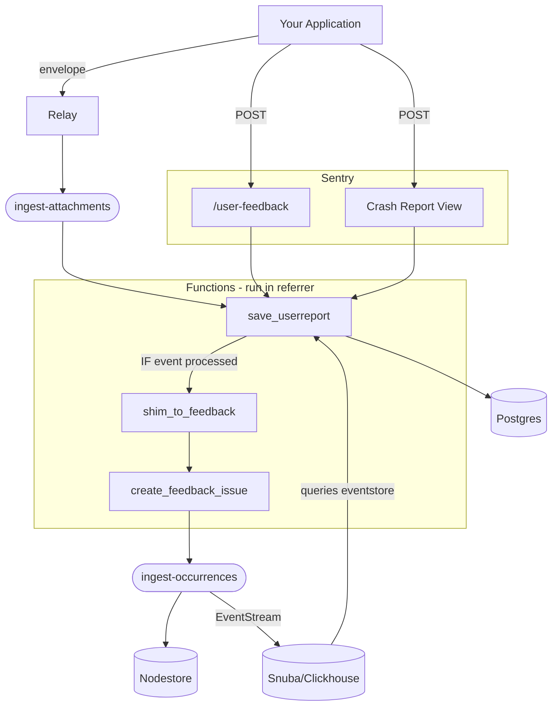
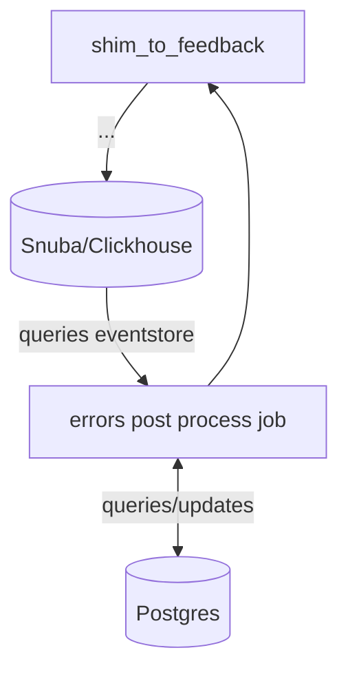
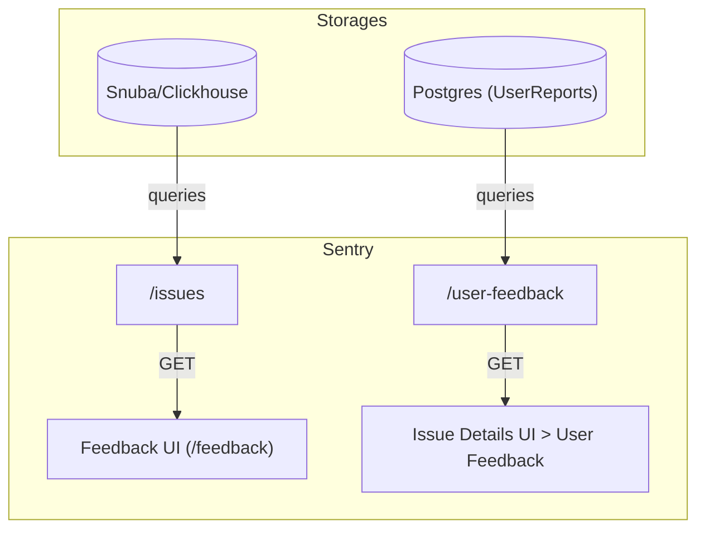

**The goal of this doc is to give engineers an in-depth understanding of User Feedback's backend.**
It will:

1. describe the relevant ingestion pipelines, data models, and functions.
2. explain the difference between “feedback”, “user reports”, and “crash reports”, and why we built and need to support each.

## Creation sources

When broken down, there are **4** ways to create feedback in our system, with
3 sharing the same data model. A good reference is the
`FeedbackCreationSource(Enum)` in [create_feedback.py](https://github.com/getsentry/sentry/blob/2b642e149c79b251e1c2f4339fc73d656347d74e/src/sentry/feedback/usecases/create_feedback.py#L33-L33).
The 4 ways _clients_ can create feedback are:

`NEW_FEEDBACK_ENVELOPE`: [The new format](/sdk/data-model/envelope-items/#user-feedback) created by the Replay team when adding
the [User Feedback Widget](https://docs.sentry.io/product/user-feedback/#user-feedback-widget)
to the JavaScript SDK. It allows adding more information, for example tags,
release, url, etc.

`USER_REPORT_ENVELOPE`: [The older format](/sdk/data-model/envelope-items/#user-report---deprecated) with name/email/comments, that requires
`event_id` to link a Sentry error event.

`USER_REPORT_DJANGO_ENDPOINT`: [The deprecated Web API](https://docs.sentry.io/api/projects/submit-user-feedback/)

`CRASH_REPORT_EMBED_FORM`: The [crash report modal](https://docs.sentry.io/product/user-feedback/#crash-report-modal)

## How feedback is stored

On the backend, each feedback submission in Sentry's UI is **an un-grouped issue occurrence**,
saved via the [issues platform](/issue-platform/).
The entrypoint is [**`create_feedback_issue()`**](https://github.com/getsentry/sentry/blob/2b642e149c79b251e1c2f4339fc73d656347d74e/src/sentry/feedback/usecases/create_feedback.py#L184-L184),
which

1. filters feedback with empty or spam messages. Note **anonymous feedbacks are not filtered** (missing name and/or email).
2. sends to issues pipeline in a standardized format. To make sure it is never grouped, we use a random UUID for the fingerprint.

---

## Feedback events

The preferred way of sending feedback from the SDK is in [feedback envelope](/sdk/data-model/envelope-items/#user-feedback).
The format is the same as error events, except the `type` header = `"feedback"`. While
user reports have an associated event, **new feedback _is_ an event**. This
offers 2 improvements:

1. Users can submit generic feedback without an error occurring. We're allowing users to catch things that Sentry can’t!
2. Rather than waiting for the associated error to be ingested asynchronously, we immediately get access to context like the environment, platform, replay, user, tags...

The user's submission is wrapped in a context object:

```Pseudo-code
event[”contexts”][”feedback”] = {
	"name": <user-provided>,
	"contact_email": <user-provided>,
	"message": <user-provided>,
	"url": <referring web page>,
	"source": <developer-provided, ex: "widget">,
	"associated_event_id": <developer-provided, should be a valid error event in the same project>
}

// All fields are optional except message.
// The widget can be configured to require a non-empty email and/or name.
```

- This doc refers to the payload format (`event` in the pseudo-code above) as a “**feedback event”**.
- The feedback [widget](https://docs.sentry.io/platforms/javascript/user-feedback/#user-feedback-widget), which is installed by default, sends these envelopes.
- SDK API: to manually capture feedback, use `captureFeedback()`. [Example for JavaScript v8+](https://docs.sentry.io/platforms/javascript/user-feedback/#user-feedback-api). This function still needs
to be implemented for most platforms.
  <br />
  <br />

### Ingest diagram



In Relay v24.5.1, we migrated feedback to its own kafka topic + consumer,
`ingest-feedback-events`. This decouples risk and ownership from errors
(`ingest-events`).

<br />

### Attachments

We only use attachments for the widget’s screenshot feature, which allows users
to submit **at most 1 screenshot per feedback**. Attachments are another [item type](/sdk/data-model/envelopes/#attachment)
in an envelope.

- SDK v8.0.0+, Relay v24.5.1+: Sends the feedback and attachment items in the same envelope.
- SDK < v8, all Relay versions: Sends a separate envelope for each item.

**The feedback pipeline does not process attachments**. Relay routes them to
a separate topic and storage, and the UI makes a separate request for them.

---

## User reports

The deprecated way of sending feedback is as a **user report**. This is a simple typed dict:

```Pseudo-code
user_report = {
	"event_id": <required UUID str>,
	"email": <optional str>,
	"name": <optional str>,
	"comments": <optional str>,
}
```

<br />

### Ingest diagram



<br />

### Shimming to feedback

Before it was extended to generic feedback, the [`UserReport` model](https://github.com/getsentry/sentry/blob/2b642e149c79b251e1c2f4339fc73d656347d74e/src/sentry/models/userreport.py#L9-L9)
was first used for crash reports. Therefore an associated event ID is required, and
we use it to set environment and group before saving the model to **Postgres**.
Only then can we shim the report to a **feedback event** and pass it to `create_feedback_issue()`.

If the event hasn’t reached eventstore (Snuba) by the time of ingest, we still
save the report, but leave the environment + group empty and skip feedback creation.

To ensure the skipped reports eventually get fixed and shimmed, we
added a post process job to the errors pipeline: [`link_event_to_user_report()`](https://github.com/getsentry/sentry/blob/2b642e149c79b251e1c2f4339fc73d656347d74e/src/sentry/tasks/post_process.py#L1387-L1387).
This is the 5th, automated way of creating feedback.

Simplified diagram:



<br />

### Envelopes

User reports are also sent to Relay in envelope format, item type [user_report](/sdk/data-model/envelope-items/#user-report---deprecated).

The SDK function that sends these is `captureUserFeedback`.

<br />

### Django endpoint

Before our envelope ingest service existed, older SDKs directly POST the report
to Sentry, with
`/api/0/projects/{organization_id_or_slug}/{project_id_or_slug}/user-feedback/`.

See [https://docs.sentry.io/api/projects/submit-user-feedback/](https://docs.sentry.io/api/projects/submit-user-feedback/).

<br />

### Crash reports

The **crash report modal** pops up when Sentry detects an error on the current
page, prompting users to describe what happened. On the backend, crash report
data is the same as user reports.

You can install it as an [SDK integration](https://docs.sentry.io/platforms/javascript/user-feedback/#crash-report-modal).

We implement it as a Django view:

- URL: `/api/embed/error-page/`
- Python Class: `error_page_embed.ErrorPageEmbedView`

Crash reports are also shimmed to feedback. The pipeline is the same as the
`/user-feedback` endpoint.

---

## Sentry UI



You can view the user reports related to a specific issue at the "User Feedback"
tab of Issue Details. This excludes "new" feedback (anything sent from the widget).

---

## Email alerts

Email alerts are triggered in feedback’s post process pipeline. (Unrelated to
the post process diagram above.) We apply some feedback-specific
filters, **skipping emails if:**

1. The feedback is [marked as spam](https://docs.sentry.io/product/user-feedback/#spam-detection-for-user-feedback) AND the `organizations.user-feedback-spam-filter-actions` feature flag is enabled.
2. The source is NOT a new feedback envelope / the widget, AND the “Crash Report Notifications” setting is disabled.
   - in UI: Settings > Projects > (project slug) > User Feedback > “Enable Crash Report Notifications”
   - project option in code: `sentry:feedback_user_report_notifications`
   - default = true/enabled

---

## Self-hosted support

This feature is available if you enable the following feature flags.

- `organizations:user-feedback-ingest`
- `organizations:user-feedback-ui`
- `organizations:user-feedback-replay-clip` (v24.7.1+)

Auto-registered flags for issue platform, for versions \<= v24.10.0 only:

- `organizations:feedback-ingest`
- `organizations:feedback-visible`
- `organizations:feedback-post-process-group`

(You won't be able to grep for these in the sentry repo, but you do need to enable them.)

You need to have v24.4.2 or higher in order to use the latest functionality of User
Feedback, such as adding screenshots. Also note that User Feedback is only available
in feature-complete Sentry, _not_ errors-only.

---

Automatic spam filtering is currently unsupported in self-hosted. _Make sure
`organizations:user-feedback-spam-filter-ingest` is false._

You may optionally enable `organizations:user-feedback-spam-filter-actions` to
manually mark feedback as spam.
