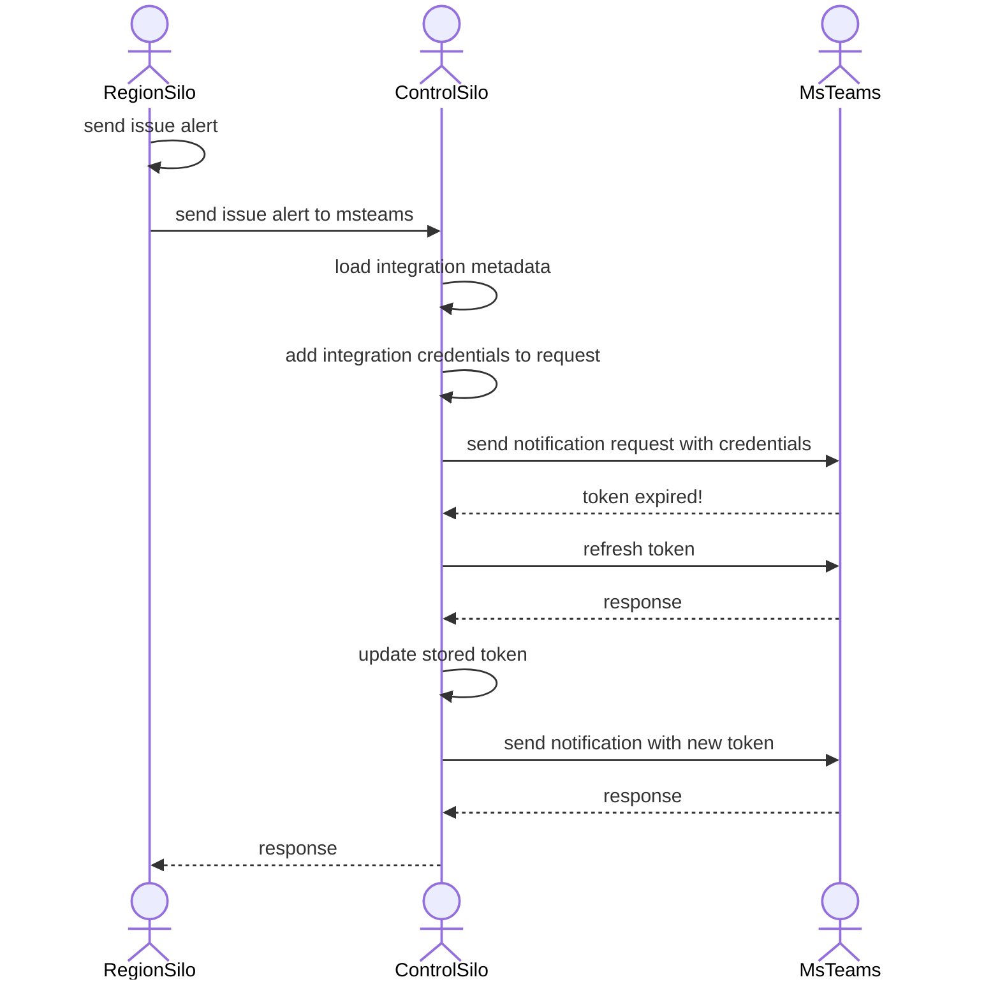
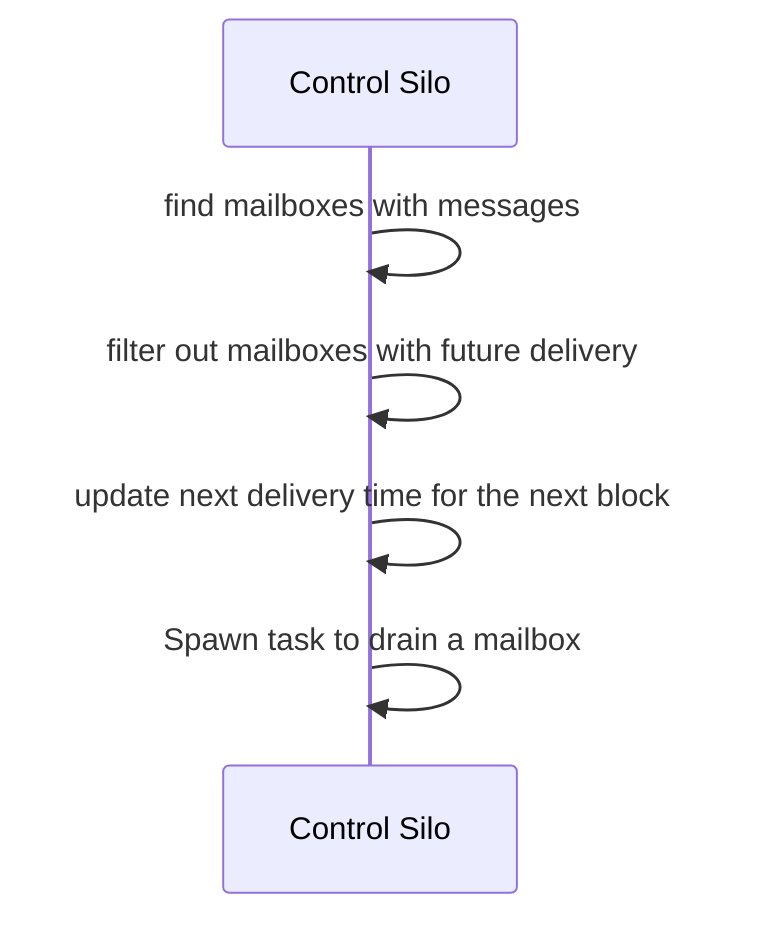
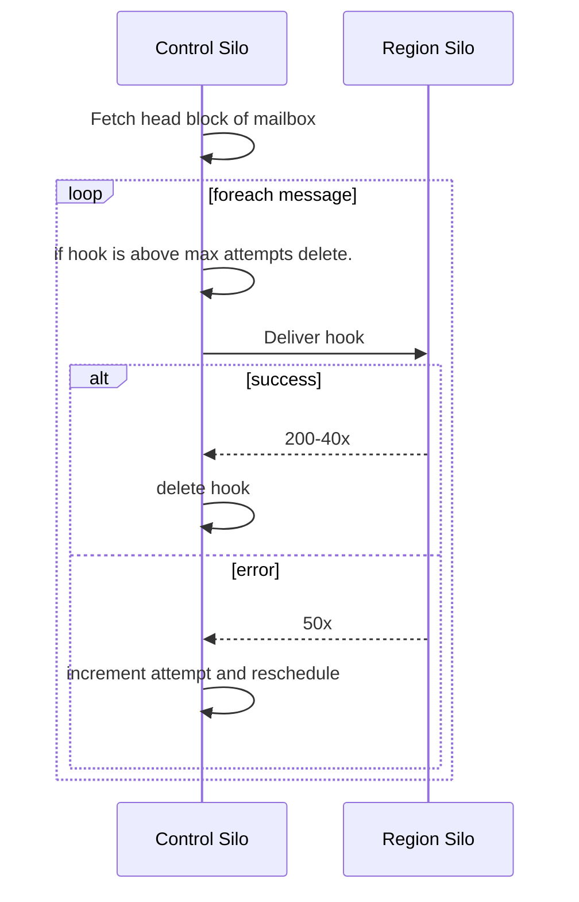

Within the Control Silo are features that allow us to provide backwards compatibility for both customer API usage, and integrations

# API Gateway

Prior to our multi-region offering, all API traffic from customers would be sent to [sentry.io](http://sentry.io) . We need to continue supporting these URLs despite some customers residing in the `us` region and others in the `de` region. The API Gateway functionality of control silo will introspect requests and proxy requests to the appropriate region based on path parameters in the request. Requests can be routed via:

- Organization slug or id
- Sentry App Installation UUID
- Sentry App Slug
- DSN host
- A static list of URL names (region pin list)

<Alert>
💡 Requests going to sentry.io do not meet data residency requirements. Customers will need to use region domains in order to not have requests go to the US.
</Alert>

The API Gateway is implemented as a middleware that only takes action when Sentry is running as Control Silo. After matching URLs, the middleware checks the silo mode of the matched endpoint. If the matched endpoint is a **region** endpoint, the API Gateway attempts to route the request to a region based on a few heuristics.

### Slug, id, and UUID based routing

For requests that use `organization_slug`, `organization_id_or_slug`, `sentry_app_slug` or `uuid` parameters the API Gateway can resolve the organization’s region using data present in control silo. Once the region is resolved requests are synchronously proxied to the appropriate region.

### DSN host

The legacy error-embed page requires specialized handling, and we extract the
destination from the `dsn` query string parameter.

### Region Pin List

We have a handful of API endpoints that lack useful hints to route requests between regions. When a request is made to one of these paths we assume the intent is to send a request to the `us` region.

### Direct Location Header

When a request is handled by the API Gateway, the response delivered to the client will contain `X-Sentry-Proxy-Url` header which contains the URL that clients should use to avoid the additional latency incurred by the API Gateway.

# Integration Credential Proxy

Integrations can be shared by multiple organizations. For example, a single MS teams workspace can be connected to multiple organizations, and those organizations can live in multiple regions. A few of our integrations leverage refresh tokens and use short lived access tokens. To avoid racy updates when tokens become invalidated and need to be refreshed, we send outbound requests to control silo, which acts as a proxy for the integration service. By funnelling all outbound traffic for integrations that require refresh tokens through control silo we can more easily co-ordinate token replacements.



The integration proxy is implemented as a class that integrations requiring refresh tokens can sub-class. Currently the following integrations use the integration credential proxy:

- GitHub
- GitLab
- MSTeams
- Azure DevOps Services (Visual Studio Team Services)

### Integration Credential Proxy Headers

The integration credential proxy leverages several specialized headers to perform its role:

- `X-Sentry-Subnet-Organization-Integration` The id of the `OrganizationIntegration` that credentials should be added from.
- `X-Sentry-Subnet-Base-Url` defines the integration host and base URL that the request should be forwarded to.
- `X-Sentry-Subnet-Signature` An HMAC based request signature that is verified in control silo.
- `X-Sentry-Subnet-Path` The path that should be used in the forwarded request.
- `X-Sentry-Subnet-Keyid` For integrations that use a keyring, the id of the key to use.

# Integration Webhook Forwarding

Many of the 3rd-party services we integrate with only offer a single endpoint that they will submit webhooks to. Because all of our existing webhook traffic is being sent to `sentry.io` we need to receive webhook requests there. For webhooks that need to be handled in a region silo, we store the webhooks in postgres and then asynchronously deliver captured webhooks to the relevant regions.

Capturing and replaying webhooks lets us solve a few availability issues:

1. Many webhook deliveries have short timeouts and need rapid responses.
2. Integrations can be shared by organizations in multiple regions and synchronous forwarding risks hitting timeouts.
3. Synchronous forwarding of webhooks could lead to RPC worker exhaustion.

### Webhook Storage

Webhook payloads are stored in postgres. Webhook payloads are sorted into ‘mailboxes’ and messages within a mailbox are delivered in the order they are received. Generally mailboxes map to a single integration, but for higher volume integration customers we further partition messages into smaller grained shards to increase delivery throughput.

The storage model for webhooks is similar to outboxes as webhooks were originally stored *in* outboxes. However, they needed to be broken out into separate storage as the transactional boundaries that outboxes require are not compatible with the longer request durations that webhook delivery entails.

```sql
create table hybridcloud_webhookpayload (
  id bigserial primary key,

  -- mailbox_name would contain values like 'jira:12364'
  mailbox_name char,
  region_name char,
  schedule_for datetime,
  attempts int default 0,

  -- payload attributes
  request_method char,
  request_path char,
  request_headers text,
  request_body text,

  date_added datetime,
  index(mailbox_name),
  index(schedule_for),
)
```

### High-volume integration mailboxes

For integration providers that have multiple high-volume customers we partition messages into more finely grained mailboxes. The partitioning strategy varies by integration, but the objective is to partition messages by remote resources such that operations to a single resource all resolve to the same mailbox. Some examples of good partitioning keys are, GitLab projectids, or Jira issue ids.

### Webhook Scheduling

With this storage model we use a pair of queries in a celery task that is spawned every 10 seconds to find the ‘next’ webhook in each mailbox.

```sql
-- Get the 'first' message in each mailbox
select min(id), mailbox_name
from sentry_webhookpayload
group by mailbox_name

-- Get any mailboxes with messages that can be delivered
select * from sentry_webhookpayload
where id in (...) and schedule_for < current_timestamp
```

For each mailbox with undelivered messages, we select a block of messages, and update their next schedule time to be a few minutes in the future. Doing this helps reduce the next scheduling task from attempting to deliver the same messages again.



### Webhook Delivery

Scheduled webhooks are delivered by celery tasks. Delivery tasks attempt to forward requests to the relevant region silo. If delivery succeeds, the payload record is deleted from postgres. If the request fails and  `attempts` is lower than the max attempts (10) the message is left alone, if the `attempts` is equal or higher than the max attempts, an log message is emitted and the webhook is discarded.

Draining a mailbox involves sending as many messages from a given mailbox as we can. Should we hit a networking error, the current head of line will be rescheduled and have its attempt number increased.



Notably, most 40x errors are considered 'successful' deliveries. The reason for this is that re-attempting a delivery of a webhook that initially had a 40x response will generally not result in a 200.
