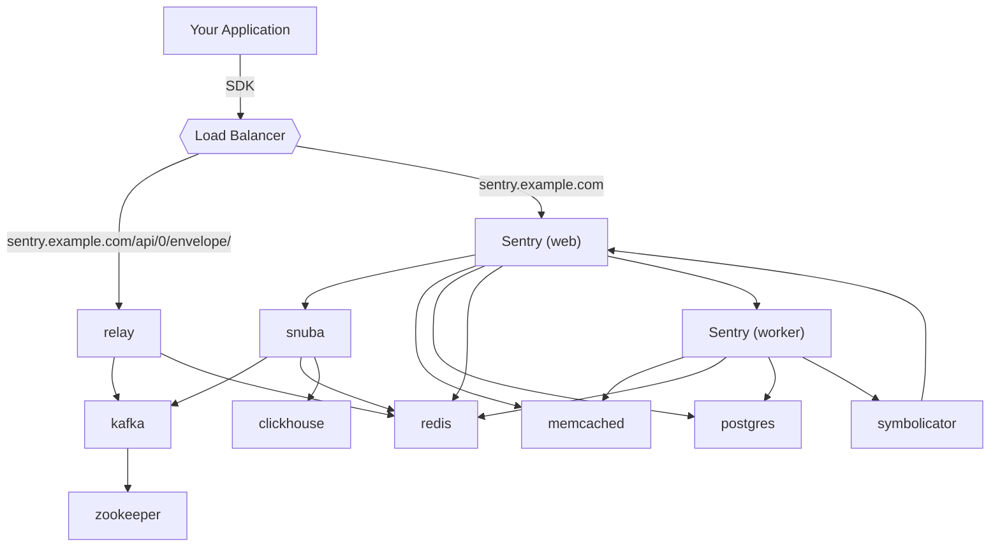
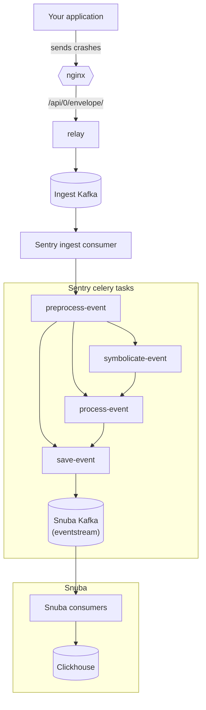
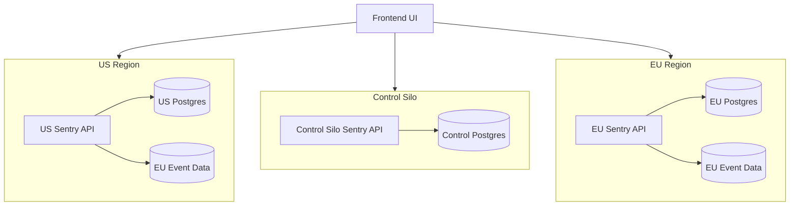

## High level overview

Edges represent service dependencies.

## Event pipeline

How an event gets saved. Edges represent data flow through system.

This graph is extremely simplified mostly due to layout constraints. Missing from this graph:

* How Relay fetches project configs. Answer: from sentry-web
* How Relay caches project configs. Answer: In memory, and in Redis
* How Relay counts events and keeps track of quotas. Answer: more Redis
* Symbolicator as auxilliary service to symbolicate-event
* How alerting is triggered. Answer: postprocess-event, a Celery task which is responsible for alerting (spawned by a Kafka consumer in Sentry reading from eventstream)
* Possibly more

For more information read [Path of an event through Relay](https://getsentry.github.io/relay/relay_server/index.html#path-of-an-event-through-relay) and [Event Ingestion Pipeline](https://getsentry.github.io/event-ingestion-graph/).

## Multi-Region

Sentry's SaaS offering is a multi-region deployment of Sentry that is built from the same source code as self-hosted and single-tenant deployments.

### The goals and constraints of our multi-region design

Our multi-region architecture was driven by several design-goals. Several of these design goals have not been implemented yet, but could be in the future without requiring extensive rework.

The high-level design goals were:

- Create a solution that allowed for many isolated regions. Isolated regions are important because they allow us to address data-residency requirements in the EU and in other regions in the future as those requirements become relevant. Regions can contain as few as one tenant or hundreds of thousands. Regions may be scaled independently from one another.
- Our solution should afford the ability for customers to provide their own hardware for a region in the future.
- Create a solution that allows single-tenants to join up with SaaS to help reduce operational overhead and increase our ability to deliver updates to single-tenants.
- Our solution would need to ‘scale down’ to self-hosted and development environments. It should offer the same functionality in all deployment environments.

In addition to the goals we had several constraints:

- SaaS Customers will continue to login and signup at `sentry.io`. They will not need to log into each organization individually.
- Existing SaaS Customers should not be required to update their DSN values. If a customer migrates to a new region, it is ok if they also need to update their DSNs.
- Generally API URLs should not be required to change. Existing customers can use `region.sentry.io` style URLs to improve latency and ensure data residency requirements are met, but they don’t need to. Customers in new regions may be required to use `region.sentry.io` style URLs.
- A single Sentry Organization has all of their data located within a single Storage Region. This requirement comes from the need to do cross-project operations in Business plans.
- The solution should support ~1000 regions. While these values are larger than we are likely to use it serves as a useful stress test for the solution.

### Silo Modes

In order to offer customers data residency we needed to co-locate the bulk of an organization’s data together. The data our customers collect and send to Sentry needs to be located within the customer’s chosen region. While customer events need to be stored in the preferred region, there is also data in Sentry that is shared between organizations, and thus between regions. This data needs to be centrally stored outside of any region.

These constraints led our design to having multiple 'silo modes'.

<Alert>
    ☝ The term ‘silo’ was chosen as other applicable terms (region, zone, partition, cluster) are all taken.
</Alert>

Our architecture includes two silo modes:

1. **Control Silo** Contains all of the globally shared data and services. This data is shared between organizations and thus between regions.
2. **Region Silo** Region silos contain organization data. Each region has independent infrastructure, and holds at least one organization.

In addition to the siloed modes, there also exists a **Monolith** mode. In monolith mode both control and region silo modes can be accessed. Models, endpoints and tasks are silo-aware and should a siloed resource be used in the wrong silo context an error is raised.

### Multi-region architecture

Each region silo can be scaled independently, and is isolated from other regions. Within each region exists separate, dedicated infrastructure and applications as outlined in the [application overview](/architecture/#high-level-overview).

### Silo Configuration

Silo modes are defined as environment variables (and django settings). The relevant settings are:

- `SILO_MODE` either `CONTROL`, `REGION` , `MONOLITH` or None.
- `SENTRY_REGION` The name of the region the application is in (eg. `us` or `de`) or `None`.
- `SENTRY_REGION_CONFIG` A list of regions that the application has. This list defines names, URLs, and category (multiregion, singletenant) that a region operates as.
- `SENTRY_MONOLITH_REGION` The region name of the former ‘monolith’ region. For [sentry.io](http://sentry.io) this is the `us` region. The monolith region has special behavior that is required for backwards compatibility.
