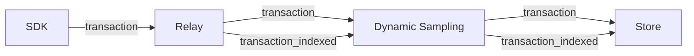
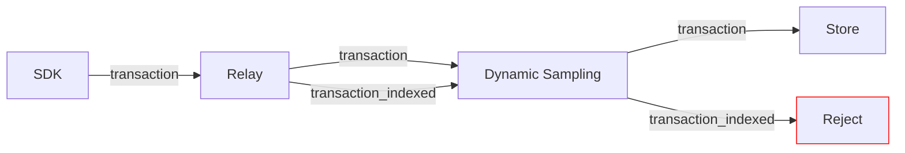

Data types which are subject to dynamic sampling are represented in two different outcome data categories: "total" and "indexed". You can think of the "total" category as counting items that are stored in _aggregated_ form, in other words, as metrics. The "indexed" category counts items that are stored individually.

If an item is dropped _before_ metrics extraction & dynamic sampling, it will show up as an outcome in both categories (for example, `"transaction"`  and `"transaction_indexed"`). If an item is dropped _by_ dynamic sampling, it will show up as a "filtered" outcome in the "indexed" category, but it lives on in the form of metrics, for which we emit an "accepted" outcome in the "total" category.

## Illustration

These charts illustrate the flow of data categories for transactions:

For a sampled transaction:

For a transaction filtered by dynamic sampling:

## Data Types

The following data categories have a corresponding `"*_indexed"` category:

* transactions
* spans
* profiles
