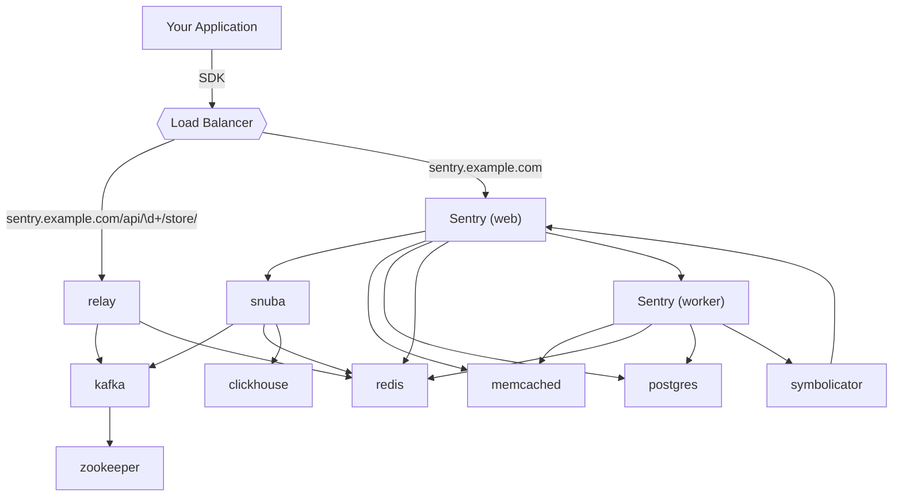
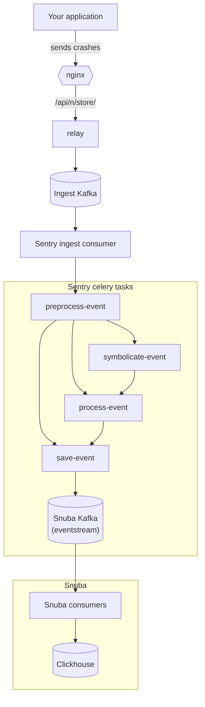

## High level overview

Edges represent service dependencies.

## Event pipeline

How an event gets saved. Edges represent data flow through system.

This graph is extremely simplified mostly due to layout constraints. Missing from this graph:

* How Relay fetches project configs. Answer: from sentry-web
* How Relay caches project configs. Answer: In memory, and in Redis
* How Relay counts events and keeps track of quotas. Answer: more Redis
* Symbolicator as auxilliary service to symbolicate-event
* How alerting is triggered. Answer: postprocess-event, a Celery task which is responsible for alerting (spawned by a Kafka consumer in Sentry reading from eventstream)
* Possibly more

For more information read [Path of an event through Relay](https://getsentry.github.io/relay/relay_server/index.html#path-of-an-event-through-relay) and [Event Ingestion Pipeline](https://getsentry.github.io/event-ingestion-graph/).

