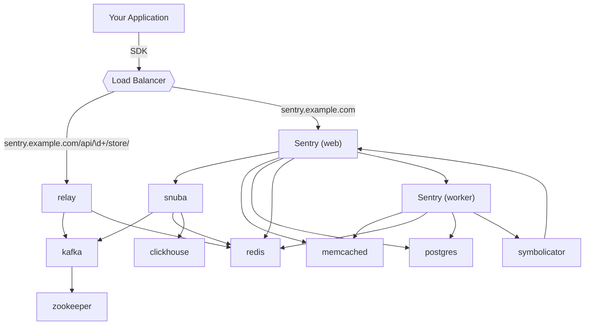

## Service Diagram

```mermaid
graph TD
app[Your Application] --> |SDK| lb{{Load Balancer}}
lb --> |"sentry.example.com/api/\d+/store/"| relay
lb --> |"sentry.example.com"| sentry_web["Sentry (web)"]
symbolicator --> sentry_web
relay --> kafka
relay --> redis
sentry_web --> snuba
sentry_web --> memcached
sentry_web --> postgres
sentry_web --> redis
snuba --> kafka
snuba --> redis
snuba --> clickhouse
kafka --> zookeeper
sentry_web --> sentry_worker["Sentry (worker)"]
sentry_worker --> memcached
sentry_worker --> redis
sentry_worker --> postgres
sentry_worker --> symbolicator

click snuba "https://github.com/getsentry/snuba" "Snuba Documentation"
click relay "https://github.com/getsentry/relay" "Relay Documentation"
```

## Additional Resources

- [Event Ingestion Pipeline](https://getsentry.github.io/event-ingestion-graph/)
