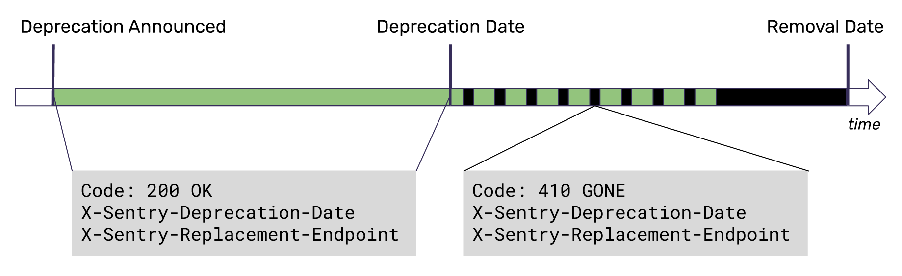

## Preface

It's easy to think of an API as just another executable block of code, like a function. Ideally, we could update it or remove it as needed with some quick fixes tacked on for any collateral code breakage. This assumes that we have control over the subroutine itself, but also anything calling the subroutine. In reality, APIs are often called by external developers and organizations with their own priorities and roadmaps; fixing broken Sentry API calls is usually not on that roadmap. Repeated breakages can erode trust from customers and lead to a chilling effect in app development.

While it would be nice to release perfect APIs that will never need to be changed or removed, breaking changes inevitably happen. Whether it's from new vulnerabilities being discovered, or from explosive customer base growth causing performance issues, the reason to create a breaking change may not be predictable at development time.

We have to balance the needs of Sentry with customer expectations. Thankfully, deprecation is not a novel problem, and most developers understand that every piece of code has a lifecycle. They'll usually work with API providers given enough lead time and communication.

Our official deprecation policy establishes expectations between us (the API provider) and developers (the consumers) about what each party will do in the event of an API removal.

## Steps to Deprecate an API

1. [API nominated for deprecation](#selecting-an-api-for-deprecation)
2. [Remove any internal usages of the API](#internal-usage-removal)
3. [Determine who is currently calling the to-be-deprecated API](#determine-affected-users)
4. [Set an official deprecation date for the endpoint](#set-a-deprecation-date)
5. [Reach out to the orgs that use the endpoint the most, informing them of the API's future removal](#notify-customers)
6. [Mark the API for deprecation in code](#response-formats)
7. [After the deprecation date is reached, start intermittently rejecting requests at a regular interval](#intermittent-blackout)
8. [2 months after the deprecation date, remove the API entirely](#post-deprecation-process)

## Breakdown

### Selecting an API for Deprecation

API deprecation is a disruptive process for API users and should only be done as a last resort. The following are valid reasons for deprecation:

- The use case for the API is no longer valid
- There aren't enough company resources to support its existence
- Planned changes to this API will cause backwards compatibility to break, or change so significantly that it no longer resembles the existing API. This includes changes due to: feature requests, refactoring, and vulnerabilities.

For APIs being removed, there should be an alternate workflow that users can follow. This could be from new APIs or a combination of existing APIs.

### Internal Usage Removal

Before announcing the deprecation, all usage of the API should be removed in the product. Make sure to check `sentry`, `getsentry`, `action-release`, and `sentry-cli`.

### Determine Affected Users

Identify the organizations and users that are currently calling the API to be deprecated.

<Alert>

Note that direct API callers don't include Sentry frontend calls.

</Alert>

### Notify Customers

Work with Customer Success, Support, and Product Marketing (`#discuss-support`, `#discuss-marketing` on Slack) on messaging to affected users. `#discuss-api` can help connect you with the right people.

<Alert>

Breaking changes should be batched together when possible to reduce continuous code churn for API consumers.

</Alert>

#### Set a Deprecation Date

The deprecation date should give ample time for users to update their apps. The more extensively used an API is, the longer the deprecation time should be. [Common sunsetting period timeframes are 3-8 months](https://swagger.io/blog/api-strategy/best-practices-for-deprecating-apis/):

- **3 months** for public APIs
- **6 months** for high-volume public APIs

#### Email Customers

Send a communication to affected users informing them of the deprecation timeline and migration path. This should include:

- What endpoint is being deprecated
- Why it's being deprecated
- The deprecation date
- What to use instead

#### Resolve Any Disputes

If there are any major concerns raised by customers about the deprecation and the proposed date, they should be resolved at this point.

#### Update API Docs

The docs should be updated as soon as we're committed to removing an API. An agreed-upon date can be added later.

## Response Formats

A developer should add the deprecation decorator to the API being removed. This decorator automates the entire deprecation process by setting appropriate headers and triggering intermittent blackouts.

### Headers

Once the deprecation has started, two new headers will be added to every response from the deprecated API:

- `X-Sentry-Deprecation-Date` — returns the expected deprecation date
- `X-Sentry-Replacement-Endpoint` — provides a possible replacement endpoint, if one exists

### Intermittent Blackout

It's likely that even after reaching out, there will be some orgs/users that don't update their apps. Rejecting all requests suddenly may look like a breakage or an outage instead of a deprecation. For this reason, we will intermittently reject requests. It doesn't completely break integrations, but should act as a signal to consumers that action is needed.

Eventually all requests to the API will be rejected.

## Post Deprecation Process

### Remove API from Docs

With the API officially deprecated, any official documentation should be removed.

### Remove the API

Once all requests are being rejected, a subsequent PR can remove the API safely. At this point the API no longer responds `410` but instead a `404`.

## Self-Hosted

API deprecations will apply to self-hosted users, but the process is slightly different. Instead of the API being removed after a specific date, it will be removed in the subsequent release. Until the user's deployment is updated with that version, the API will be available without interruption.

## Exceptions

It's permitted to immediately remove an API without going through the flow above if it meets one of these conditions:

- The API is on the cusp of or causing an incident
- The API has a blocker vulnerability (only if there's no other solution besides removing the API)
