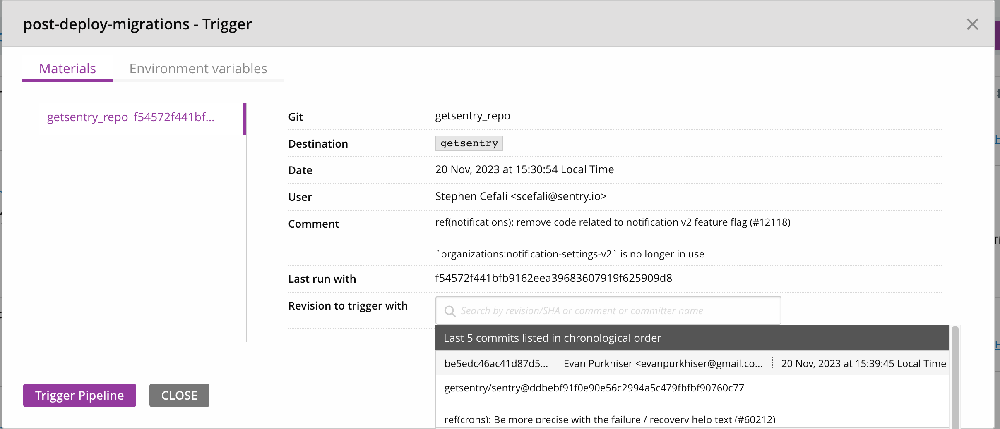
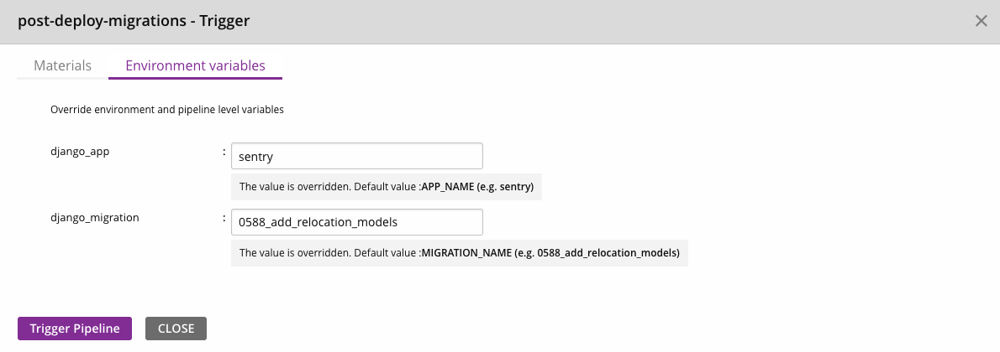

Django migrations are how we handle changes to the database in Sentry.

Django migration official docs: [https://docs.djangoproject.com/en/5.1/topics/migrations/](https://docs.djangoproject.com/en/5.1/topics/migrations/) . These will cover most things you need to understand what a migration is doing.

## Commands

Note that for all of these commands you can substitute `getsentry` for `sentry` if in the `getsentry` repo.

### Upgrade your database to latest

`sentry upgrade` will automatically bring your migrations up to date. You can also run `sentry django migrate` to access the migration command directly.

### Move your database to a specific migration

This can be helpful for when you want to test a migration.

`sentry django migrate <app_name> <migration_name>` - Note that `migration_name` can be a partial match, often the number is all you need.

eg: `sentry django migrate sentry 0005`

This can be used to roll a migration back as well. Useful in dev if you make a mistake.

### Produce SQL for a migration

A GitHub action will automatically comment on your PR with the SQL for your migration, and the comment will stay updated with any future changes.
You can also manually generate SQL with this command.

`sentry django sqlmigrate <app_name> <migration_name>`

eg `sentry django sqlmigrate sentry 0003`

### Generate Migrations

This generates migrations for you automatically based on changes you've made to models.

`sentry django makemigrations`

or

`sentry django makemigrations <app_name>` for a specific app.

eg `sentry django makemigrations sentry`

You can also generate an empty migration with `sentry django makemigrations <app_name> --empty`. This is useful for data migrations and other custom work.

Note that if you have added a new model, you also need to import the model in `__init__.py`, or the model will not be recognized in testing.

## Merging migrations to master

When merging to master you might notice a conflict with `migrations_lockfile.txt`. This file is in place to help us avoid merging two migrations with the same migration number to master, and if you're conflicting with it then it's likely someone has committed a migration ahead of you.

To resolve this, rebase against latest master, delete your current migration and then regenerate it. If your migration was custom, just save the operations in a text file somewhere so that you can reapply them on the regenerated migration.

Always commit the changes to `migrations_lockfile.txt` with your migration.

## Guidelines

There are some things we need to be careful about when running migrations.

### Testing

Database migrations are risky operations that can lead to irreversible data loss or corruption. This is especially true for [data migrations](https://docs.djangoproject.com/en/4.0/topics/migrations/#data-migrations).
For this reason, every migration should have a corresponding integration test.

To test your migration, derive a test case from `TestMigrations` and add it to `tests/sentry/migrations`.
For example:

```python
class MyMigrationTest(TestMigrations):
    migrate_from = "0123_previous_migration"
    migrate_to = "0124_my_new_migration"

    def setup_before_migration(self, apps):
        # Create your db state here
        Project = apps.get_model("sentry", "Project")
        self.project = Project.objects.create(organization_id=self.organization.id, name="my_project")

    def test(self):
        # Test state after migration
        self.project.refresh_from_db()
        assert self.project.name == "MyProject"

```

To run the test locally, run `pytest` with `--migrations` flag. For example, `pytest -v --migrations tests/getsentry/migrations/test_0XXX_migration_name.py`.

If you would like to speed up the migration tests and do not require rebuilding the databases on each test run, supply `--reuse-db` as an additional option to the test command.

#### Notes

- There is a [known issue](https://github.com/getsentry/sentry/blob/e4627f093de4718e054ba9c6b002ff0b9a5b6033/tests/sentry/migrations/test_0295_backfill_alertrule_type.py#L1-L3) with the `django-pg-zero-downtime-migrations` package which causes the roll back of a `NOT NULL` constraint to fail.
  If this happens with an old migration test, it's ok to delete the test rather than trying to fix the issue.
- If you want to use existing [`create_*`](https://github.com/getsentry/sentry/blob/5f81ff47685db524133e75db181eb36e93f04327/src/sentry/testutils/factories.py#L241) helper functions to create model instances, override [`setup_initial_state`](https://github.com/getsentry/sentry/blob/57367022f65ada2323fb40147b38e795f869f148/src/sentry/testutils/cases.py#L1596-L1602)
  rather than `setup_before_migration`. This function will run _before_ the database is rolled back to `migration_from`.

### Filters

If a (data) migration involves large tables, or columns that aren't indexed it is better to iterate over the entire table instead of using a filter.
For example:

```python
EnvironmentProject.objects.filter(environment__name="none")
```

Because there are too many `EnvironmentProject` rows, this will bring too many rows into memory at once.
Instead we should iterate over all the `EnvironmentProject` rows using `RangeQuerySetWrapperWithProgressBar` since it will do it in chunks.
For example:

```python
for env in RangeQuerySetWrapperWithProgressBar(EnvironmentProject.objects.all()):
	if env.name == 'none':
		# Do what you need
```

We generally prefer to avoid using `.filter` with `RangeQuerySetWrapperWithProgressBar`. Since it already orders by the id to iterate through the table,
we can't take advantage of any indexes on the fields, and could potentially scan a large number of rows for each chunk. This will run slower, but we
generally prefer that, since it averages the load out over a longer period of time, and makes each query to fetch each chunk fairly cheap.

### Indexes

We prefer to create indexes on large existing tables with `CREATE INDEX CONCURRENTLY`. Our migration framework will do this automatically when creating
a new index. Note that when `CONCURRENTLY` is used we can't run the migration in a transaction, so it's important to use `atomic = False` to run these.

When adding indexes to large tables you should use a `is_post_deployment` migration as creating the index could take longer than the migration statement timeout of 5s.

### Deleting columns

This is complicated due to our deploy process. When we deploy, we run migrations, and then push out the application code, which takes a while. This means that if we just delete a column or model, then code in sentry will be looking for those columns/tables and erroring until the deploy completes. In some cases, this can mean Sentry is hard down until the deploy is finished.

To avoid this, follow these steps:

- Make a PR to remove all uses of the column in the codebase in a separate PR. This mostly helps with code cleanliness. This should be merged ahead of the migration prs, but we don't need to worry about whether it is deployed first.
- Make another PR that:
    - Checks if the column is either not nullable, or doesn't have a `db_default` set. If either of these is true, then make it nullable via `null=True`.
    - If the column is a foreign key, remove the database level foreign key constraint it by setting `db_constraint=False`.
    - Remove the column and in the generated migration use `SafeRemoveField(..., deletion_action=DeletionAction.MOVE_TO_PENDING)` to replace `RemoveField(...)`. This only marks the state for the column as removed.
    - Combine these migrations together to save making multiple deploys
- Deploy your migration changes. It's important that all previous pull requests are in production before we remove the actual column from the table.
- Make a pull request that create a new migration that has the same `SafeRemoveField` operation as before, but set `deletion_action=DeletionAction.DELETE` instead. This deletes the actual column from the table in Postgres.
- Deploy the drop column migration.

Here's an example of removing the `project` column from this model. It is both a foreign key and not null:

```python
@region_silo_model
class TestModel(Model):
    __relocation_scope__ = RelocationScope.Excluded

    project = FlexibleForeignKey("sentry.Project")
    name = models.TextField()

    class Meta:
        app_label = "uptime"
        db_table = "uptime_testmodel"
```

First, we remove all references to this field from the codebase. This is best done as a separate pr to keep things clean.

Next we produce two migrations, in individual prs that we will deploy separately.

First PR
```python
# <Field removed from model and code completely>

# First migration
# ... Migration boilerplate ...
operations = [
    migrations.AlterField(
        model_name="testmodel",
        name="project",
        field=sentry.db.models.fields.foreignkey.FlexibleForeignKey(
            db_constraint=False,
            null=True,
            on_delete=django.db.models.deletion.CASCADE,
            to="sentry.project",
        ),
    ),
    SafeRemoveField(model_name="testmodel", name="project", deletion_action=DeletionAction.MOVE_TO_PENDING),
]
# ... Migration boilerplate ...
```

Second PR:
```python
# Second migration
# ... Migration boilerplate ...
operations = [
    SafeRemoveField(model_name="testmodel", name="project", deletion_action=DeletionAction.DELETE),
]
# ... Migration boilerplate ...
```

So once we have these two prs, we merge/deploy the first, and then the second and then the table is fully removed.

So to recap the steps here:
 - Remove all references to the column in the code in a separate pull request and merge. Doesn't matter if this deploys before the next step or not.
 - If the column has a foreign key constraint them remove it. If it's not null and has no `db_default` then mark it as nullable. Then delete the column using `SafeRemoveField(..., deletion_action=DeletionAction.MOVE_TO_PENDING)`. These operations can be in the same migration to save time.
 - Deploy all previous before continuing.
 - Remove the column from the table in from Postgres using `SafeRemoveField(..., deletion_action=DeletionAction.DELETE),`

If you're comfortable producing these prs and deploying them, then stop here. Otherwise, this next section covers how to produce them in more detail.

To produce the first migration, we need to remove the db level foreign key constraint, make the column nullable and remove the column from the codebase. To remove the db level foreign key constraints and mark the column nullable we add `db_constraint=False, null=True` to this column and generate a migration:

```python
# Model change
...
project = FlexibleForeignKey("sentry.Project", db_constraint=False, null=True)
...

# Migration operations
operations = [
    migrations.AlterField(
        model_name="testmodel",
        name="project",
        field=sentry.db.models.fields.foreignkey.FlexibleForeignKey(
            db_constraint=False,
            null=True,
            on_delete=django.db.models.deletion.CASCADE,
            to="sentry.project",
        ),
    ),
]
```

Once we've done this, we can now remove the column from the model and generate the migration to remove it. The generated migration looks like this:

```python
operations = [
    migrations.RemoveField(model_name="testmodel", name="project"),
]
```

Django doesn't know about the `SafeRemoveField` operation, so we replace it with that instead. This allows us to remove all state related to the column, but defer deleting it until a later migration. So this becomes

```python
operations = [
    SafeRemoveField(model_name="testmodel", name="project", deletion_action=DeletionAction.MOVE_TO_PENDING),
]
```

So now as a final step, we can combine these operations into a single migration, which is the first migration we want to deploy.

```python
operations = [
    migrations.AlterField(
        model_name="testmodel",
        name="project",
        field=sentry.db.models.fields.foreignkey.FlexibleForeignKey(
            db_constraint=False,
            null=True,
            on_delete=django.db.models.deletion.CASCADE,
            to="sentry.project",
        ),
    ),
    SafeRemoveField(model_name="testmodel", name="project", deletion_action=DeletionAction.MOVE_TO_PENDING),
]
```

To produce the second migration we generate an empty migration (`sentry django makemigrations <your_app> --empty`), then use the same `SafeRemoveField` command from the previous migration, but change the deletion_action to `DeletionAction.DELETE`. This operation will remove the column from the table in Postgres:

```python
operations = [
    SafeRemoveField(model_name="testmodel", name="project", deletion_action=DeletionAction.DELETE),
]
```

### Deleting Tables

Extra care is needed here if the table is referenced as a foreign key in other tables. In that case, first remove the foreign key columns in the other tables, then come back to this step.

- Make a pull request to remove all uses of the model in the codebase in a separate pull request. This mostly helps with code cleanliness. This should be merged ahead of the migration pull requests, but we don't need to worry about whether it is deployed first.
- Make another pull request to:
    - Remove any database level foreign key constraints from this table to other tables by setting `db_constraint=False` on the columns. If it's a hybrid cloud foreign key, set `null=True` instead.
    - Remove the model and in the generated migration use `SafeDeleteModel(..., deletion_action=DeletionAction.MOVE_TO_PENDING)` to replace `DeleteModel(...)`. This only marks the state for the model as removed.
- Deploy. It's important that all previous pull requests are in production before we remove the actual table.
- Make a pull request that creates a new migration that has the same `SafeDeleteModel` operation as before, but set `deletion_action=DeletionAction.DELETE` instead. This deletes the actual table from Postgres.
- Deploy

Here's an example of removing this model:

```python
@region_silo_model
class TestModel(Model):
    __relocation_scope__ = RelocationScope.Excluded

    project = FlexibleForeignKey("sentry.Project")
    name = models.TextField()

    class Meta:
        app_label = "uptime"
        db_table = "uptime_testmodel"
```

First, we remove all references to this model from the codebase, including making sure that it's not referenced by any other models. This is best done as a separate pr to keep things clean.

Next we produce two migrations, in individual prs that we will deploy separately.

First PR
```python
# <Model removed from code completely>

# First migration
# ... Migration boilerplate ...
operations = [
    migrations.AlterField(
        model_name="testmodel",
        name="project",
        field=sentry.db.models.fields.foreignkey.FlexibleForeignKey(
            db_constraint=False,
            on_delete=django.db.models.deletion.CASCADE,
            to="sentry.project",
        ),
    ),
    SafeDeleteModel(name="TestModel", deletion_action=DeletionAction.MOVE_TO_PENDING),
]
# ... Migration boilerplate ...
```

Second PR:
```python
# Second migration
# ... Migration boilerplate ...
operations = [
    SafeDeleteModel(name="TestModel", deletion_action=DeletionAction.DELETE),
]
# ... Migration boilerplate ...
```

So once we have these two prs, we merge/deploy the first, and then the second and then the table is fully removed.

So to recap the steps here:
 - Remove all references to the model in the code in a separate pull request and merge. Doesn't matter if this deploys before the next step or not.
 - Remove any foreign key constraints and delete the model using `SafeDeleteModel(..., deletion_action=DeletionAction.MOVE_TO_PENDING)`. These operations can be in the same migration to save time.
 - Deploy all previous before continuing.
 - Remove the table from Postgres using `SafeDeleteModel(..., deletion_action=DeletionAction.DELETE),`

If you're comfortable producing these prs and deploying them, then stop here. Otherwise, this next section covers how to produce them in more detail.

To produce the first migration, we need to remove any db level foreign key constraints and remove the table from the codebase. To remove the db level foreign key constraints we add `db_constraint=False` to this column and generate a migration:

```python
project = FlexibleForeignKey("sentry.Project", db_constraint=False)
```

This produces a migration with operations like:
```python
operations = [
    migrations.AlterField(
        model_name="testmodel",
        name="project",
        field=sentry.db.models.fields.foreignkey.FlexibleForeignKey(
            db_constraint=False,
            on_delete=django.db.models.deletion.CASCADE,
            to="sentry.project",
        ),
    ),
]
```

Next, we remove the model from code and generate the migration to remove it. The generated migration looks like this:

```python
operations = [
    migrations.DeleteModel(name="TestModel"),
]
```

Django doesn't know about the `SafeDeleteModel` operation, so we replace it with that instead. This allows us to remove all state related to the model, but defer deleting it until a later migration. So this becomes

```python
operations = [
    SafeDeleteModel(name="TestModel", deletion_action=DeletionAction.MOVE_TO_PENDING),
]
```

So now as a final step, we can combine these operations into a single migration, which is the first migration we want to deploy.
```python
operations = [
    migrations.AlterField(
        model_name="testmodel",
        name="project",
        field=sentry.db.models.fields.foreignkey.FlexibleForeignKey(
            db_constraint=False,
            on_delete=django.db.models.deletion.CASCADE,
            to="sentry.project",
        ),
    ),
    SafeDeleteModel(name="TestModel", deletion_action=DeletionAction.MOVE_TO_PENDING),
]
```

To produce the second migration we generate an empty migration (`sentry django makemigrations <your_app> --empty`), then use the same `SafeDeleteModel` command from the previous migration, but change the deletion_action to `DeletionAction.DELETE`. This operation will remove the table from Postgres:

```python
operations = [
    SafeDeleteModel(name="TestModel", deletion_action=DeletionAction.DELETE),
]
```

This second PR will contain only the migration and related boilerplate.

### Foreign Keys

Creating foreign keys is mostly fine, but for some large/busy tables like `Project`, `Group` it can cause problems due to difficulties in acquiring a lock. You can still create a Django level foreign key though, without creating a database constraint. To do so, set `db_constraint=False` when defining the key.

### Renaming Tables

Renaming tables is dangerous and will result in downtime. The reason this occurs is that during the deploy a mix of old/new code will be running. So once we rename the table in Postgres, the old code will immediately start erroring if it attempts to access it. There are two ways to handle renaming a table:

- Don't rename the table in Postgres. Instead, just rename the model in Django, and make sure `Meta.db_table` is set to the current tablename so that nothing breaks. This is the preferred method.
- If you absolutely want to rename the table, then the steps would be:
 - Create a table with the new name
 - Start dual-writing to both the old and new table, ideally in a transaction.
 - Backfill the old rows into the new table.
 - Change the model to start reading from the new table.
 - Stop writing to the old table and remove references from the code.
 - Drop the old table.
 - Generally, this is not worth doing and a lot of risk/effort compared to the reward.

### Adding Columns

With postgres 14, columns can be added to tables of all sizes as deploy time
migrations if you follow the guidelines on default values & allowing nulls. When
creating new columns they should either be:

- Not null with a default
- Created as nullable. If no default value can be set on the column, then it's best just to make it nullable.

For nullable columns with a constraint and not null columns with a default, see [Adding Constraints to Columns](#adding-constraints-to-columns-including-not-null). For bigger tables, these constraints can lock the table and cause downtime.


### Adding Columns With a Default

Since we run Postgres >= 14 in production we are able to add columns with a default. To do so, instead of using `default=<your_default>`, use `db_default=<your_default>`. This tells Django to set a default at the database level and manage it there, rather than managing it in application code.

We can't use `default` because Django's default behaviour for creating a new not null column with a default is dangerous. When using default, in the migration Django will add the default to backfill all fields, then immediately remove it so that it can handle them in the app layer. This means that during a deploy, the column is sitting in production without a default until all code rolls out, which means that inserts will fail for this table until the deploy completes.

### Adding Constraints to Columns (Including Not Null)

It can be dangerous to add constraints to columns, whether they are new or existing columns, even if the data in every row of the table does not violate the constraint. This is because Postgres still needs to perform a constraint check on all rows before it can add the constraint. On small tables this can be fine since the check will be quick, but on larger tables this can cause downtime. There are a few options here to make this safe:

```sql
ALTER TABLE tbl ADD CONSTRAINT cnstr CHECK (col IS NOT NULL) NOT VALID;  -- example with a not null constraint
ALTER TABLE tbl VALIDATE CONSTRAINT cnstr;
```

One approach is to create the constraint as not valid. Then we validate it afterwards. We still need to scan the whole table to validate, but we only need to hold a `SHARE UPDATE EXCLUSIVE` lock, which only blocks other `ALTER TABLE` commands, but will allow reads/writes to continue. This works well, but has a slight performance penalty of 0.5-1%. After Postgres 12 we can extend this method to add the real constraint.

Alternatively, if the table is small enough and has low enough volume it should be safe to just create the constraint as is. Small being a few million rows or less.

### Altering Column Types

Altering the type of a column is usually dangerous, since it will require a whole table rewrite. There are some exceptions:

- Altering a `varchar(<size>)` to a `varchar` with a larger size.
- Altering any `varchar` to `text`
- Altering a `numeric` to a `numeric` where the `precision` is higher but the `scale` is the same.

For any other types, the best path forward is usually:

- Create a column with the new type
- Start dual-writing to both the old and new column.
- Backfill and convert the old column values into the new column.
- Change the code to use the new field.
- Stop writing to the old column and remove references from the code.
- Drop the old column from the database.

Generally this can be worth a discussion in #discuss-backend.

### Renaming Columns

Renaming columns is dangerous and will result in downtime. The reason this occurs is that during the deploy a mix of old/new code will be running. So once we rename the column in Postgres, the old code will immediately start erroring if it attempts to access it. There are two ways to handle renaming a column:

- Don't rename the column in Postgres. Instead, just rename the field in Django, and use `db_column` in the definition to set it to the existing column name so that nothing breaks. This is the preferred method.
- If you absolutely want to rename the column, then the steps would be:
  - Create a column with the new name
  - Start dual-writing to both the old and new column.
  - Backfill the old column values into the new column.
  - Change the field to start reading from the new column.
  - Stop writing to the old column and remove references from the code.
  - Drop the old column from the database.
  - Generally, this is not worth doing and a lot of risk/effort compared to the reward.

## Siloed Database Management

The local database for siloed servers is separate from the database used for monolith operations. The siloed databases are named `region` and `control` matching the silo modes. Within django, the `default` connection is for the region database, and the `control` connection is for the `control` database. The same database names are used by both sentry and getsentry.

### Cloning a monolith database

```bash
# Copy your existing application data into the split databases.
bin/split-silo-database --database sentry --reset

# When working with getsentry run the following from getsentry root directory
bin/split-silo-database --database getsentry --reset
```

There is a script in both sentry & getsentry that are functionally equivalent. If you are working on getsentry, you need to use the getsentry script to ensure that all of your tables end up in the correct siloed database.

The `split-silo-database` scripts use silo annotations on models to selectively dump your monolith database into the siloed databases.

You might need to set `SENTRY_MONOLITH_REGION="us"` in your sentry config in order to successfully update the organization mappings.

### Apply Migrations to siloed databases

You have two options for maintaining siloed databases:

1. Run migrations on your monolith database, and use `split-silo-database` to rebuild your siloed databases.
2. Run migrations for siloed databases.

To run migrations on the siloed databases, run migrations in region and control mode.

```bash
# Run migrations for region mode
SENTRY_SILO_DEVSERVER=1 SENTRY_SILO_MODE=REGION SENTRY_REGION=us getsentry upgrade

# Run migrations for control
SENTRY_SILO_DEVSERVER=1 SENTRY_SILO_MODE=CONTROL getsentry upgrade
```

## Migration Deployment

<Alert title="Employees Only" level="warning">
  The following section covers migration deployment in Sentry's
  SaaS products.
</Alert>

We support two kinds of migrations in our SaaS deployments:

- Deploy time migrations
- Post-deploy migrations

### Deployment Migrations

Deployment migrations are run in each region and tenant before code is deployed. Deployment migrations are expected to finish quickly and all statements must complete within 5 seconds. If a migration could take longer because a large number of rows is being operated on, it should be deployed as a post-deploy migration instead. Deployment migrations are ideal for:

* Adding new tables and columns.
* Adding indexes to most tables.
* Removing columns and tables - as long as you follow the processes outlined
  above.

### Post-deploy migrations (is_post_deployment)

Post-deploy migrations are run manually by engineers **after** a migration has been deployed **to all** regions. During deployment, post-deploy migrations are marked as complete (faked) with django's fake migration behavior. When a post-deploy migration is run, it is run against all regions and tenants. Post-deploy migrations are triggered manually by engineers.

Post-deploy migrations are ideal for:

* Adding indexes to large tables, where adding the index would take longer than
  5 seconds in any given region.
* Doing data backfills or mutations on tables with more than 50,000 rows.

Post-deploy migrations **should not** be used for:

* Column additions, removals or renames.
* Table creation.

Using post-deploy migrations for these operations will cause an outage.

### Running post-deploy migrations

Post-deploy migrations (both data and schema) are now run through a [GoCD
pipeline](https://deploy.getsentry.net/go/pipelines?viewName=Default#!/) named
`post-deploy-migrations`.

To run a post-deploy migration, first locate the `post-deploy-migrations job`. Click on the play button:


Under `Materials`, input the getsentry SHA you want to run migrations from. The sha you choose should be one that contains the migration, and has been deployed to all regions.



Then click `Environment Variables` and fill in a value for `django_app` and `django_migration`. The django_app should match the app name containing the migration. e.g. `sentry`, `getsentry`.  Next, input the name of the migration to run, e.g. `0233_pickle_to_json_admin_auditlogentry`.



### Cancelling a post-deploy migration

Just cancel the GoCD stage.

We don't have tooling to reverse migrations, so generally we introduce another migration which reverse the migration we want to reverse and run that.

### Cancelling a DDL/schema Migration

GoCD won’t always be able to kill a long-running query - so instead we'll need to find the query run in `pg_stat_activity` and kill it using `pg_terminate_backend(pid)`. This will require assistance from SRE.
