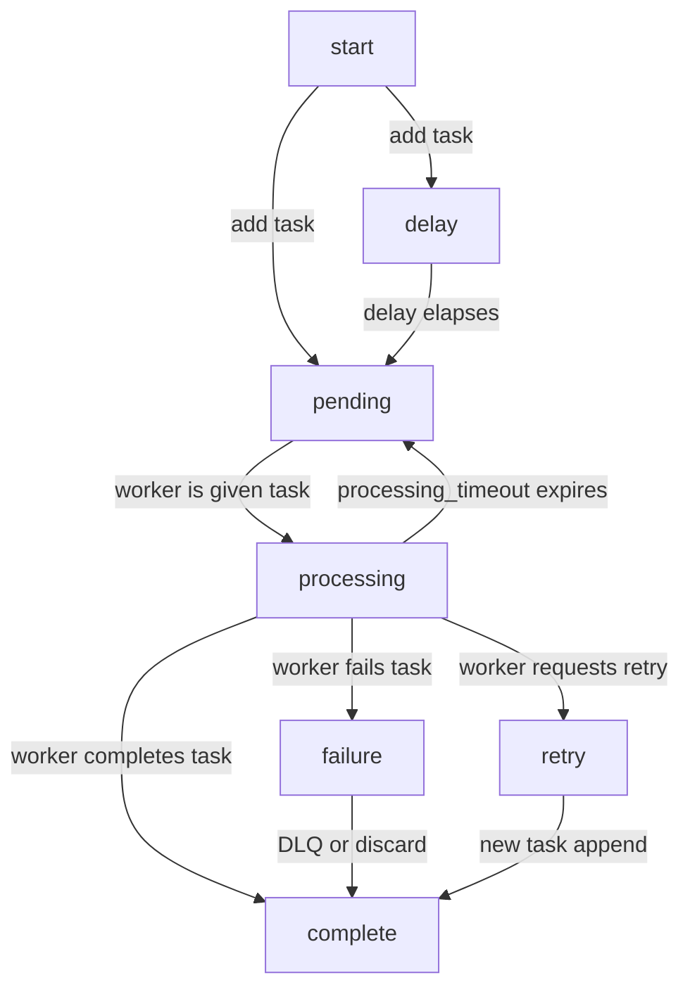
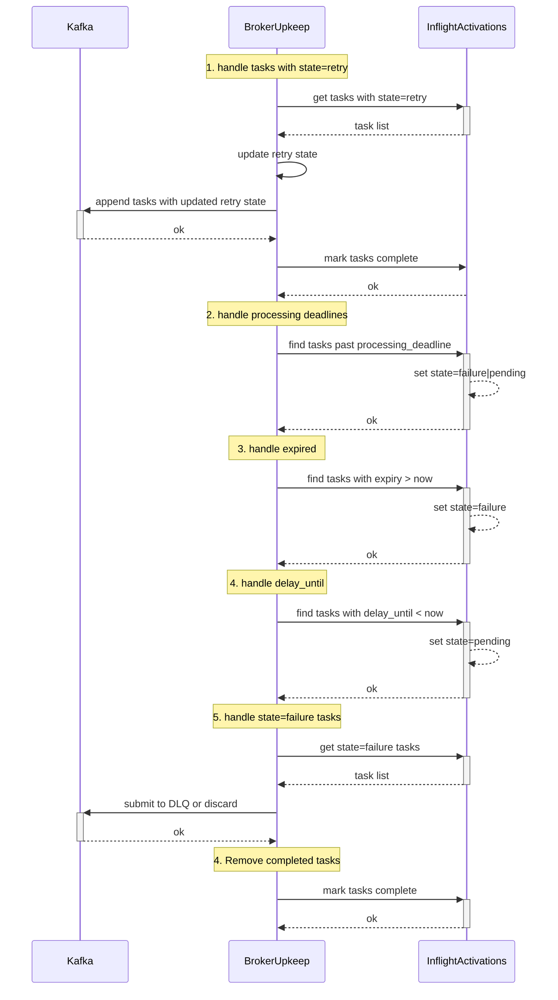
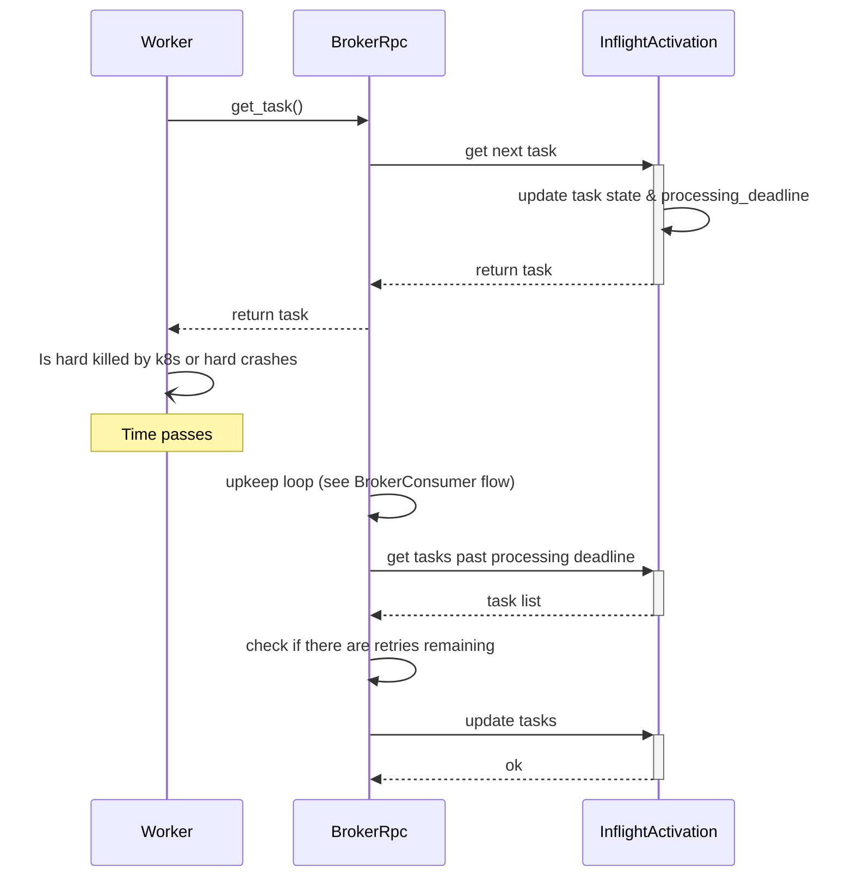

Once a `TaskActivation` is consumed by a Taskbroker, the broker creates an
`InflightActivation` that manages the state and lifecycle of an activation.

### State descriptions

- `pending` - The activation has been added to `InflightActivations` but not given to a worker.
- `delay` - The activation has a `delay` attribute set. The activation will be stored as status=delay until the activation `received_at + delay` has elapsed.
- `processing` - The activation has been assigned to a worker and we’re waiting on the worker.
- `failure` - The activation failed in the worker. The task will not be retried and the consumer can DLQ/discard the message.
- `retry` - The activation should be rescheduled on the next consumer loop.
- `complete` - The activation has all required actions complete, and can be removed from the task store.

## Advancing the state machine - Upkeep

The `BrokerUpkeep` activity periodically advances the state machines of all inflight activations. Upkeep is composed of several steps:

## Task processing deadline

When BrokerRpc provides a worker a task, the task’s `processing_deadline` is set, and the `processing_attempts` counter is incremented. Processing deadlines are calculated with the current timestamp and task’s `processing_deadline_duration` configuration. After the processing deadline has elapsed, the Broker assumes the Worker has died, or the TaskActivation had an abnormal execution time.

Workers need to enforce execution timeouts to prevent a `while True` poison-pill
task from consuming all available workers. When a worker receives a task to
process, they also receive a `processing_deadline`. The worker uses the
`processing_deadline` as a hard timeout for task execution. If a task fails to
complete by its `processing_deadline`, and the worker is still alive, the worker
is expected to update the status of the task to be `failure` or `retry`.

When a processing deadline elapses and the broker did not get a confirmed
outcome from a worker, the task’s  `status` is reset to `pending` and the
current `processing_deadline` is cleared. When a task exceeds
a `processing_deadline` no retries are consumed, as the failure could be an
infrastructure issue.

## Processing Attempts

Because tasks contain arbitrary logic, they have theoretically unbounded
execution time. We must also assume that workers will be restarted, crash or
otherwise be unable to complete all work they are given. To avoid brokers
becoming blocked by slow to process messages, or workers that are lost, inflight
tasks have deadlines for both processing - `processing_deadline`, and maximum
number of processing attempts. Once an activation has reached the broker’s
`max_processing_attempts` , the activation’s status is set to `failure` . The
activation will be discarded/deadlettered based on the activation’s retry state.

## Task completion & retries

As tasks complete `InflightActivation` state is updated and the consumer state
machine will retry, deadletter or discard tasks in subsequent upkeep run.

## Task Failures

When a worker reports a task as `failure` the `InflightActivation` state is
updated, and the Consumer will deadletter/discard the task in a future upkeep
run. Once the `failure` action has been taken, the task state is set to
`complete` for garbage collection.

## Data loss

Data loss of the `InflightActivationStore` will result in tasks not being
executed.
