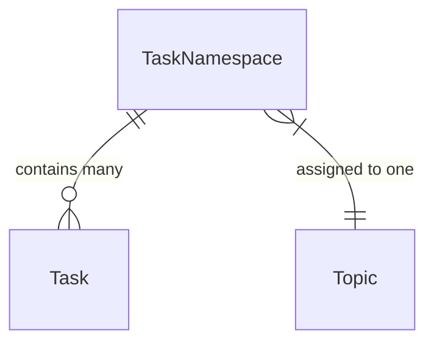
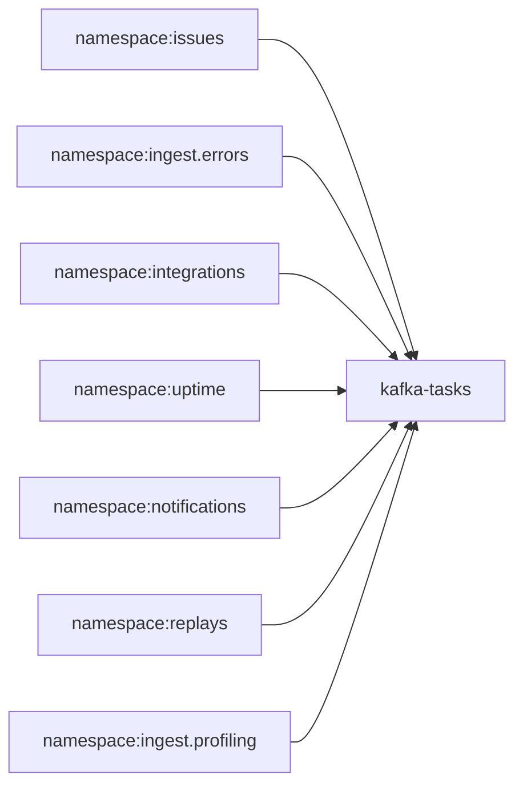
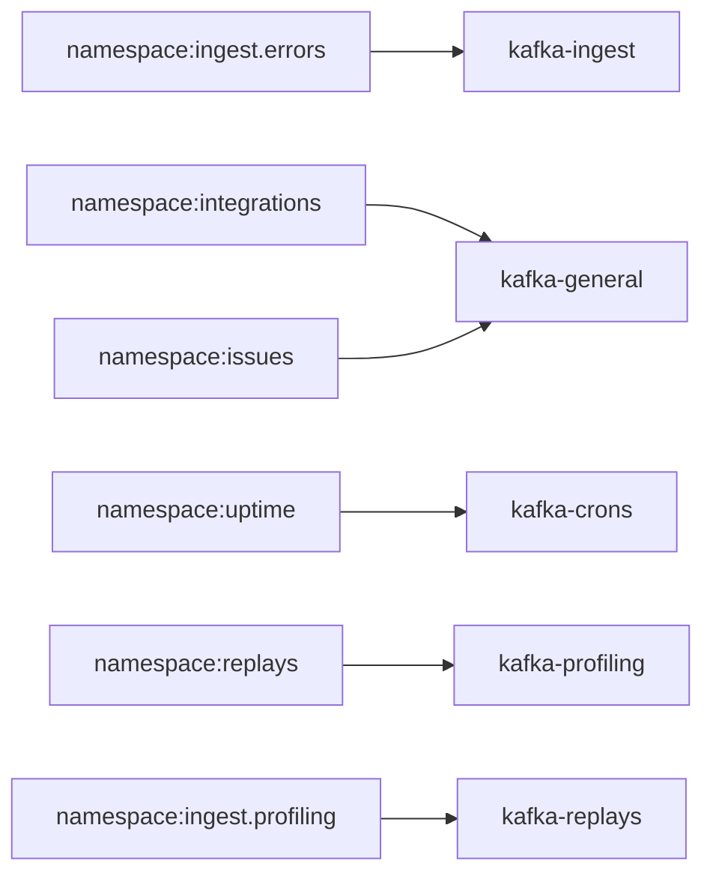
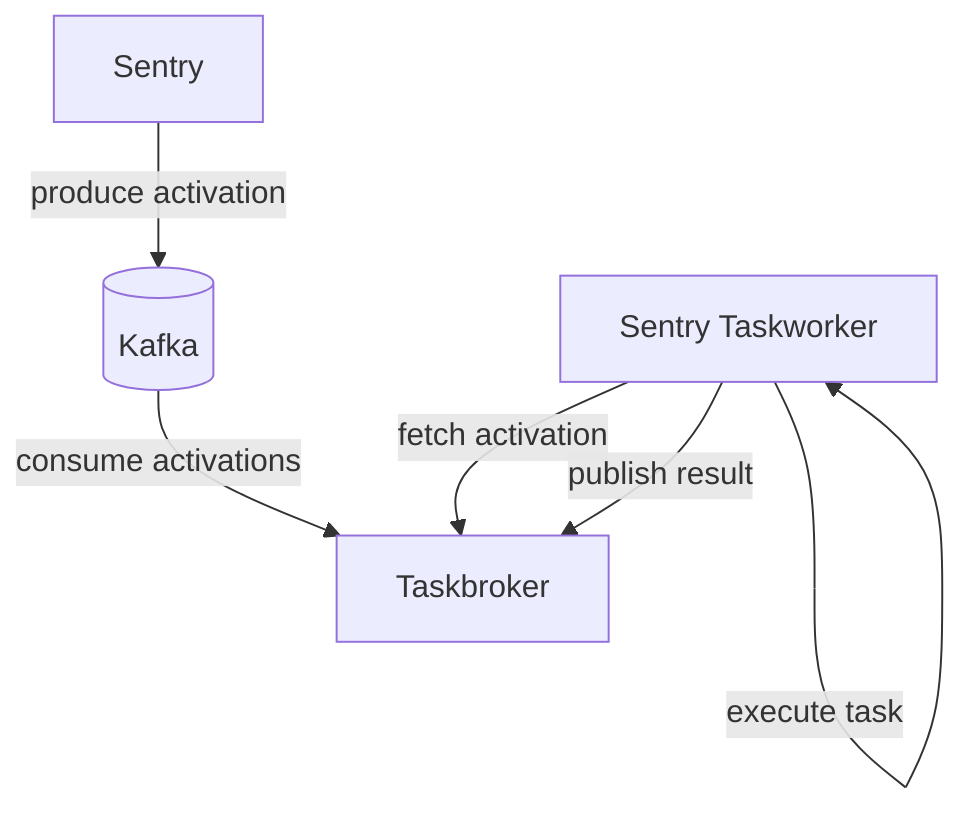

Tasks are functions that can be scheduled to run asynchronously in the future.
Tasks are defined as functions and registered into namespaces:

```python
@instrumented_task(
    name="sentry.issues.tasks.deliver_issue_webhook",
    namespace=issues_tasks,
    retry=Retry(times=3, times_exceeded=LastAction.Deadletter)
)
def deliver_issue_webhook(organization_id: int, group_id: int) -> None:
   ...
```

Once a task is defined it can be scheduled:

```python
from sentry.issues.tasks.webhooks import deliver_issue_webhook

# Schedule a task to run in the future as soon as possible
deliver_issue_webhook.delay(organization_id=org.id, issue_id=issue.id)
```

See [Defining Tasks](/backend/application-domains/tasks/#defining-tasks) for
more information on defining tasks.

## Task Namespaces

Namespaces provide logical groupings of tasks by product domain or
functionality. All task activations within a namespace are processed in order
(normal partitioning races are still possible). There are no ordering guarantees
between namespaces.

Namespaces can define defaults for retries and processing deadlines. Namespaces
provide logical separation between workloads in the application, and enable
different regions to be scaled differently.



Each namespace is mapped to a Kafka topic. All activations for a namespace are
enqueued to the same topic. While a namespace has a single topic, multiple
namespaces can share a topic.

These relations allow us to map all tasks to a single topic in local development



And map those same namespaces to multiple topics and kafka clusters in saas:



## System Components

The task framework is composed of a few components:



Client applications produce TaskActivation messages (serialized as protobuf messages) to Kafka topics. Taskbroker instances consume Kafka messages, and make activations available to workers via gRPC.

## Terminology

- `Task` A function that can be scheduled to run later. Tasks are executed by workers, and can be retried should they fail.
- `TaskNamespace` A collection of related tasks that are operated together. Activations within a namespace will be ordered, but activations between namespaces have no ordering promises.
- `TaskActivation` A deferred task invocation that can be serialized and executed later. Also referred to as an `activation` .
- `Broker` Taskbrokers consume tasks from a Kafka topic and save them to `InflightActivations`. Brokers prepare tasks for Workers, and receive work completion updates from Workers.
- `Worker` workers fetch tasks from Brokers and handle executing tasks. As tasks are executed, workers report task outcomes back to a Broker.
- `processing_pool` Used to describe a broker + worker group. Each region has multiple processing pools that handle different namespaces. Processing pools provide failure isolation boundaries from each other.
- `processing_deadline` The number of seconds that an activation result is expected by. If a broker does not receive a result by the processing deadline, the broker will assume the worker has died and will give the activation to a new worker

### Broker specific terms

- `InflightActivations` When `TaskActivations` are being processed, additional metadata is stored in the `InflightActivationStore` until execution is complete.
- `max_pending_count` The maximum number of tasks that can be pending in `InflightActivations` sqlite database.
- `max_processing_deadline` The maximum duration that tasks can be in a `processing` state. If a task is not completed within this time, Brokers assume the worker has died and the task is made `pending` again.
- `max_processing_attempts` The maximum number of times an activation can move from `pending` → `processing`.
