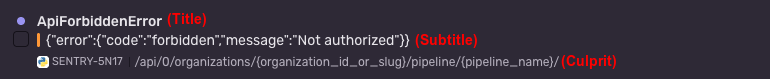

Normally, detectors handle the job of producing issue occurrences. However, there are cases where you want to produce issue occurrence programmatically. This article covers the mechanism for doing so.

## Send Payloads to the Issue Platform

If operating within the Sentry codebase, you can call <Link to="https://github.com/getsentry/sentry/blob/master/src/sentry/issues/producer.py#L41-L46">sentry.issues.produce_occurrence_to_kafka</Link> with the following optional parameters:

- `payload_type`: <Link to="#payload-type">PayloadType</Link>
- one of the following, per `payload_type`
  - `occurrence`: <Link to="https://github.com/getsentry/sentry/blob/d262bbd9d8d3a2747d5251bee35c016c13ca050a/src/sentry/issues/issue_occurrence.py#L58">IssueOccurrence</Link>
  - `status_change`: <Link to="https://github.com/getsentry/sentry/blob/7fd40bc33607e727ea2fac0183bd04f4ad298ba3/src/sentry/issues/status_change_message.py#L15">StatusChange</Link>
- `event_data`: Dict[str, Any]

If operating from an external service then pass a json payload that matches the <Link to="#issue-occurrence-schema">Issue Occurrence Schema</Link> to the `ingest-occurrences` topic on the <Link to="https://github.com/getsentry/getsentry/blob/97039335a29517a7e48149148cdd7a30a60971e7/getsentry/conf/settings/prod.py#L567-L571">issue occurrences Kafka cluster</Link>

### Payload Type

Determines the type of payload sent to the issue platform. By default, `payload_type` is set to `OCCURRENCE`.

The <Link to="https://github.com/getsentry/sentry/blob/2e5a39ff3dd4afbd33f2ff7d2ba161285107afe4/src/sentry/issues/producer.py#L23">PayloadType</Link> enum has two types:

- `OCCURRENCE`: for sending an occurrence
- `STATUS_CHANGE`: for sending a status update

### Issue Occurrence Schema

<Link to="https://github.com/getsentry/sentry/blob/ccfb37212102945df5f35e8f55fe38891b70036b/src/sentry/issues/issue_occurrence.py#L23-L36">Schema</Link>

Required:

- `id`: str. A user generated uuid in string format representing a unique id for this occurrence.
  Generally it's a good idea to generate this separately to your event id.
- `project_id`: int. Id of the project this occurred in
- `fingerprint`: Sequence[str]. Unique identifier for the root cause of this problem.
  Used for aggregating occurrences together into groups. We only make use of the first
  fingerprint for the moment - if you have a use case for additional fingerprints let the
  issue platform team know.
- `issue_title`: str. A short description of the problem. This will be used as the title
  of the issue and also used in notifications.
- `subtitle`: str: Extra detail about the issue, displayed below the `issue_title`
- `culprit`: str: Where the problem occurred. This could be an api path, a function path, etc.
  
- `evidence_data`: Mapping[str, Any]. An arbitrary map of data. The issue platform doesn't
  make use of this data directly, it just make it available for use on the frontend and in
  notifications. This can be used to customize the issue details ui, notifications and so on.
- `evidence_display`: Sequence[<Link to="#issue-evidence-schema">IssueEvidence</Link>]. A sequence of `IssueEvidence` entries. These are used to display generic information about your issue in the issue details ui and in various notifications. Even if you are customizing the ui and email, it's recommended to include this so that we can display information correctly on all our other integrations. Typically, these will be displayed in a table when space allows. For space limited integrations we'll display one row that is labelled `important` if available.
- `type`: int: The type of issue you are creating. Maps to `type_id` in your registered `GroupType`.
- `detection_time`: float. A timestamp representing when the issue was detected.
- `level`: str. Info\Warning\Error

One of:

- `event_id`: str. The event id of an existing event, typically this would be an error or transaction id.
- `event`: <Link to="#event-schema">Event</Link>

Optional:

- `resource_id`: str | None. An identifier used to link to an external system to load data.
  For example, this could be an id that we use to build a link to a specific product page.

### Issue Evidence Schema

<Link to="https://github.com/getsentry/sentry/blob/ccfb37212102945df5f35e8f55fe38891b70036b/src/sentry/issues/issue_occurrence.py#L17-L20">Schema</Link>

Required:

- `name`: str.
- `value`: str
- `important`: bool. Whether this entry contains important data to display to the user.
  One entry should be marked as important, and it will be displayed in space constrained
  integrations.

### Event Schema

<Link to="https://github.com/getsentry/sentry/blob/ccfb37212102945df5f35e8f55fe38891b70036b/src/sentry/issues/json_schemas.py#L3">Schema</Link>

The event schema should match the <Link to="/sdk/foundations/envelopes/event-payloads/">Sentry event schema</Link>. Any fields/interfaces defined here can be passed along with your event. It's best to fill in as many of these as makes sense for your issue type.

There's a minimum set of fields which should be included:

- `environment`
- `event_id`
- `platform`
- `project_id`
- `received`
- `tags` - Should be an empty dict if no tags
- `timestamp`

Caveats

- Attachments are not supported.

### Status Change Schema

If `payload_type` is set to `STATUS_CHANGE`, providing a `StatusChangeMessage` will update the status of an issue.

The `StatusChangeMessage` schema is as follows:

- `fingerprint`: unique identifier for the occurrence
- `project_id`: int.
- `new_status`: int. Uses <Link url="https://github.com/getsentry/sentry/blob/2e5a39ff3dd4afbd33f2ff7d2ba161285107afe4/src/sentry/models/group.py#L148">GroupStatus</Link> enum. We currently support the following:
  - `UNRESOLVED`
  - `RESOLVED`
  - `IGNORED`
- `new_substatus`: int | None. Uses <Link url="https://github.com/getsentry/sentry/blob/2e5a39ff3dd4afbd33f2ff7d2ba161285107afe4/src/sentry/types/group.py#L4">GroupSubStatus</Link> enum. We do not support the `NEW` substatus.

When providing the `new_status` and `new_substatus`, refer to the supported issue states and transitions <Link url="https://docs.sentry.io/product/issues/states-triage/">here</Link>.
