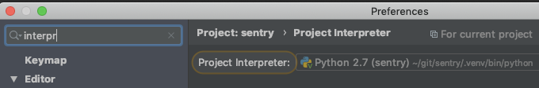
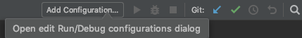
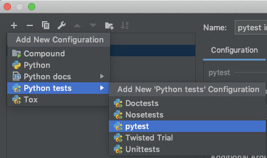
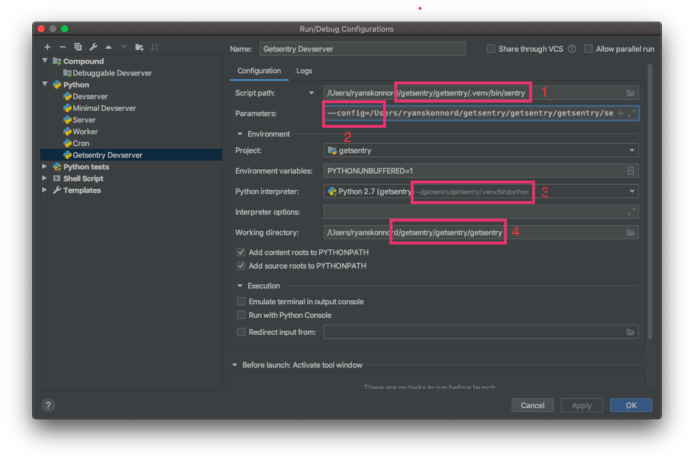
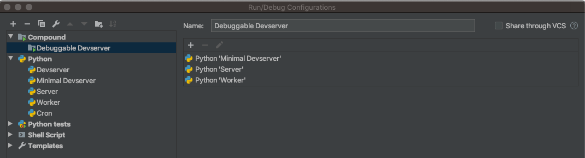
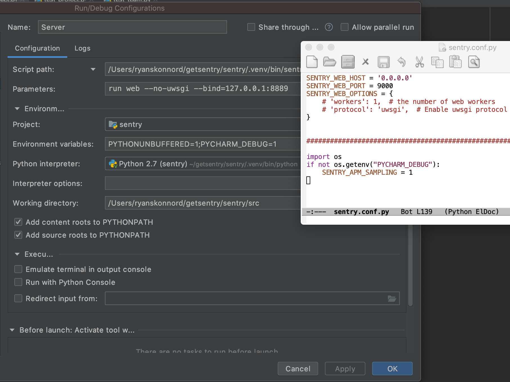
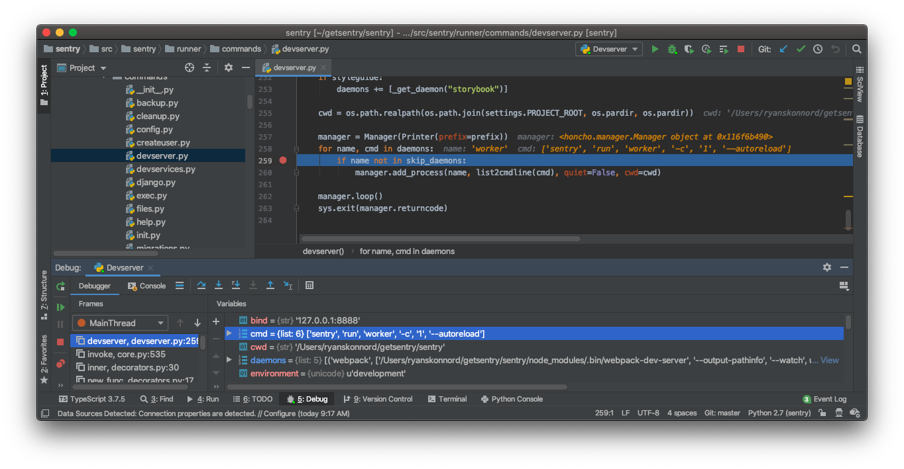

## Overview

If you use PyCharm for developing there are a few things you need to configure in order to be able to run and debug.

This document describes a few useful configurations for sentry development

## Configurations:

Python interpreter: (make sure it is the venv interpreter) e.g. `~/venv/sentry/bin/python`



To create a configuration (a run/debug configuration) just go to Run | Edit Configurations... (also available in the default toolbar).



### Test runner

Sentry uses pytest for its unit tests.

Create a pytest configuration (under Python tests)

Set Target: **Custom**

Additional Arguments: **tests/sentry**



### Dev server with everything needed

For running (not debugging) with everything set up (web, workers, cron):

- Create another Python configuration
- Script path: `<venv dir>/bin/sentry` e.g. `~/venv/sentry/bin/sentry`
- Parameters: `devserver --workers`
- Python interpreter: the venv interpreter
- Working dir: (the `src` path in your sentry installation directory ) e.g. ~/dev/sentry/src

**Note:** You will not be able to debug the web workers with this configuration (the web worker is started by invoking a uwsgi server and I couldn't find a way to attach to it).


### Getsentry dev server with everything needed

You can duplicate a Sentry devserver run configuration to run from the "getsentry" repo, with the following changes:

1. Change the script path to `getsentry/.venv/bin/sentry` within your getsentry project. (Not to be confused with `.venv/bin/getsentry`, which is a bash script.)
2. Prepend the parameters with `--config=<your path>/getsentry/getsentry/settings.py`. So the full value should look like `--config=.../settings.py devserver --workers`.
3. Change the Python interpreter to point at `.venv/bin/python` within your getsentry project. You may need to go into PyCharm's global "Preferences" window and add it as a project interpreter ("Project: sentry > Project Interpreter").
4. Change the working directory to `getsentry/getsentry`.

Note that the paths in step 2 and 4 refer to the directory named `getsentry` within the repository named `getsentry`. If the repository also has a parent directory named `getsentry` to correspond to the GitHub org name, the correct paths may contain [getsentry/getsentry/getsentry](https://en.wikipedia.org/wiki/Semantic_satiation).



### Debugging with PyCharm

The `devserver` command exists mainly to spawn daemons in separate processes, which means it is not very useful to attach a debugger to it. In order to debug the more interesting code, you will need to launch those processes yourself, in their own run configurations.

To suppress those processes from being launched by the devserver, change your devserver parameters to:

- Parameters: `devserver --workers --skip-daemons=cron,worker,server`

Then, create three additional run configurations to replace the skipped daemons. The following attributes should be the same as your original config. (You may clone it and change only the "Parameters" field.)

- Script path: `<venv dir>/bin/sentry` e.g. `~/venv/sentry/bin/sentry`
- Python interpreter: the venv interpreter
- Working dir: (the `src` path in your sentry installation directory ) e.g. `~/dev/sentry/src`

In order to debug with PyCharm you need to run the web worker with a python webserver.

#### Cron config:

- Parameters:  `run cron`

#### Worker config:

- Parameters: `run worker -c 1`

#### Web config:

Note that the `run web` command corresponds to the `server` daemon name.

- Parameters: `run web --bind=127.0.0.1:8889`

Put this into your `~/.sentry/sentry.conf.py`:

```
SENTRY_USE_UWSGI = False
```

The correct value of the `--bind` option may vary with your local environment. If you encounter errors, try running `sentry devserver` without `--skip-daemons`. Look in the console logs for a line that looks like

> `server | uwsgi socket 0 bound to TCP address 127.0.0.1:8889 fd 3`

and substitute the address as the `--bind` value.

The `SENTRY_USE_UWSGI = False` setting is necessary because, otherwise, the `SentryHTTPServer` class will spawn a [uWSGI](https://uwsgi-docs.readthedocs.io/) server in a separate process, which once again makes it impossible to attach a debugger. (Inspect `src/sentry/services/http.py` for details.)

#### Tips and troubleshooting

- The same set of modifications will work on run configs for the `getsentry` project, if you want to debug that.
- You don't need all three arguments to `--skip-daemons` if you don't want to debug all three individually. For example, you probably do not touch the `cron` component very much. If you wish, you may delete individual values from the `--skip-daemons` list and skip running those configurations.
- PyCharm's "Compound" run configuration type is useful for launching several run configurations at once. The most convenient setup is to have one "full" devserver configuration with no `--skip-daemons` option, and a "minimal" duplicate with `--skip-daemons` added. Then create a compound run config that combines your minimal devserver config with the individual configs for daemons.



- If you would like Sentry to behave differently in a debugging environment than in a regular run, you can add arbitrary environment variables and then check for them in your `.sentry/sentry.conf.py` file. For example, the screenshot below shows a setup where APM sampling is disabled while debugging (since stopping on breakpoints would pollute time measurements). Note that `PYCHARM_DEBUG` is an arbitrary name; it has no special meaning to PyCharm nor to Sentry.



- If your individually-run daemons are not working, do you have a happy devserver in the "full" configuration? If so, you can attach a debugger to `src/sentry/runner/commands/devserver.py` and manually inspect the commands that it is running. (Look for the `manager.add_process` call near the bottom.) The parameters in your run configs should generally match those commands (aside from the extra ones that need to be added to `run web`, as documented above). If they don't match, your run configs may need to be updated.


