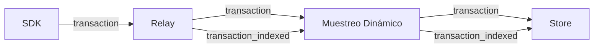
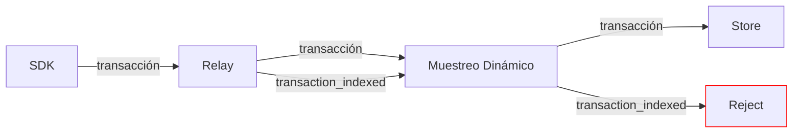

Los tipos de datos sujetos a muestreo dinámico se representan en dos categorías de resultados diferentes: “total” e “indexed”. Puedes pensar en la categoría “total” como el recuento de elementos que se almacenan de forma _agregada_, es decir, como métricas. La categoría “indexed” cuenta elementos que se almacenan individualmente.

Si un elemento se descarta _antes_ de la extracción de métricas y del muestreo dinámico, aparecerá como un resultado en ambas categorías (por ejemplo, `"transaction"` y `"transaction_indexed"`). Si un elemento se descarta _mediante_ muestreo dinámico, aparecerá como un resultado "filtered" en la categoría “indexed”, pero seguirá existiendo en forma de métricas, para las cuales emitimos un resultado "accepted" en la categoría “total”.

  ## Ilustración

Estos gráficos muestran el flujo de categorías de datos para las transacciones:

Para una transacción de ejemplo:

Para una transacción filtrada mediante muestreo dinámico:

  ## Tipos de datos

Las siguientes categorías de datos tienen una categoría correspondiente `"*_indexed"`:

* transacciones
* spans
* perfiles