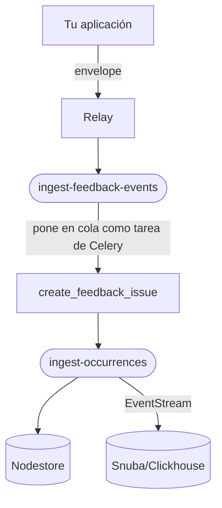
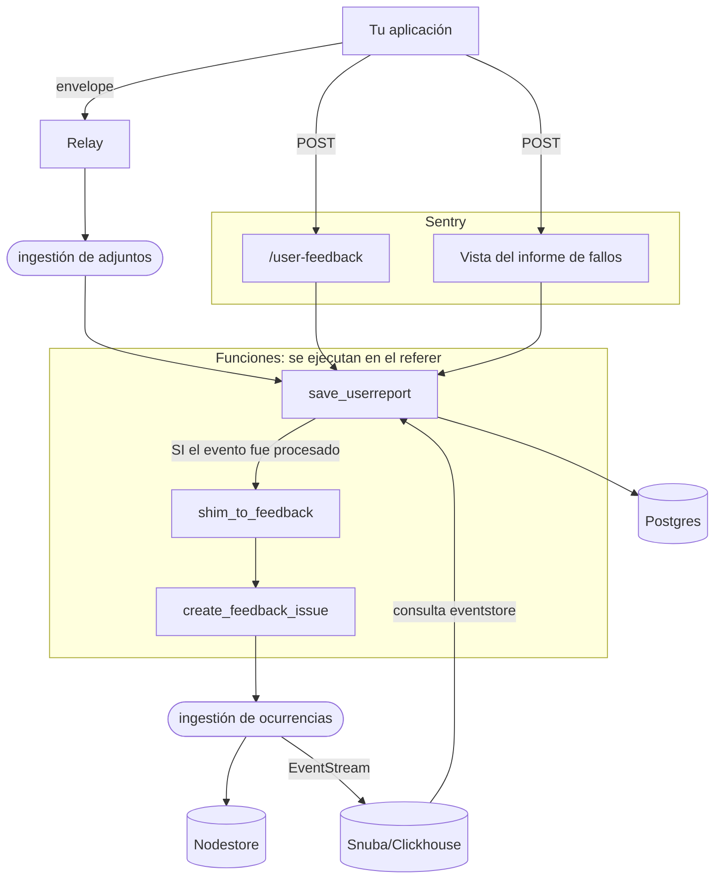
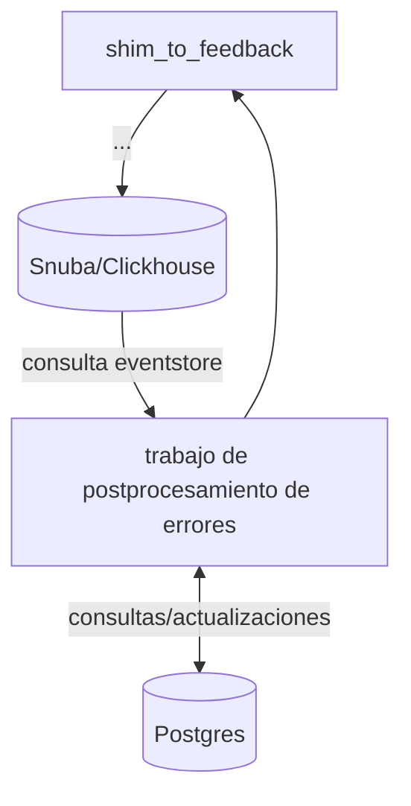
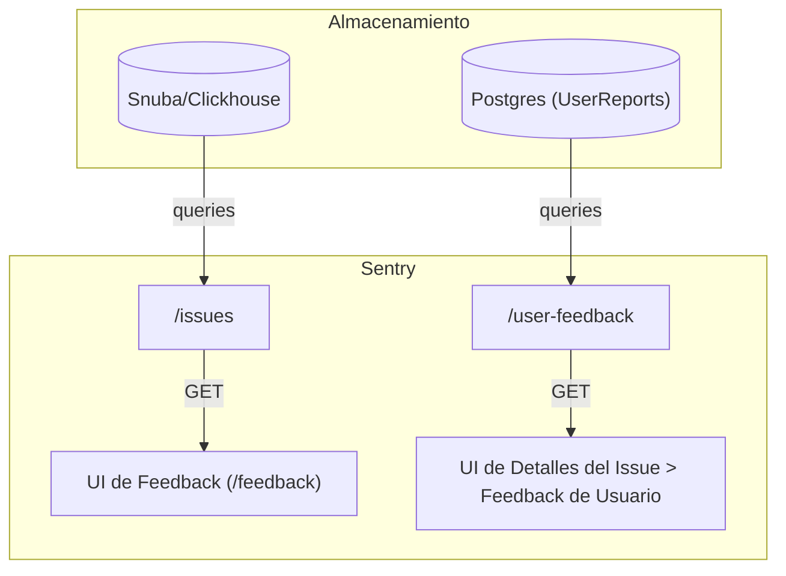

**El objetivo de este documento es ofrecer a los ingenieros una comprensión detallada del backend de Comentarios de usuario.**
Este documento:

1. describe los pipelines de ingesta relevantes, los modelos de datos y las funciones.
2. explica la diferencia entre “feedback”, “informes de usuario” e “informes de fallos”, y por qué creamos y necesitamos admitir cada uno.

<div id="creation-sources">
  ## Fuentes de creación
</div>

Al desglosarlo, hay **4** maneras de crear comentarios en nuestro sistema, de las cuales
3 comparten el mismo modelo de datos. Una buena referencia es
`FeedbackCreationSource(Enum)` en [create&#95;feedback.py](https://github.com/getsentry/sentry/blob/2b642e149c79b251e1c2f4339fc73d656347d74e/src/sentry/feedback/usecases/create_feedback.py#L33-L33).
Las 4 maneras en que los *clientes* pueden crear comentarios son:

`NEW_FEEDBACK_ENVELOPE`: [El formato nuevo](/es/sdk/data-model/envelope-items/#user-feedback) creado por el equipo de Replay al agregar
el [User Feedback Widget](https://docs.sentry.io/product/user-feedback/#user-feedback-widget)
al SDK de JavaScript. Permite añadir más información, por ejemplo, etiquetas,
release, URL, etc.

`USER_REPORT_ENVELOPE`: [El formato antiguo](/es/sdk/data-model/envelope-items/#user-report---deprecated) con nombre/correo/comentarios, que requiere
`event_id` para vincular un evento de error de Sentry.

`USER_REPORT_DJANGO_ENDPOINT`: [La API web obsoleta](https://docs.sentry.io/api/projects/submit-user-feedback/)

`CRASH_REPORT_EMBED_FORM`: El [modal de informe de fallos](https://docs.sentry.io/product/user-feedback/#crash-report-modal)

<div id="how-feedback-is-stored">
  ## Cómo se almacena el feedback
</div>

En el backend, cada envío de feedback en la interfaz de Sentry es **una ocurrencia de issue sin agrupar**,
guardada mediante la [plataforma de issues](/es/issue-platform/).
El punto de entrada es [**`create_feedback_issue()`**](https://github.com/getsentry/sentry/blob/2b642e149c79b251e1c2f4339fc73d656347d74e/src/sentry/feedback/usecases/create_feedback.py#L184-L184),
que

1. filtra feedback con mensajes vacíos o spam. Nota: **el feedback anónimo no se filtra** (faltan el nombre y/o el correo electrónico).
2. lo envía al pipeline de issues en un formato estandarizado. Para asegurarnos de que nunca se agrupe, usamos un UUID aleatorio como fingerprint.

***

<div id="feedback-events">
  ## Eventos de feedback
</div>

La forma preferida de enviar feedback desde el SDK es mediante [feedback envelope](/es/sdk/data-model/envelope-items/#user-feedback).
El formato es el mismo que el de los eventos de error, excepto que el encabezado `type` = `"feedback"`. Mientras que
los informes de usuario tienen un evento asociado, **el feedback nuevo *sí es* un evento**. Esto
ofrece dos mejoras:

1. Los usuarios pueden enviar feedback genérico sin que ocurra un error. ¡Permitimos que los usuarios detecten cosas que Sentry no puede!
2. En lugar de esperar a que el error asociado se ingiera de forma asíncrona, obtenemos acceso inmediato a contexto como el entorno, la plataforma, la repetición, el usuario, las etiquetas...

El envío del usuario se encapsula en un objeto de contexto:

```Pseudo-code
event["contexts"]["feedback"] = {
	"name": <proporcionado por el usuario>,
	"contact_email": <proporcionado por el usuario>,
	"message": <proporcionado por el usuario>,
	"url": <página web de referencia>,
	"source": <proporcionado por el desarrollador, ej: "widget">,
	"associated_event_id": <proporcionado por el desarrollador, debe ser un evento de error válido en el mismo proyecto>
}

// Todos los campos son opcionales excepto message.
// El widget puede configurarse para requerir un correo electrónico y/o nombre no vacío.
```

* Este documento se refiere al formato de carga útil (`event` en el pseudocódigo anterior) como un “**evento de feedback**”.
* El [widget](https://docs.sentry.io/platforms/javascript/user-feedback/#user-feedback-widget) de feedback, que se instala de forma predeterminada, envía estos sobres.
* API del SDK: para capturar feedback manualmente, usa `captureFeedback()`. [Ejemplo para JavaScript v8+](https://docs.sentry.io/platforms/javascript/user-feedback/#user-feedback-api). Esta función aún debe
  implementarse en la mayoría de las plataformas.
  <br />
  <br />

<div id="ingest-diagram">
  ### Diagrama de ingesta
</div>



En Relay v24.5.1, trasladamos el feedback a su propio topic de Kafka y consumidor,
`ingest-feedback-events`. Esto desacopla el riesgo y la responsabilidad de los errores
(`ingest-events`).

<br />

<div id="attachments">
  ### Archivos adjuntos
</div>

Los archivos adjuntos son otro [tipo de elemento](/es/sdk/data-model/envelopes/#attachment)
dentro de un sobre. Usamos archivos adjuntos para la función de captura de pantalla del widget.

* SDK v8.0.0+, Relay v24.5.1+: Envía los elementos de comentarios y los archivos adjuntos en el mismo sobre.
* SDK &lt; v8, todas las versiones de Relay: Envía un sobre separado para cada elemento.

**El flujo de comentarios no procesa archivos adjuntos**. Relay los envía a
un tópico y un almacenamiento separados, y la interfaz hace una solicitud independiente para obtenerlos.

***

<div id="user-reports">
  ## Informes de usuario
</div>

La forma obsoleta de enviar comentarios es como un **informe de usuario**. Es un `TypedDict` simple:

```Pseudo-code
user_report = {
	"event_id": <UUID str requerido>,
	"email": <str opcional>,
	"name": <str opcional>,
	"comments": <str opcional>,
}
```

<br />

<div id="ingest-diagram">
  ### Diagrama de ingesta
</div>



<br />

<div id="shimming-to-feedback">
  ### Intercalado a comentarios
</div>

Antes de ampliarse a comentarios genéricos, el modelo [`UserReport`](https://github.com/getsentry/sentry/blob/2b642e149c79b251e1c2f4339fc73d656347d74e/src/sentry/models/userreport.py#L9-L9)
se usó primero para informes de fallos. Por lo tanto, se requiere un ID de evento asociado y
lo usamos para establecer el entorno y el grupo antes de guardar el modelo en **Postgres**.
Solo entonces podemos adaptar el informe a un **evento de comentarios** y pasarlo a `create_feedback_issue()`.

Si el evento no ha llegado a eventstore (Snuba) en el momento de la ingesta, aun así
guardamos el informe, pero dejamos el entorno y el grupo vacíos y omitimos la creación de comentarios.

Para asegurarnos de que los informes omitidos eventualmente se corrijan y se adapten,
agregamos un trabajo de posprocesamiento al pipeline de errores: [`link_event_to_user_report()`](https://github.com/getsentry/sentry/blob/2b642e149c79b251e1c2f4339fc73d656347d74e/src/sentry/tasks/post_process.py#L1387-L1387).
Esta es la quinta forma automatizada de crear comentarios.

Diagrama simplificado:



<br />

<div id="envelopes">
  ### Sobres
</div>

Los informes de usuario también se envían a Relay en formato de sobre, con el tipo de elemento [user&#95;report](/es/sdk/data-model/envelope-items/#user-report---deprecated).

La función del SDK que los envía es `captureUserFeedback`.

<br />

<div id="django-endpoint">
  ### Endpoint de Django
</div>

Antes de que existiera nuestro servicio de ingesta de sobres (envelope), los SDK más antiguos enviaban el informe directamente mediante una solicitud POST
a Sentry, con
`/api/0/projects/{organization_id_or_slug}/{project_id_or_slug}/user-feedback/`.

Consulta [https://docs.sentry.io/api/projects/submit-user-feedback/](https://docs.sentry.io/api/projects/submit-user-feedback/).

<br />

<div id="crash-reports">
  ### Informes de fallos
</div>

El **modal de informe de fallos** aparece cuando Sentry detecta un error en la página actual y solicita a los usuarios que describan lo que ocurrió. En el backend, los datos de los informes de fallos son los mismos que los de los informes de usuario.

Puedes instalarlo como una [integración de SDK](https://docs.sentry.io/platforms/javascript/user-feedback/#crash-report-modal).

Lo implementamos como una vista de Django:

* URL: `/api/embed/error-page/`
* Clase de Python: `error_page_embed.ErrorPageEmbedView`

Los informes de fallos también se envían a feedback. La canalización es la misma que la del endpoint `/user-feedback`.

***

<div id="sentry-ui">
  ## Interfaz de Sentry
</div>



Puedes ver los informes de usuarios relacionados con un problema específico en la pestaña &quot;User Feedback&quot;
de los detalles del problema. Esto excluye los comentarios “nuevos” (cualquier cosa enviada desde el widget).

***

<div id="email-alerts">
  ## Alertas por correo electrónico
</div>

Las alertas por correo electrónico se activan en la canalización de posprocesamiento de los comentarios. (No relacionada con el diagrama de posprocesamiento anterior). Aplicamos algunos filtros específicos para comentarios, **omitiendo correos si:**

1. El comentario está [marcado como spam](https://docs.sentry.io/product/user-feedback/#spam-detection-for-user-feedback) Y la feature flag `organizations.user-feedback-spam-filter-actions` está habilitada.
2. La fuente NO es un nuevo sobre de comentarios/ni el widget, Y la opción “Crash Report Notifications” está deshabilitada.
   * en la IU: Settings &gt; Projects &gt; (project slug) &gt; User Feedback &gt; “Enable Crash Report Notifications”
   * opción del proyecto en código: `sentry:feedback_user_report_notifications`
   * valor predeterminado = true/habilitado

***

<div id="self-hosted-support">
  ## Compatibilidad autohospedada
</div>

Esta función está disponible si habilitas las siguientes flags de características.

* `organizations:user-feedback-ingest`
* `organizations:user-feedback-ui` (v25.6.2 y anteriores)
* `organizations:user-feedback-replay-clip` (desde v24.7.1 hasta v25.3.0)

Flags registradas automáticamente para la plataforma de issues, solo para versiones &lt;= v24.10.0:

* `organizations:feedback-ingest`
* `organizations:feedback-visible`
* `organizations:feedback-post-process-group`

(No podrás buscarlas con grep en el repositorio de Sentry, pero sí necesitas habilitarlas.)

Necesitas tener v24.4.2 o superior para usar la funcionalidad más reciente de User
Feedback, como agregar capturas de pantalla. Ten en cuenta también que User Feedback solo está disponible
en Sentry con todas las funciones, *no* en el modo solo errores.

***

El filtrado automático de spam actualmente no es compatible en entornos autohospedados. *Asegúrate de que
`organizations:user-feedback-spam-filter-ingest` esté en false.*

Opcionalmente, puedes habilitar `organizations:user-feedback-spam-filter-actions` para
marcar manualmente el feedback como spam.