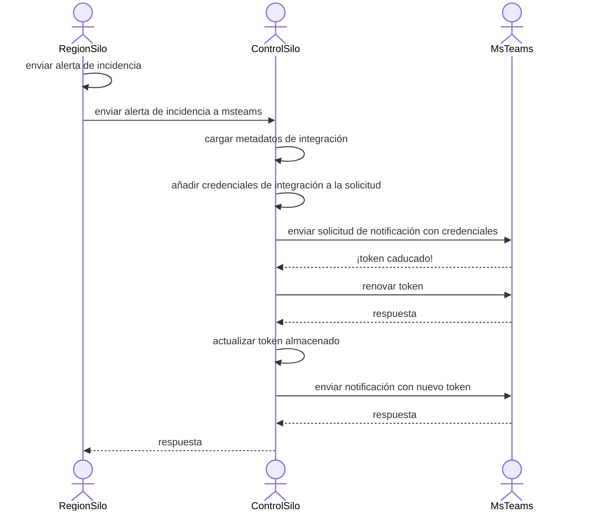
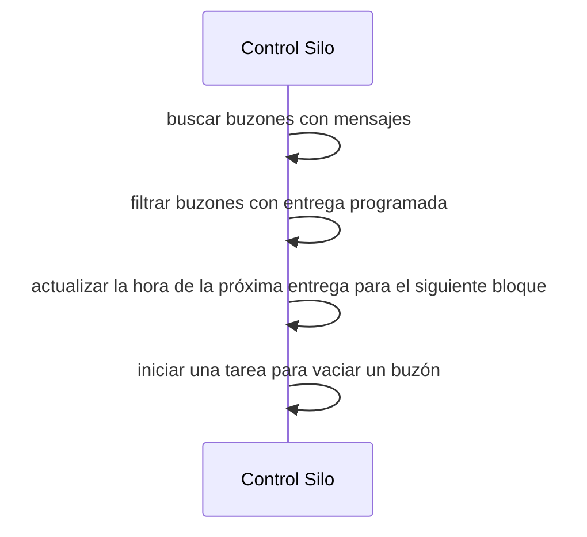
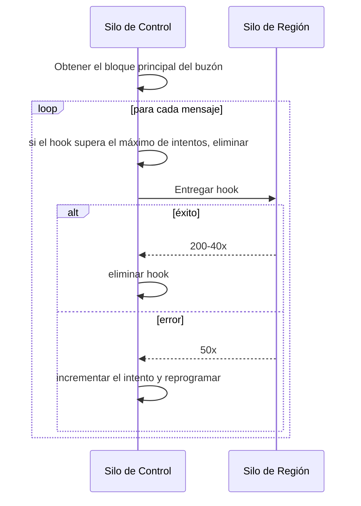

El Silo de control incluye funciones que nos permiten mantener la compatibilidad con versiones anteriores tanto para el uso de la API por parte de clientes como para las integraciones

<div id="api-gateway">
  # Puerta de enlace de API
</div>

Antes de nuestra oferta multirregión, todo el tráfico de API de los clientes se enviaba a [sentry.io](http://sentry.io). Debemos seguir admitiendo estas URL aunque algunos clientes residan en la región `us` y otros en la región `de`. La funcionalidad de la puerta de enlace de API del control silo inspeccionará las solicitudes y las reenviará a la región adecuada según los parámetros de ruta de la solicitud. Las solicitudes pueden enrutarse por:

- Slug o id de la organización
- UUID de la instalación de Sentry App
- Slug de Sentry App
- Host de DSN
- Una lista estática de nombres de URL (lista de fijación de región)

<Alert>
💡 Las solicitudes dirigidas a sentry.io no cumplen los requisitos de residencia de datos. Los clientes deberán usar dominios regionales para evitar que las solicitudes vayan a EE. UU.
</Alert>

La puerta de enlace de API se implementa como un middleware que solo actúa cuando Sentry se ejecuta como Control Silo. Tras hacer coincidir las URL, el middleware verifica el modo de silo del endpoint coincidente. Si el endpoint coincidente es un endpoint de **región**, la puerta de enlace de API intenta enrutar la solicitud a una región basándose en algunas heurísticas.

<div id="slug-id-and-uuid-based-routing">
  ### Enrutamiento basado en slug, id y UUID
</div>

Para las solicitudes que usan los parámetros `organization_slug`, `organization_id_or_slug`, `sentry_app_slug` o `uuid`, la puerta de enlace de la API puede determinar la región de la organización usando datos presentes en el silo de control. Una vez determinada la región, las solicitudes se envían mediante proxy de forma síncrona a la región correspondiente.

<div id="dsn-host">
  ### Host DSN
</div>

La página heredada de inserción de errores requiere un manejo especializado y extraemos el destino del parámetro de consulta `dsn`.

<div id="region-pin-list">
  ### Lista de pines de región
</div>

Tenemos algunos endpoints de la API que no ofrecen pistas útiles para enrutar solicitudes entre regiones. Cuando se hace una solicitud a una de estas rutas, asumimos que la intención es enviarla a la región `us`.

<div id="direct-location-header">
  ### Encabezado de ubicación directa
</div>

Cuando una solicitud es procesada por el API Gateway, la respuesta enviada al cliente incluirá el encabezado `X-Sentry-Proxy-Url`, que contiene la URL que los clientes deben usar para evitar la latencia adicional introducida por el API Gateway.

<div id="integration-credential-proxy">
  # Proxy de credenciales de integración
</div>

Las integraciones pueden compartirse entre varias organizaciones. Por ejemplo, un único espacio de trabajo de MS Teams puede conectarse a varias organizaciones, y estas pueden estar en distintas regiones. Algunas de nuestras integraciones utilizan tokens de renovación y emplean tokens de acceso de corta duración. Para evitar condiciones de carrera al actualizar cuando los tokens se invalidan y deben renovarse, enviamos las solicitudes salientes al control silo, que actúa como proxy del servicio de integración. Al canalizar todo el tráfico saliente de las integraciones que requieren tokens de renovación a través del control silo, podemos coordinar con más facilidad el reemplazo de tokens.



El proxy de integración está implementado como una clase que las integraciones que requieren tokens de actualización pueden extender. Actualmente, las siguientes integraciones usan el proxy de credenciales de integración:

* GitHub
* GitLab
* MSTeams
* Azure DevOps Services (Visual Studio Team Services)


<div id="integration-credential-proxy-headers">
  ### Encabezados del proxy de credenciales de integración
</div>

El proxy de credenciales de integración utiliza varios encabezados especializados para cumplir su función:

- `X-Sentry-Subnet-Organization-Integration` El ID de la `OrganizationIntegration` desde la cual se deben agregar las credenciales.
- `X-Sentry-Subnet-Base-Url` define el host de la integración y la URL base a la que se debe reenviar la solicitud.
- `X-Sentry-Subnet-Signature` Una firma de solicitud basada en HMAC que se verifica en el silo de control.
- `X-Sentry-Subnet-Path` La ruta que se debe usar en la solicitud reenviada.
- `X-Sentry-Subnet-Keyid` Para integraciones que usan un llavero, el ID de la clave a usar.

<div id="integration-webhook-forwarding">
  # Reenvío de webhooks de integración
</div>

Muchos de los servicios de terceros con los que nos integramos solo ofrecen un único endpoint al que envían webhooks. Como todo nuestro tráfico actual de webhooks se envía a `sentry.io`, necesitamos recibir allí las solicitudes. Para los webhooks que deben manejarse en un silo regional, almacenamos los webhooks en Postgres y luego entregamos de forma asíncrona los webhooks capturados a las regiones correspondientes.

Capturar y reproducir webhooks nos permite resolver algunos problemas de disponibilidad:

1. Muchas entregas de webhooks tienen tiempos de espera breves y requieren respuestas rápidas.
2. Las integraciones pueden ser compartidas por organizaciones en varias regiones y el reenvío síncrono corre el riesgo de exceder los tiempos de espera.
3. El reenvío síncrono de webhooks podría provocar el agotamiento de los workers de RPC.

<div id="webhook-storage">
  ### Almacenamiento de webhooks
</div>

Las cargas útiles de los webhooks se almacenan en Postgres. Estas cargas se organizan en “buzones” y los mensajes dentro de un buzón se entregan en el orden en que se reciben. Por lo general, cada buzón corresponde a una sola integración, pero para clientes con integraciones de alto volumen dividimos los mensajes en particiones más pequeñas para aumentar el rendimiento de entrega.

El modelo de almacenamiento de los webhooks es similar al de las outboxes, ya que originalmente se almacenaban dentro de ellas. Sin embargo, fue necesario separarlos en un almacenamiento independiente, porque los límites transaccionales que requieren las outboxes no son compatibles con las solicitudes de mayor duración que conlleva la entrega de webhooks.

```sql
create table hybridcloud_webhookpayload (
  id bigserial primary key,

  -- mailbox_name contendría valores como 'jira:12364'
  mailbox_name char,
  region_name char,
  schedule_for datetime,
  attempts int default 0,

  -- atributos de la carga útil
  request_method char,
  request_path char,
  request_headers text,
  request_body text,

  date_added datetime,
  index(mailbox_name),
  index(schedule_for),
)
```


<div id="high-volume-integration-mailboxes">
  ### Buzones de alto volumen para integraciones
</div>

Para los proveedores de integración con múltiples clientes de alto volumen, dividimos los mensajes en buzones más específicos. La estrategia de particionado varía según la integración, pero el objetivo es dividir los mensajes por recursos remotos de modo que todas las operaciones sobre un mismo recurso vayan al mismo buzón. Algunos ejemplos de buenas claves de particionado son los project IDs de GitLab o los issue IDs de Jira.

<div id="webhook-scheduling">
  ### Programación de webhooks
</div>

Con este modelo de almacenamiento, usamos un par de consultas en una tarea de Celery que se ejecuta cada 10 segundos para encontrar el próximo webhook en cada buzón.

```sql
-- Obtener el 'primer' mensaje de cada buzón
select min(id), mailbox_name
from sentry_webhookpayload
group by mailbox_name

-- Obtener los buzones con mensajes listos para entregar
select * from sentry_webhookpayload
where id in (...) and schedule_for < current_timestamp
```

Para cada buzón con mensajes no entregados, seleccionamos un lote de mensajes y actualizamos su próxima hora de programación para dentro de unos minutos. Esto ayuda a evitar que la siguiente tarea de programación intente volver a entregar los mismos mensajes.




<div id="webhook-delivery">
  ### Entrega de webhooks
</div>

Los webhooks programados se entregan mediante tareas de Celery. Las tareas de entrega intentan reenviar las solicitudes al silo de la región correspondiente. Si la entrega tiene éxito, el registro del payload se elimina de Postgres. Si la solicitud falla y `attempts` es menor que el número máximo de intentos (10), el mensaje se deja como está; si `attempts` es igual o superior al máximo, se emite un mensaje de log y se descarta el webhook.

Vaciar un buzón consiste en enviar tantos mensajes de un buzón dado como sea posible. Si se produce un error de red, el elemento que está al frente de la cola se reprogramará y se incrementará su contador de intentos.



Cabe destacar que la mayoría de los errores 40x se consideran entregas “correctas”. Esto se debe a que volver a intentar la entrega de un webhook que inicialmente arrojó una respuesta 40x generalmente no dará como resultado un 200.
