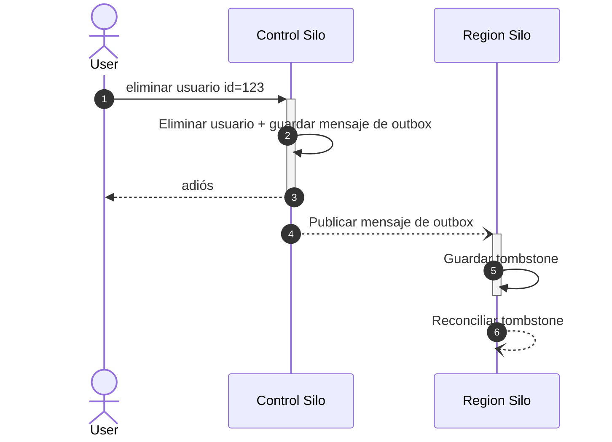

Nuestro modelo de datos incluye muchas relaciones entre los usuarios y los objetos que crean o con los que interactúan. Con el tiempo, algunos usuarios se eliminan y deben desvincularse de los registros que crearon, o bien esos registros deben eliminarse. Antes de que Sentry se convirtiera en una aplicación multirregional, dependíamos de una combinación de callbacks de Django y restricciones de Postgres para realizar eliminaciones en cascada. Sin embargo, en un entorno multirregional ya no podemos depender de esto, ya que los usuarios están en el [Control Silo](/es/architecture/#silo-modes) y muchos de los objetos con los que interactúan están en los distintos Region Silos.

<div id="hybridcloud-foreign-keys">
  ## Claves foráneas de HybridCloud
</div>

Al igual que `ForeignKey`, el campo `HybridCloudForeignKey` aporta a la aplicación una semántica relacional de eliminación en cascada. El uso de `HybridCloudForeignKey` es muy similar al del `ForeignKey` estándar:

```python
@region_silo_model
class GroupHistory(Model):
    organization = FlexibleForeignKey("sentry.Organization", db_constraint=False)
    group = FlexibleForeignKey("sentry.Group", db_constraint=False)
    project = FlexibleForeignKey("sentry.Project", db_constraint=False)
    release = FlexibleForeignKey("sentry.Release", null=True, db_constraint=False)

    user_id = HybridCloudForeignKey(settings.AUTH_USER_MODEL, null=True, on_delete="SET_NULL")
```

`HybridCloudForeignKey` admite las mismas opciones `on_delete` y `db_index` que
`FlexibleForeignKey`; sin embargo, las operaciones en cascada son **eventualmente consistentes**

<div id="tombstones">
  ## Tombstones
</div>

Rastrear la ausencia de un registro es complicado. Es mucho más sencillo rastrear la presencia de otro objeto. Cuando se elimina un recurso entre regiones (como un usuario), creamos y propagamos un marcador de lo que alguna vez existió, también conocido como un *Tombstone*. La presencia de un tombstone se usa para depurar datos que antes estaban relacionados con el registro ahora eliminado.

Los tombstones tienen algunas propiedades:

* `id` un entero monótono que aumenta a medida que se reciben nuevos tombstones.
* `table_name` La tabla a la que pertenece el tombstone.
* `object_identifier` El registro que ha sido eliminado.

Con estas propiedades podemos conciliar la eliminación de un registro con eliminaciones de datos en otra región.

<div id="tombstone-workflow">
  ### Flujo de tombstones
</div>

Las eliminaciones de usuarios, organizaciones y membresías son la forma más común de eliminaciones entre regiones que aprovechan los tombstones. Nuestra implementación de tombstones está basada en [Outboxes](/es/backend/outboxes/) para propagar los cambios de forma confiable y eventual a otras regiones.

El flujo para eliminar a un usuario es



En los pasos 5 y 6 del diagrama anterior conciliamos los cambios de tombstone con el resto de los datos de la región. Es necesario conciliar los tombstones para cada relación que tuviera el registro eliminado. Por ejemplo, eliminar a un usuario:

* Eliminará las búsquedas guardadas del usuario, los paneles y más mediante la acción `CASCADE`.
* Establecerá en NULL los campos del usuario en reglas de alerta, lanzamientos y más mediante la acción `SET NULL`.

<div id="tombstone-reconciliation">
  ### Reconciliación de tombstones
</div>

Para cada modelo que tiene un `HybridCloudForeignKey`, tenemos una cantidad arbitraria de datos que procesar. Además, debido a la consistencia eventual, es posible que recibamos nuevos registros que hagan referencia a una entidad eliminada después de que esta haya sido eliminada.

Para manejar esta consistencia eventual inherente, mantenemos un conjunto de “watermarks” para cada relación. Los watermarks pueden incrementarse por lotes y se puede avanzar en cada relación de forma aislada.

Para cada relación que la aplicación tiene con un modelo marcado como tombstone, hacemos lo siguiente:

1. Obtener el watermark actual para la relación. Un watermark consta del último registro totalmente procesado + identificador de transacción.
2. Si el tombstone actual todavía tiene filas que lo referencian, procesar otro lote de eliminaciones. Las eliminaciones pueden consistir en eliminaciones programadas en segundo plano adicionales o en consultas de actualización masiva para la acción `SET NULL`.
3. Si el tombstone actual se ha procesado por completo, avanzar el watermark del tombstone para que se procesen los siguientes.
4. Repetir los pasos 1–3 hasta que se hayan procesado todos los tombstones.

<div id="adding-new-hybridcloudforeignkey-usage">
  ### Agregar un nuevo uso de HybridCloudForeignKey
</div>

Si estás creando una relación de clave foránea con un modelo existente como `User`, no necesitas hacer nada adicional para que se apliquen las acciones de la clave foránea. Si estás creando un modelo nuevo que se usará en relaciones de `HybridCloudForeignKey`, hay varios pasos que deben completarse.

1. Agrega una nueva `OutboxCategory` para tu modelo.
2. El método `delete` de tu modelo debe guardar mensajes de la outbox en la misma
   transacción en la que se ejecuta `delete`.
3. Necesitas implementar un &quot;receptor de outbox&quot; que use `maybe_process_tombstone` para generar un registro tombstone.

Con estas tareas completadas, el sistema de tombstones podrá encadenar en cascada
operaciones de eliminación a modelos relacionados en otras regiones.

<div id="replicated-models">
  ## Modelos replicados
</div>

Los modelos replicados permiten leer los modelos localmente en todas las regiones donde se usan. Aunque las lecturas pueden realizarse en cualquier región, las escrituras deben hacerse en la región “propietaria”. Los modelos replicados añaden complejidad y carga operativa, por lo que deben usarse con moderación. Son adecuados para:

* Registros con alto volumen de lecturas
* Operaciones de lectura en las que la sobrecarga de RPC provocaría un impacto de rendimiento inaceptable
* Registros donde podemos aceptar la **consistencia eventual** y no se requieren semánticas de “lectura tras escritura”

Los modelos replicados se basan en [outboxes](/es/backend/outboxes/) y usan outboxes para propagar cambios de estado desde la región propietaria a las regiones interesadas en dichos cambios. Para los recursos con alcance de organización, a menudo esto se limita a la región en la que se encuentra la organización. Para los recursos con alcance de usuario, generalmente se trata de las regiones en las que el usuario tiene membresía.

<div id="adding-a-new-replicated-model">
  ### Agregar un nuevo modelo replicado
</div>

Agregar un modelo replicado requiere varios cambios en el modelo &quot;source&quot; y la creación de un modelo &quot;replica&quot;. El proceso general para agregar un modelo replicado es:

1. Define el modelo &quot;replica&quot;. Este modelo debe tener un esquema igual o similar al del modelo source. Procura conservar el id del modelo source como un campo independiente en el esquema para poder realizar actualizaciones y eliminaciones en los datos replicados.
2. Agrega un nuevo `OutboxCategory` para las actualizaciones del modelo y añade esa `category` a la clase del modelo.
3. Agrega una subclase de RpcModel para tu modelo. El RpcModel se usa para serializar el estado entre regiones.
4. Agrega un nuevo método RPC a `region_replica_service` o `control_replica_service` para manejar la replicación de tu modelo. Tu método RPC de replicación debe aceptar tu `RpcModel` como parámetro y actualizar el modelo réplica de forma idempotente.
5. Actualiza el modelo source para heredar de `ReplicatedControlModel` o `ReplicatedRegionModel`. Elige una clase base según el modo de silo del modelo &quot;source&quot;.
6. Implementa los métodos `payload_for_update`, `outboxes_for_update`, `handle_async_replication` y `handle_async_deletion` según sea necesario.

Para un ejemplo existente de modelos replicados, consulta `OrgAuthToken` y `OrgAuthTokenReplica`.

<div id="backfilling-replicated-models">
  ### Rellenado retroactivo de modelos replicados
</div>

Después de crear un modelo replicado y poner en marcha la replicación, necesitarás una manera de rellenar retroactivamente todos los registros existentes desde la región de origen hacia las regiones donde hay réplicas. El sistema de modelos replicados incluye herramientas para ejecutar estos rellenados y volver a ejecutarlos a medida que el esquema evoluciona. Internamente, los rellenados de réplicas se realizan generando y procesando mensajes de outbox para cada registro que deba replicarse.

Antes de poder realizar rellenados en un modelo replicado, es necesario hacer lo siguiente:

1. Define una opción siguiendo el patrón `outbox_replication.{table_name}.replication_version` en `sentry/hybridcloud/options.py`. Establece el valor predeterminado en `0`.
2. Establece la opción que creaste en el paso 1 al valor predeterminado con options-automator.

Con estos pasos completados, ya puedes comenzar un rellenado. Los rellenados se controlan incrementando el valor de la opción hasta que sea igual a `replication_version` definido en la clase del modelo. De forma predeterminada, `replication_version` se establece en `1`. Los rellenados avanzarán de manera incremental en lotes, para no sobrecargar la entrega del outbox.

<div id="running-backfills-as-schema-evolves">
  ### Ejecutar backfills a medida que evoluciona el esquema
</div>

A medida que el esquema de tu modelo y su réplica evolucionan, es posible que necesites volver a ejecutar
backfills para sincronizar el estado sin tener que esperar a que el usuario realice alguna acción.

1. Incrementa el atributo `replication_version` en el modelo &#39;source&#39;.
2. Actualiza el valor correspondiente de la opción `outbox_replication` para iniciar otro
   backfill.