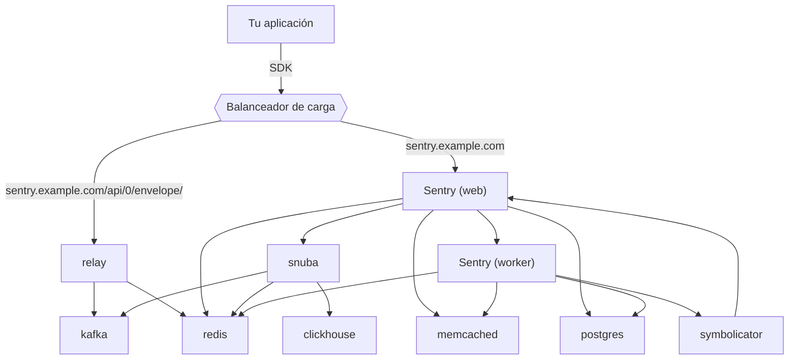
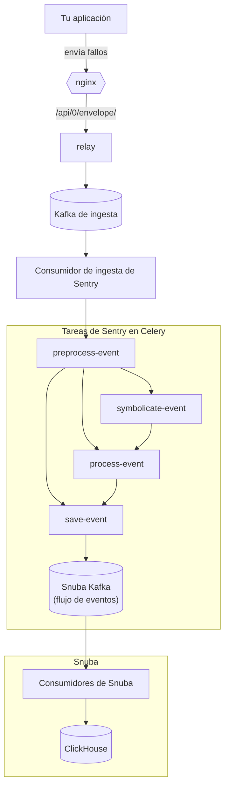
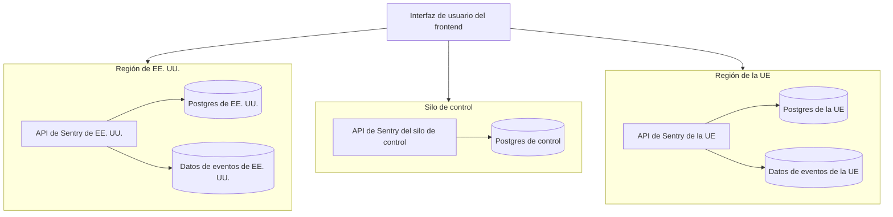

  ## Descripción general de alto nivel

Las aristas representan las dependencias entre servicios.

  ## Canalización de eventos

Cómo se guarda un evento. Las aristas representan el flujo de datos a través del sistema.

Este gráfico está muy simplificado, en gran parte debido a limitaciones de diseño. Falta en este gráfico:

* Cómo Relay obtiene las configuraciones del proyecto. Respuesta: desde sentry-web
* Cómo Relay almacena en caché las configuraciones del proyecto. Respuesta: en memoria y en Redis
* Cómo Relay cuenta los eventos y lleva el seguimiento de las cuotas. Respuesta: más Redis
* Symbolicator como servicio auxiliar para symbolicate-event
* Cómo se activan las alertas. Respuesta: postprocess-event, una tarea de Celery responsable de las alertas (generada por un consumidor de Kafka en Sentry que lee de eventstream)
* Posiblemente más

Para más información, consulta [Path of an event through Relay](https://getsentry.github.io/relay/relay_server/index.html#path-of-an-event-through-relay) y [Event Ingestion Pipeline](https://getsentry.github.io/event-ingestion-graph/).

  ## Multirregión

La oferta SaaS de Sentry es una implementación multirregional de Sentry, basada en el mismo código fuente que las implementaciones autogestionadas y de arrendatario único.

  ### Los objetivos y las restricciones de nuestro diseño multirregional

Nuestra arquitectura multirregional estuvo guiada por varios objetivos de diseño. Varios de estos aún no se han implementado, pero podrían hacerlo en el futuro sin requerir una reestructuración extensa.

Los objetivos de diseño de alto nivel fueron:

* Crear una solución que permitiera muchas regiones aisladas. Las regiones aisladas son importantes porque nos permiten abordar los requisitos de residencia de datos en la UE y en otras regiones en el futuro, a medida que esos requisitos cobren relevancia. Las regiones pueden contener desde un solo inquilino (tenant) hasta cientos de miles. Las regiones pueden escalarse de manera independiente entre sí.
* Nuestra solución debería ofrecer la posibilidad de que los clientes proporcionen su propio hardware para una región en el futuro.
* Crear una solución que permita que los inquilinos únicos (single-tenant) se integren con el SaaS para ayudar a reducir la carga operativa y aumentar nuestra capacidad de entregar actualizaciones a los inquilinos únicos.
* Nuestra solución necesitaría “escalar hacia abajo” para entornos autogestionados y de desarrollo. Debería ofrecer la misma funcionalidad en todos los entornos de despliegue.

Además de los objetivos, teníamos varias restricciones:

* Los clientes de SaaS seguirán iniciando sesión y registrándose en `sentry.io`. No necesitarán iniciar sesión en cada organización de forma individual.
* No se debería exigir a los clientes de SaaS existentes que actualicen sus valores de DSN. Si un cliente migra a una nueva región, no hay problema en que también necesite actualizar sus DSN.
* En general, no se debería requerir cambiar las URL de la API. Los clientes existentes pueden usar URL del estilo `region.sentry.io` para mejorar la latencia y garantizar que se cumplan los requisitos de residencia de datos, pero no es obligatorio. Es posible que los clientes en nuevas regiones deban usar URL del estilo `region.sentry.io`.
* Una sola organización de Sentry tiene todos sus datos ubicados dentro de una sola región de almacenamiento. Este requisito proviene de la necesidad de realizar operaciones entre proyectos en los planes Business.
* La solución debería admitir ~1000 regiones. Si bien estos valores son mayores de lo que probablemente usaremos, sirven como una útil prueba de estrés para la solución.

  ### Modos de silo

Para ofrecer a los clientes residencia de datos, necesitábamos ubicar en el mismo lugar la mayor parte de los datos de una organización. Los datos que nuestros clientes recopilan y envían a Sentry deben ubicarse dentro de la región elegida por el cliente. Si bien los eventos de los clientes deben almacenarse en la región preferida, también hay datos en Sentry que se comparten entre organizaciones y, por lo tanto, entre regiones. Estos datos deben almacenarse de forma centralizada fuera de cualquier región.

Estas restricciones nos llevaron a diseñar múltiples «modos de silo».

<Alert>
  ☝ El término «silo» se eligió porque otros términos aplicables (región, zona, partición, clúster) ya están en uso.
</Alert>

Nuestra arquitectura incluye dos modos de silo:

1. **Control Silo** Contiene todos los datos y servicios compartidos globalmente. Estos datos se comparten entre organizaciones y, por lo tanto, entre regiones.
2. **Region Silo** Los silos de región contienen datos de las organizaciones. Cada región tiene una infraestructura independiente y alberga al menos una organización.

Además de los modos en silo, también existe un modo **Monolith**. En el modo monolítico se puede acceder tanto al modo de control como al modo de silo de región. Los modelos, endpoints y tareas son conscientes del silo y, si se utiliza un recurso con silo en el contexto de un silo incorrecto, se genera un error.

  ### Arquitectura multirregional

Cada silo regional puede escalarse de forma independiente y está aislado de otras regiones. En cada región hay infraestructura y aplicaciones separadas y dedicadas, como se detalla en la [visión general de la aplicación](/es/architecture/#high-level-overview).

  ### Configuración de Silo

Los modos de Silo se definen como variables de entorno (y ajustes de Django). Los ajustes relevantes son:

* `SILO_MODE` puede ser `CONTROL`, `REGION`, `MONOLITH` o `None`.
* `SENTRY_REGION` El nombre de la región en la que se encuentra la aplicación (p. ej., `us` o `de`) o `None`.
* `SENTRY_REGION_CONFIG` Una lista de regiones que tiene la aplicación. Esta lista define nombres, URL y la categoría (multirregión, single-tenant) bajo la cual opera una región.
* `SENTRY_MONOLITH_REGION` El nombre de la región del antiguo ‘monolith’. Para [sentry.io](http://sentry.io) esta es la región `us`. La región monolith tiene un comportamiento especial necesario para la compatibilidad con versiones anteriores.