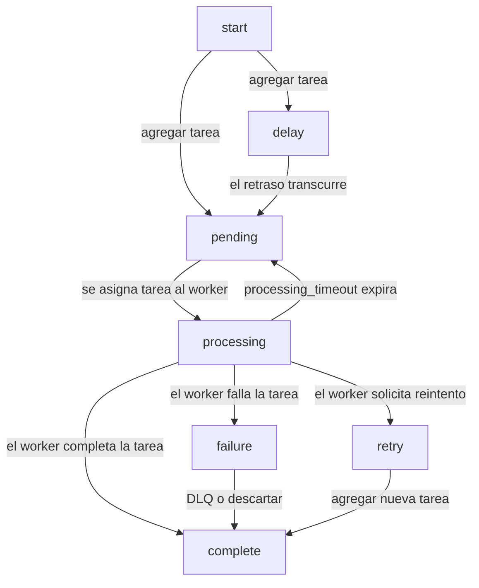
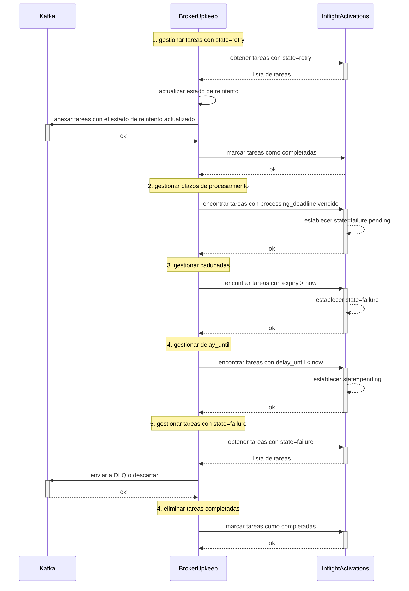
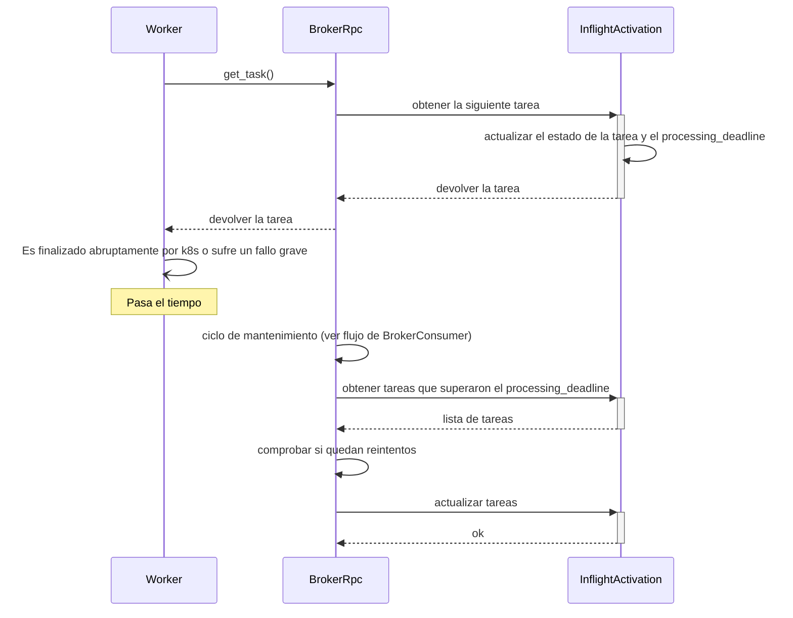

Una vez que un `TaskActivation` es consumido por un Taskbroker, el broker crea un
`InflightActivation` que gestiona el estado y el ciclo de vida de la activación.

  ### Descripciones de estado

- `pending` - La activación se ha agregado a `InflightActivations`, pero aún no se ha asignado a un worker.
- `delay` - La activación tiene un atributo `delay` establecido. La activación se almacenará con status=delay hasta que se cumpla `received_at + delay`.
- `processing` - La activación se ha asignado a un worker y estamos esperando al worker.
- `failure` - La activación falló en el worker. La tarea no se reintentará y el consumidor puede enviar el mensaje a la DLQ o descartarlo.
- `retry` - La activación debe reprogramarse en el siguiente ciclo del consumidor.
- `complete` - La activación tiene todas las acciones requeridas completadas y puede eliminarse del almacén de tareas.

  ## Avanzar la máquina de estados - Mantenimiento

La actividad `BrokerUpkeep` avanza periódicamente las máquinas de estados de todas las activaciones en curso. El mantenimiento consta de varios pasos:

  ## Fecha límite de procesamiento de la tarea

Cuando BrokerRpc asigna una tarea a un trabajador, se establece el `processing_deadline` de la tarea y se incrementa el contador `processing_attempts`. Las fechas límite de procesamiento se calculan usando la marca de tiempo actual y la configuración `processing_deadline_duration` de la tarea. Una vez que vence la fecha límite de procesamiento, el Broker asume que el Worker ha muerto o que el TaskActivation tuvo un tiempo de ejecución anormal.

Los workers deben aplicar límites de tiempo de ejecución para evitar que una tarea “pastilla venenosa” del tipo `while True` consuma todos los workers disponibles. Cuando un worker recibe una tarea para procesar, también recibe un `processing_deadline`. El worker usa el `processing_deadline` como un límite de tiempo estricto para la ejecución de la tarea. Si una tarea no se completa antes de su `processing_deadline`, y el worker sigue activo, se espera que el worker actualice el estado de la tarea a `failure` o `retry`.

Cuando vence un plazo de procesamiento y el broker no obtuvo un resultado confirmado de un worker, el `status` de la tarea se restablece a `pending` y el `processing_deadline` actual se borra. Cuando una tarea excede un `processing_deadline` no se consumen reintentos, ya que la falla podría deberse a un problema de infraestructura.

  ## Intentos de procesamiento

Dado que las tareas pueden contener lógica arbitraria, su tiempo de ejecución es teóricamente ilimitado. También debemos asumir que los workers se reiniciarán, fallarán o, de otro modo, no podrán completar todo el trabajo asignado. Para evitar que los brokers se bloqueen por mensajes lentos de procesar o por workers perdidos, las tareas en curso tienen plazos tanto para el procesamiento (`processing_deadline`) como un número máximo de intentos de procesamiento. Una vez que una activación alcanza el `max_processing_attempts` del broker, su estado se establece en `failure`. La activación se descartará o enviará a dead letter según su estado de reintento.

  ## Finalización de tareas y reintentos

A medida que las tareas se completan, el estado `InflightActivation` se actualiza y la máquina de estados del consumidor volverá a intentar, enviará a la cola de dead-letter o descartará tareas en la siguiente ejecución de mantenimiento.

  ## Fallos de tareas

Cuando un worker reporta una tarea como `failure`, se actualiza el estado de `InflightActivation`, y el consumidor enviará la tarea a la cola de mensajes no entregables o la descartará en una futura ejecución de mantenimiento. Una vez que se ha realizado la acción `failure`, el estado de la tarea se establece en `complete` para su recolección por el garbage collector.

  ## Pérdida de datos

La pérdida de datos en `InflightActivationStore` provocará que las tareas no se ejecuten.