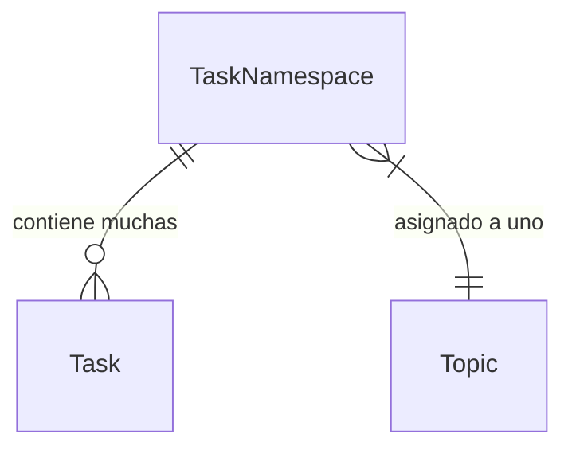
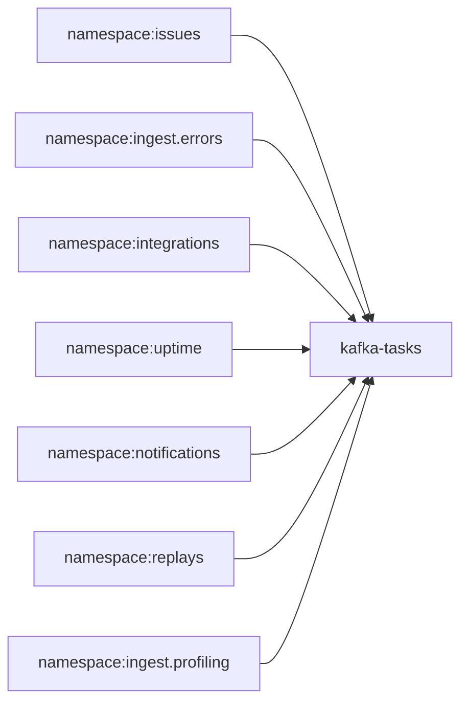
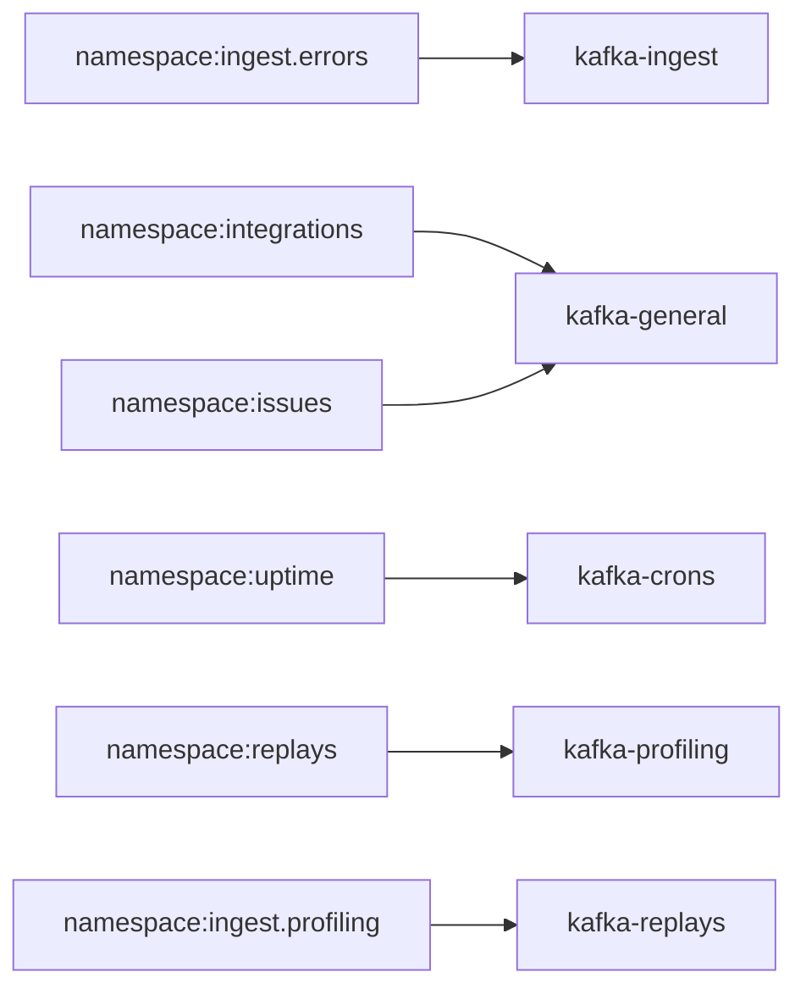
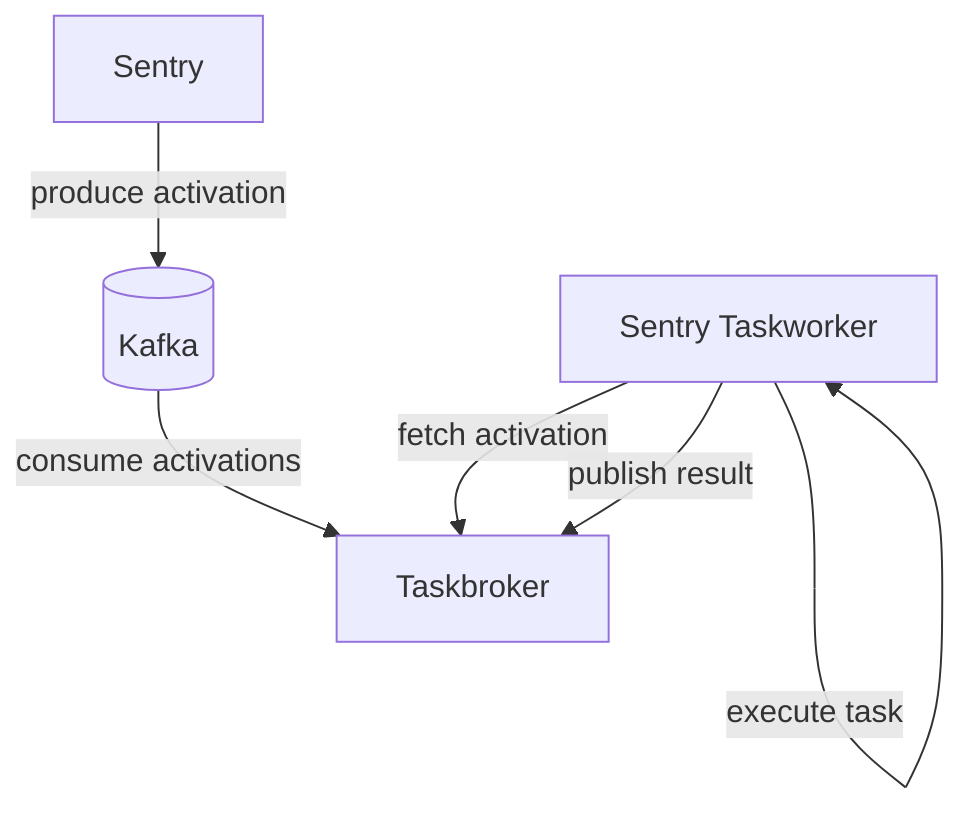

Las tareas son funciones que pueden programarse para ejecutarse de forma asíncrona en el futuro.
Las tareas se definen como funciones y se registran en espacios de nombres:

```python
@instrumented_task(
    name="sentry.issues.tasks.deliver_issue_webhook",
    namespace=issues_tasks,
    retry=Retry(times=3, times_exceeded=LastAction.Deadletter)
)
def deliver_issue_webhook(organization_id: int, group_id: int) -> None:
   ...
```

Una vez definida una tarea, se puede programar:

```python
from sentry.issues.tasks.webhooks import deliver_issue_webhook

# Programar una tarea para ejecutarse en el futuro, tan pronto como sea posible
deliver_issue_webhook.delay(organization_id=org.id, issue_id=issue.id)
```

Consulta [Defining Tasks](/es/backend/application-domains/tasks/#defining-tasks) para
obtener más información sobre cómo definir tareas.

<div id="task-namespaces">
  ## Espacios de nombres de tareas
</div>

Los espacios de nombres agrupan lógicamente las tareas por dominio de producto o por funcionalidad. Todas las activaciones de tareas dentro de un espacio de nombres se procesan en orden (aun así pueden producirse condiciones de carrera con la partición normal). No hay garantías de orden entre espacios de nombres.

Los espacios de nombres pueden definir valores predeterminados para reintentos y plazos de procesamiento. Los espacios de nombres proporcionan una separación lógica entre las cargas de trabajo de la aplicación y permiten escalar regiones diferentes de forma independiente.



Cada espacio de nombres se asigna a un tópico de Kafka. Todas las activaciones de un espacio de nombres se
ponen en cola en el mismo tópico. Aunque un espacio de nombres tenga un único tópico, varios
espacios de nombres pueden compartirlo.

Estas relaciones nos permiten asignar todas las tareas a un único tópico en el entorno de desarrollo local



Y asigna esos mismos namespaces a varios topics y clústeres de Kafka en SaaS:



<div id="system-components">
  ## Componentes del sistema
</div>

El framework de tareas está compuesto por algunos componentes:



Las aplicaciones cliente publican mensajes de TaskActivation (serializados como mensajes protobuf) en tópicos de Kafka. Las instancias de Taskbroker consumen mensajes de Kafka y ponen las activaciones a disposición de los workers mediante gRPC.

<div id="terminology">
  ## Terminología
</div>

* `Task` Función que puede programarse para ejecutarse más tarde. Las tareas las ejecutan los workers y pueden reintentarse si fallan.
* `TaskNamespace` Conjunto de tareas relacionadas que se operan en conjunto. Las activaciones dentro de un namespace estarán ordenadas, pero entre namespaces no hay garantías de orden.
* `TaskActivation` Invocación de tarea diferida que puede serializarse y ejecutarse más tarde. También se denomina una `activation`.
* `Broker` Los Taskbrokers consumen tareas de un tópico de Kafka y las guardan en `InflightActivations`. Los Brokers preparan tareas para los Workers y reciben actualizaciones de finalización de trabajo de los Workers.
* `Worker` Los workers obtienen tareas de los Brokers y se encargan de ejecutarlas. A medida que se ejecutan las tareas, los workers informan los resultados de las tareas a un Broker.
* `processing_pool` Se utiliza para describir un grupo broker + worker. Cada región tiene múltiples processing pools que manejan diferentes namespaces. Los processing pools proporcionan límites de aislamiento ante fallos entre sí.
* `processing_deadline` Cantidad de segundos en que se espera el resultado de una activación. Si un broker no recibe un resultado antes de la processing deadline, asumirá que el worker ha fallado y entregará la activación a un nuevo worker.

<div id="broker-specific-terms">
  ### Términos específicos del broker
</div>

* `InflightActivations` Cuando se procesan las `TaskActivations`, se almacenan metadatos adicionales en `InflightActivationStore` hasta que finaliza la ejecución.
* `max_pending_count` El número máximo de tareas que pueden estar pendientes en la base de datos SQLite de `InflightActivations`.
* `max_processing_deadline` El tiempo máximo que las tareas pueden estar en estado `processing`. Si una tarea no se completa dentro de este plazo, los brokers asumen que el worker ha fallado y la tarea vuelve a `pending`.
* `max_processing_attempts` El número máximo de veces que una activación puede pasar de `pending` a `processing`.