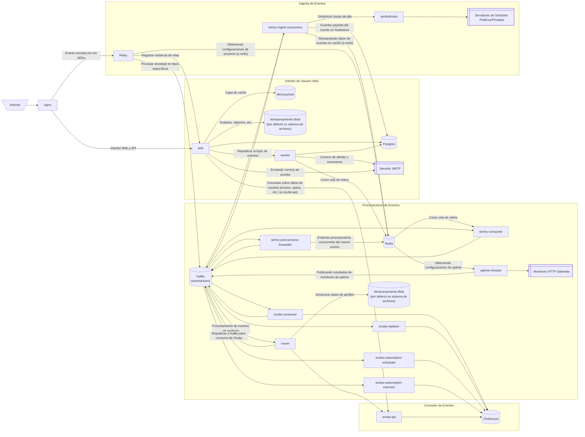

Este diagrama muestra el flujo de datos de Sentry autohospedado. Es similar a [Arquitectura de la aplicación](/es/application-architecture/overview/), pero nos centramos más en los componentes autohospedados.

  ### Canalización de ingesta de eventos

1. Los eventos del SDK se envían al servicio `relay`.
2. Relay analiza el sobre entrante, verifica si el DSN y el ID de proyecto son válidos y lee la configuración del proyecto desde `redis`.
3. Relay construye una nueva carga útil para que la consuman los consumidores de ingesta de Sentry y la envía a `kafka`.
4. Los consumidores de Sentry `ingest-*` (donde `*` [comodín] representa el tipo de evento [errores, transacciones, perfiles, etc.]) consumen el evento, lo almacenan en caché en `redis` y inician la tarea `preprocess_event`.
5. La tarea `preprocess_event` simbólica las trazas de pila con el servicio `symbolicator` y procesa el evento según su tipo.
6. La tarea `preprocess_event` guarda la carga útil del evento en nodestore (el backend predeterminado de nodestore es `postgres`).
7. La tarea `preprocess_event` publica el evento en `kafka` bajo el tema `events`.

  ### Canal de procesamiento de eventos

1. El servicio `snuba-consumer` consume eventos del tópico `events` y los procesa. Después de que los eventos se escriben en ClickHouse, Snuba publica eventos de error y de transacción en `post-process-forwarder`.
2. El consumidor `post-process-forwarder` de Sentry consume mensajes y lanza una tarea `post_process_group` por cada error e incidencia procesados.

  ### Interfaz de usuario web

1. El servicio `web` es lo que ves: la interfaz y API web de Django que provee el frontend de Sentry.
2. El servicio `worker` consume principalmente tareas de `redis`, que actúa como una cola de Celery. Una tarea destacada es el envío de correos electrónicos a través del servidor SMTP.