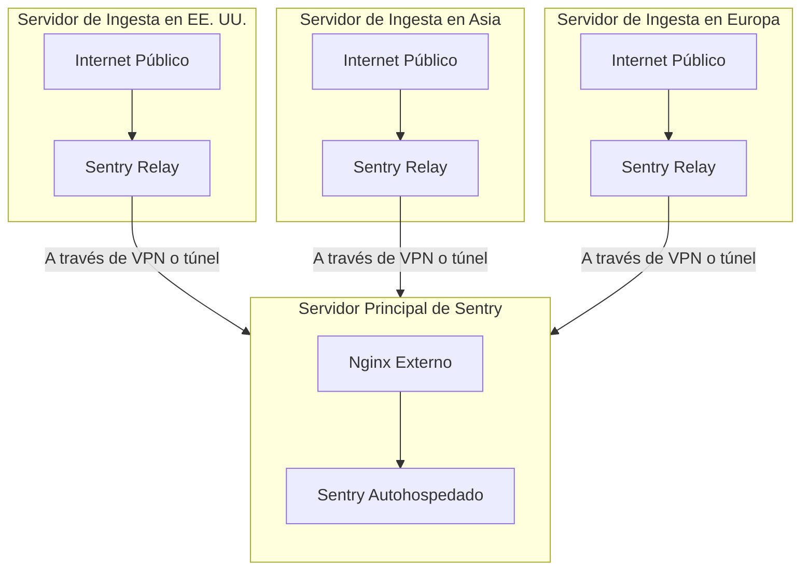

Además de contar con un [dominio separado](/es/self-hosted/experimental/reverse-proxy/#expose-only-ingest-endpoint-publicly) para ver la interfaz web y realizar la ingesta de datos, puedes implementar un servidor dedicado para la ingesta que reenvíe la información a tu servidor principal. Esta configuración se recomienda para instalaciones de alto tráfico y entornos con múltiples centros de datos.

Esta arquitectura ayuda a mitigar ataques DDoS al distribuir la ingesta entre múltiples endpoints, mientras que tu instancia principal de Sentry con la interfaz web debería estar protegida en una red privada (accesible por VPN). Las cargas inválidas enviadas a tus instancias de Relay se descartarán de inmediato. Si tu servidor principal deja de estar disponible, tu Relay seguirá intentando enviar los datos.

Ten en cuenta que los nombres de las regiones en el diagrama a continuación se usan solo con fines ilustrativos.



Para configurar el relay, instala Sentry Relay en tu máquina siguiendo la [guía de inicio de Relay](https://docs.sentry.io/product/relay/getting-started/). Configura Relay para que se ejecute en modo `managed` y señálalo a tu servidor principal de Sentry. Puedes personalizar el puerto y el protocolo (HTTP o HTTPS) según sea necesario.

Después de instalar Relay (con Docker o mediante el ejecutable) y ejecutar el comando `configure init`, puedes configurarlo con los siguientes parámetros:

```yaml
# Consulta la documentación relevante.
# Optimización de rendimiento: https://docs.sentry.io/product/relay/operating-guidelines/
# Todas las opciones de configuración: https://docs.sentry.io/product/relay/options/
relay:
  mode: managed
  instance: default
  upstream: https://sentry.yourcompany.com/
  host: 0.0.0.0
  port: 3000

limits:
  max_concurrent_requests: 20

# Para evitar problemas de memoria insuficiente,
# se recomienda habilitar el spooler de envelopes.
spool:
  envelopes:
    path: /var/lib/sentry-relay/spool.db # asegúrate de que esta ruta exista
    max_memory_size: 200MB
    max_disk_size: 1000MB

# metrics:
#   statsd: "100.100.123.123:8125"

sentry:
  enabled: true
  dsn: "https://xxx@sentry.yourcompany.com/1"
```

Si bien es posible ejecutar Relay en una versión distinta de la de tu instancia autogestionada, recomendamos mantener Relay y Sentry en la misma versión. Recuerda actualizar Relay cada vez que actualices tu instalación autogestionada de Sentry.

<Alert level="info" title="Dato curioso">
  Sentry SaaS utiliza una configuración similar para sus servidores de ingesta, detrás de direcciones IP Anycast de Google.
</Alert>
