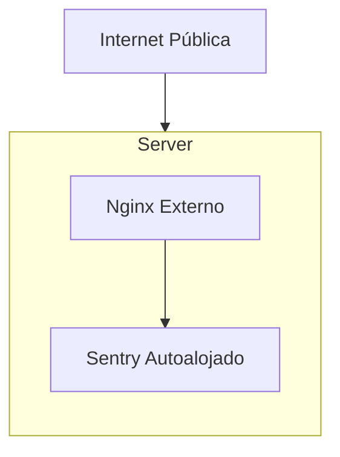

Esta es la configuración más simple para Sentry autohospedado. Se recomienda para instalaciones pequeñas o medianas. Esta configuración cumple con [los requisitos mínimos](/es/self-hosted/#required-minimum-system-resources) para ejecutar Sentry.

Se recomienda encarecidamente colocar un balanceador de carga externo (o proxy inverso) delante de tu implementación autohospedada de Sentry. Así podrás ajustar el rate limiting, la terminación TLS y otras funciones sin modificar el archivo de configuración de nginx incorporado. Se recomienda instalar el balanceador de carga en la máquina host en lugar de como un contenedor de Docker. Hacerlo te ayuda en caso de una falla del motor de Docker.

Si no es posible usar un balanceador de carga externo, puedes ejecutarlo como un contenedor de Docker, apuntando al servicio `nginx` en el puerto `80`. No importará el valor que asignes a la variable de entorno `SENTRY_BIND`.

Para más información sobre cómo configurar tu balanceador de carga externo, consulta la sección [Balanceador de carga externo](/es/self-hosted/experimental/reverse-proxy/).
