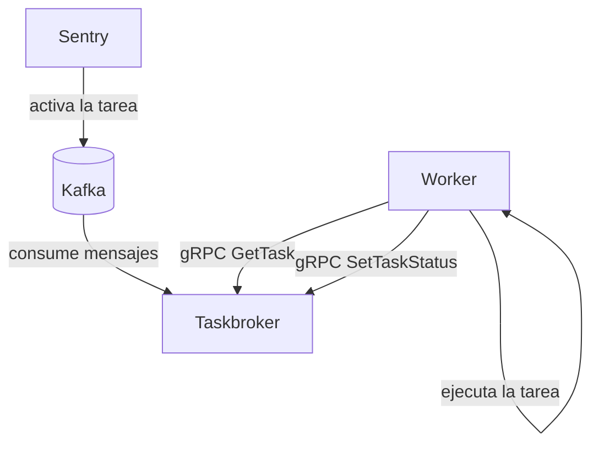

<div id="system-architecture">
  ## Arquitectura del sistema
</div>

La plataforma de tareas de Sentry está diseñada para escalar horizontalmente y habilitar
un procesamiento de alto rendimiento. La plataforma de tareas se compone de varios componentes:



Los brokers y los workers se emparejan para crear “grupos de procesamiento” para las tareas.
Tanto los brokers como los workers pueden escalarse horizontalmente para aumentar el paralelismo.


<div id="scaling-workers">
  ## Escalado de workers
</div>

De forma predeterminada, las instalaciones autogestionadas incluyen un único broker y una réplica de worker. Puedes aumentar la capacidad de procesamiento añadiendo más concurrencia al worker (con la opción `--concurrency` del worker) o añadiendo réplicas adicionales de workers y brokers. No se recomienda superar las 24 réplicas de workers por broker, ya que el rendimiento del broker puede degradarse con un mayor número de workers.

Si tu despliegue requiere más capacidad de procesamiento, puedes añadir réplicas adicionales de brokers y usar opciones de la CLI para indicar a los workers las direcciones de los brokers:

```bash
sentry run taskworker --rpc-host-list=sentry-broker-default-0:50051,sentry-broker-default-1:50051
```

Los workers usan balanceo de carga en el cliente para distribuir la carga entre los brokers a los que
se les ha asignado.

Si solo quieres escalar las réplicas de `taskworker` y tienes un único `taskbroker`,
puedes aumentarlas fácilmente (hasta 24 réplicas) modificando tu archivo `docker-compose.override.yml`:

```yaml
services:
  taskworker:
    deploy:
      replicas: 5
```

Esto lanzará 5 réplicas del servicio `taskworker`. Ten en cuenta que, aunque
aumenta la capacidad de procesamiento, tendrás que supervisar y escalar
los recursos del sistema (CPU y RAM) en consecuencia.


<div id="scaling-brokers">
  ## Escalado de brokers
</div>

Si ya alcanzaste el número máximo de réplicas de `taskworker`, puedes escalar las réplicas de `taskbroker`. Primero, debes aumentar el número de particiones del tópico &quot;taskworker&quot; en Kafka; la cantidad de particiones debe ser divisible de forma exacta entre el número de réplicas de `taskbroker` al que planeas escalar.
Luego, debido a las limitaciones de Docker Compose, tendrás que escalar manualmente tus réplicas de `taskbroker`. Puedes hacerlo añadiendo más definiciones de contenedor en tu archivo `docker-compose.override.yml`:

```yaml
services:
  taskbroker-beta:
    restart: "unless-stopped"
    image: "$TASKBROKER_IMAGE"
    environment:
      TASKBROKER_KAFKA_CLUSTER: "kafka:9092"
      TASKBROKER_KAFKA_DEADLETTER_CLUSTER: "kafka:9092"
      TASKBROKER_DB_PATH: "/opt/sqlite/taskbroker-activations-beta.sqlite"
    volumes:
      - sentry-taskbroker:/opt/sqlite
    depends_on:
      - kafka
  taskbroker-charlie:
    restart: "unless-stopped"
    image: "$TASKBROKER_IMAGE"
    environment:
      TASKBROKER_KAFKA_CLUSTER: "kafka:9092"
      TASKBROKER_KAFKA_DEADLETTER_CLUSTER: "kafka:9092"
      TASKBROKER_DB_PATH: "/opt/sqlite/taskbroker-activations-charlie.sqlite"
    volumes:
      - sentry-taskbroker:/opt/sqlite
    depends_on:
      - kafka
```

Ten en cuenta que cada réplica de `taskbroker` necesita su propia base de datos SQLite para evitar la contención y los bloqueos entre réplicas.

Por último, debes modificar el comando `taskworker` para que `rpc-host-list` apunte a los nuevos brokers:

```yaml
taskworker:
  <<: *sentry_defaults
  command: run taskworker --concurrency=4 --rpc-host-list=taskbroker:50051,taskbroker-beta:50051,taskbroker-charlie:50051 --health-check-file-path=/tmp/health.txt
  healthcheck:
    <<: *file_healthcheck_defaults
```

Si estás en Kubernetes, puedes usar `--rpc-host` y `--num-brokers`
si estás utilizando un StatefulSet. De lo contrario, puedes usar `--rpc-host-list`
si los brokers siguen un patrón de nombre de host diferente.


<div id="isolate-workload-separation">
  ## Aislar las cargas de trabajo
</div>

En instalaciones de mayor rendimiento, quizá quieras aislar las cargas de trabajo de las tareas
entre sí para garantizar el procesamiento oportuno de las tareas de menor volumen. Por ejemplo,
podrías aislar las tareas relacionadas con la ingesta del resto del trabajo:

```mermaid
flowchart

Sentry -- genera tareas --> k[(Kafka)]
k -- topic-taskworker-ingest --> tb-i[Ingesta de Taskbroker]
k -- topic-taskworker --> tb-d[Taskbroker (predeterminado)]
tb-i --> w-i[Trabajador de ingesta]
tb-d --> w-d[Trabajador predeterminado]
```

Para lograr esta separación del trabajo necesitamos hacer algunos cambios:

1. Aprovisiona cualquier tema (topic) adicional. Los nombres de los temas deben provenir de uno de los
   temas predefinidos en `src/sentry/conf/types/kafka_definition.py`
2. Despliega las réplicas adicionales del broker. Puedes usar la variable de entorno
   `TASKBROKER_KAFKA_TOPIC` para definir el tema (topic) del que consume un
   taskbroker.
3. Despliega trabajadores adicionales que usen los nuevos brokers en su flag de la CLI `rpc-host-list`.
4. Obtén la lista de espacios de nombres que quieres migrar al nuevo tema. La lista de
   espacios de nombres de tareas se encuentra en el módulo `sentry.taskworker.namespaces`.
5. Actualiza la opción de enrutamiento de tareas, definiendo los mapeos de espacio de nombres -&gt; tema (p. ej.):
   ```yaml
   # in sentry/config.yml
   taskworker.route.overrides:
      "ingest.errors": "taskworker-ingest"
      "ingest.transactions": "taskworker-ingest"
   ```
