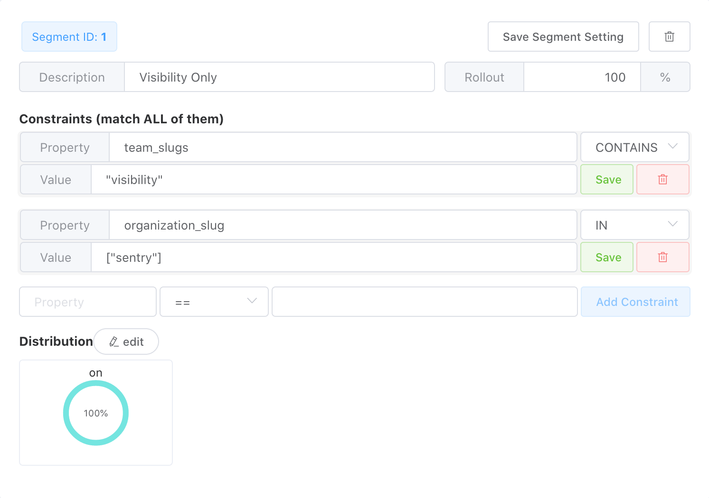
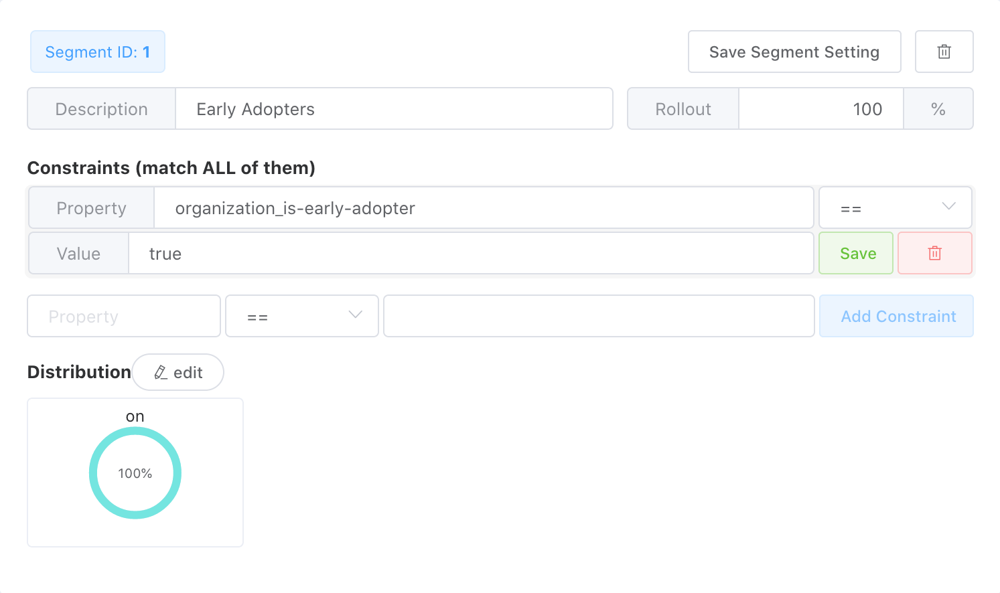

Feature flags are declared in Sentry's codebase. For self-hosted users, those
flags are then configured via `sentry.conf.py`. For Sentry's SaaS deployment,
Flagr is used to configure flags in production.

You can find a list of features available by looking at
`sentry/features/__init__.py`. They're declared on the `FeatureManager` like so:

```python
# Don't set entity_feature, or set it to False if you don't plan to use Flagr
default_manager.add("organizations:onboarding", OrganizationFeature, entity_feature=True)
```

The feature can be enabled with the following in your `sentry.conf.py`, usually located at `~/.sentry/`:

```python
SENTRY_FEATURES["organizations:onboarding"] = True
```

You can modify the state of [feature flags in tests](/testing/#setting-options-and-feature-flags) using a context manager.

Generally you want your feature names to be unique to help in their
[removal](#after-launch-graduation).  For example a feature flag like `trends`
may prove difficult to find because `trends` may appear throughout the codebase.
But a name like `performance-trends-view` is more likely to be unique and easier
to remove later

## Creating a new Feature Flag

### Determine what scope the feature should have

Features can be scoped by organization, and projects. If you're not confident
you want a project feature, create an organization level one. In this example
we'll build a feature called `test-feature` scoped at the _organization_ level.

### Add your feature to server.py

[`conf/server.py`](https://github.com/getsentry/sentry/blob/master/src/sentry/conf/server.py)
contains many of the default settings in the application. Here you will add
your feature, and decide what default value it should hold unless specified by
the user.

The `SENTRY_FEATURES` dictionary contains all the features in the application
with their corresponding scope. Your feature should start off disabled by default:

```python
SENTRY_FEATURES = {
    'organizations:test-feature': False,
    'auth:register': True,
    # ...
    'projects:minidump': False,
}
```

### Add your feature to the FeatureManager

The `FeatureManager` handles the application features. We add all the features
to the `FeatureManager`, including the type of feature we want to add to the
file `/src/sentry/features/__init__.py`.

If you plan to use [flagr in production](#enabling-your-feature-in-production)
add a third optional boolean parameter when adding the feature, for example:

```python
default_manager.add('organizations:test-feature', OrganizationFeature, True)
```

If you don't plan to use flagr don't pass this third parameter, for example:

```python
default_manager.add('organizations:test-feature', OrganizationFeature)
```

Flagr has significant latency, and is somewhat flakey. If you're working in
high throughput areas like Ingest or Relay, Flagr is not fast enough or
reliable enough. In these cases, you should use [options](/options/) instead.

### Add it to the Organization Model Serializer

The Organization model serializer
(`src/sentry/api/serializers/models/organization.py`) builds a list
called `feature_list` that is given to the front-end to use. By default the all
features are checked and those that are present are added into the list. If
your feature requires additional custom logic you will have to update the
organization serializer

### Using Model Flags (Less common)

Sometimes a flag on the model is used to indicate a feature flag as shown
below. This is not recommended unless there is a specific reason to make
changes to the model. For example, the `require_2fa` flag affects behavior on
the backend to enforce two-factor authentication.

```python
feature_list = []

if getattr(obj.flags, 'allow_joinleave'):
    feature_list.append('open-membership')
if not getattr(obj.flags, 'disable_shared_issues'):
    feature_list.append('shared-issues')
if getattr(obj.flags, 'require_2fa'):
    feature_list.append('require-2fa')
```

## Checking your feature

### In Python code

The FeatureManager's `has` method checks see if the feature exists. The has
method takes in the feature's name, the object that corresponds to the scope of
the feature *(i.e. an organization for an organization level feature or
a project for a project level feature)*, and the actor (aka user). In our case
the feature will be added like:

```python
if features.has('organizations:test-feature', obj, actor=user):
    feature_list.append('test-feature')
```

which only adds the feature to the `feature_list` if that feature is enabled for
the organization and the type of user given. Note that when we give the feature
to the frontend, we remove the scope prefix, and
our `'organizations:test-feature'` becomes `'test-feature'`.

### In JavaScript

There is a difference between using the flag in Sentry and in GetSentry. At this
stage you're not quite ready to use your feature flag in GetSentry, but you are
able to use it inside Sentry.

### Declarative features with the Feature component

React uses a declarative programming paradigm. As such, we have a utility
component that we use to hide components based on the feature flags available to
a organization/project

```jsx
import Feature from 'app/components/acl/feature';

const toRender = (
  <Feature features={['test-feature']}>
    <MyComponentToFlag />
  </Feature>
);
```

### Imperative feature flag checks

There are some exceptions when React components are generated imperatively (e.g.
headers/columns for Tables). In difficult times like these, the `Organization`
/ `Project` object has a array of the feature flags, which you can use in this
way:

```jsx
const {organization} = this.props;

// Method 2
organization.features.includes('test-feature'); // evals to True/False
```

## Enabling features in development

In Sentry you can run `sentry devserver` to view your changes in development
mode. If you would like to view a change behind a feature flag, you will need to
open the file `~/.sentry/sentry.config.py` on your local machine. This file
contains your local settings for the sentry application, and can be viewed and
edited. If you would like to toggle a flag on or off, add this to your
configuration file:

```python
SENTRY_FEATURES['organizations:test-feature'] = True
```

Where `SENTRY_FEATURES` will correspond to the `SENTRY_FEATURES` from `step 2`.
Set it to `True` if you'd like the feature to be available and `False` if not.

### Flagr in development

In general, you do not need to run flagr in development to test your feature
flagging. If you do want to run flagr, you'll need to be running
[getsentry](/sentry-vs-getsentry/):

1. Set the environment variable: `export SENTRY_USE_FLAGR=true`
2. [Start your devservices](/services/devservices/)

Your local instance of flagr can be found at
[localhost:18000](http://localhost:18000/#/)

## Enabling your feature in production

Feature flags are declared in Sentry's codebase. For self-hosted users, those
flags are then configured via `sentry.conf.py`. For Sentry's SaaS deployment,
Flagr is used to configure flags in production.

If you want to enable your feature for a subset of production users, you will
need to set up your feature in Flagr. If you haven't already make sure that
when you add your flag in sentry that you passed the third option so that Flagr
knows to check this feature in production.

```python
default_manager.add("organizations:onboarding", OrganizationFeature, True)  # NOQA
```

## Building your feature in Flagr

Navigate to the [Flagr UI](https://flagr.getsentry.net/#/) and in the input box
enter your feature name as the flag's *description*. Next, click the arrow on the
right of the **Create New Flag** button and select **Create Simple Boolean
Flag**. The flag's description is only used for easy finding of your flag on the
Flagr homepage, but it is the `Flag Key` that the API uses to find your flag.


You should then see your newly created flag in the list below, click your flag
and enter your feature name as the flag key, optionally enter notes about your
flag here, then click **Save Flag**. At this point, both your flag key and
description should be your new feature. It is very important that your flag key
matches exactly what is in sentry as that is what is used to look your feature
up.

Each flag defaults to disabled, and your feature will not appear until you
enable it, this is done via the toggle at the top right of the flag page.


In Flagr your feature needs a Variant and at least one Segment.

### Variant

Variants represent the possible variations of a flag. Because flagr is
currently only used to toggle features, the only supported variant is `on`, and
this value is case-insensitive.

### Segment

Segments represent the portions of our audience that your feature will be
enabled for. Each segment can have multiple conditions **all** of which
must be matched for a feature to be enabled.

### Distribution

Represents the distribution of variants in a segment, because we'll only have
one variant this value should always be 100% for each segment.

### Creating a segment constraint

When creating a segment, without the distribution set, Flagr will respond as if
the segment doesn't exist yet. This means that if you're creating or modifying a
segment do not set the Distribution until you're ready for your feature to be
enabled.

Here are the properties that are being sent to Flagr as well as the types of
their values.

Each constraint requires a Property, Operator, and Value. Each segment can
contain multiple constraints, all of which must be matched. A way to think about
segments is that each segment is **OR**ed together, and each constraint is
**AND**ed together

### Properties

Properties are a preset dictionary that get sent to flagr by sentry, these depend
on the organization or project being passed to `features.has`

| Property                        | Value Types  | Notes/Example config                                                                   |
| :-----------------------------  | :----------- | :------------------------------------------------------------------------------------- |
| `organization_id`               | `int`        |                                                                                        |
| `organization_slug`             | `string`     | [Example](#releasing-a-feature-to-a-subset-of-organizations)                           |
| `organization_is-early-adopter` | `bool`       | Users opt in from settings, [example](#releasing-a-feature-to-early-adopters)          |
| `features`                      | `[string]`   | All active features for org                                                            |
| `subscription_is-free`          | `bool`       | Whether the organization is on a free plan.                                            |
| `subscription_is-trial-plan`    | `bool`       | Whether the organization is on any of the trial plans.                                 |
| `subscription_plan-family`      | `string`     | [Example](#releasing-a-feature-to-organizations-with-specific-plans)                   |
| `subscription_plan-tier`        | `string`     | [Example](#releasing-a-feature-to-organizations-with-specific-plans)                   |
| `subscription_channel`          | `int`        |                                                                                        |
| `project_slug`                  | `string`     | Only passed for projects                                                               |
| `project_id`                    | `int`        | Only passed for projects                                                               |
| `user_id`                       | `int`        |                                                                                        |
| `user_email`                    | `string`     | The user's email address                                                               |
| `user_domain`                   | `string`     | The domain of the user's email address.                                                |
| `user_is-superuser`             | `bool`       |                                                                                        |
| `user_is-staff`                 | `bool`       |                                                                                        |
| `team_slugs`                    | `[string]`   | Use with an organization condition, [example](#releasing-a-feature-to-a-specific-team) |

More properties can be added by updating `FlagrFeatureHandler.get_context`
but be considerate of the performance of additional context. Properties
cannot contain periods `.` as this is a special character used by flagr, in
general use an underscore `_` instead.

### Operators

Operators are generally straightforward, for example, `==` means equal. There
is the exception however of `CONTAINS` and `IN` which only operate on arrays,
This means that if you want to check that for a substring you want to use the
`=~` operator.

```json
property CONTAINS "foo"    =======> {"property": ["foo", "bar"]} -> True
                                    {"property": "foobar"}       -> False

property IN ["foo", "bar"] =======> {"property": ["foo", "bar"]} -> False
                                    {"property": "foo"}          -> True

property =~ "foo"          =======> {"property": ["foo", "bar"]} -> False
                                    {"property": "foobar"}       -> True
```

### Values

- Values that are strings must be wrapped in double-quotes `""`
- Values that are arrays must be wrapped in square brackets `[]`
- Values that are bools or ints should not be wrapped in quotes, for example,
`true` or `1`

### Saving

New constraints must be saved by clicking **Add Constraint**, existing
constraints are only updated after clicking the green **Save** button, the
**Save Segment Settings** button does not include constraints.

## Sample Flagr Configurations

Here are some example flagr configurations for methods to release a feature to
different audiences

### Releasing a feature to a subset of organizations

You can enable a feature for a specific list of organization slugs by setting
the condition property to `organization_slug`, the operator to `IN`, and the
value to an array of organizations, using square brackets `[]` for the array, and
double quotes `"` for each organization.


### Releasing a feature to a specific team

You can enable a feature for only a specific team within an organization
by setting the condition property to `team_slugs`, the operator to
`CONTAINS`, and the value to the slug of the team wrapped in double quotes `"`.
**Also include a condition in the same segment to match organization**, with either
`organization_slug` or `organization_id`. If this isn't included, any org that has the same team name will get the
feature.



### Releasing a feature to Early Adopters

You can enable a feature to organizations that have opted in to be early
adopters. To do this set the constraint property to
`organization_is-early-adopter`, the operator to `==`, and the value to `true`.



### Releasing a feature to organizations with specific plans

Enabling a feature for customers on specific plans can be done by creating a
segment using plan properties. There are a few plan related properties you can
use:

* `subscription_is-free` Whether or not the account is on a free plan.
* `subscription_channel` Which billing channel an organization is on. The values
  of this can be found on the `Subscription` model.
* `subscription_plan-family` This is one of `free`, `team` or `business` or
  None.
* `subscription_plan-tier` This is the plan tier eg. `am1`.
* `subscription_plan` This property is deprecated and should not be used in new
  feature flags.


### Releasing to organizations incrementally

When releasing a large or potentially disruptive feature you may want to enable
it for a percentage of organizations incrementally. For example, on Monday it is
available to 10% of users, and increasing the percentage of customers by 10%
each day.

When creating your segment set the rollout rate to 0, then on each day that you
increase it, enter a larger value, and click *Save Segment Setting*.

*Note:* You should not need to modify the distribution to incrementally release
your feature.

## After launch (Graduation)

After your feature has been mainlined and is available for all customers on
sentry.io, you have a few potential paths:

- If the feature cannot be disabled, or you don't need to conditionally disable
  the feature, remove the feature flag and all related checks from the Sentry
  code base. If necessary, also remove references to the feature from the
  [self-hosted](https://github.com/getsentry/self-hosted) and getsentry
  repositories.
- If the feature will only be available to SaaS customers on specific plans, you
  need to add your feature flag to the appropriate plans and update feature
  handlers (see below).You should also enable the feature by default in
  [`conf/server.py`](https://github.com/getsentry/sentry/blob/master/src/sentry/conf/server.py)
  in sentry to ensure that the feature is available for self-hosted deployments.

Finally, if your feature was enabled through flagr, delete the feature from the
Flagr UI. This is done by navigating to the flag configuration page then
clicking **Delete Flag** at the bottom of the page.


## Getsentry feature handlers

Getsentry contains a variety of feature handlers that override the
`SENTRY_FEATURES` map.

### Plan specific features

If your feature is available for a subset of plans (eg. only on Business plans)
you need to:

1. Disable the feature in `getsentry/conf/settings/defaults.py` by updating `SENTRY_FEATURES`.
2. Add your feature to the appropriate plan feature list.
3. Update `SubscriptionPlanFeatureHandler` to handle your feature.

### Custom handlers

If your feature requires additional logic to become active, you can also
implement a feature handler in getsentry. For example, you can create a feature flag that is backed by [options](/options/). follow these steps:

1. Disable the feature in `getsentry/conf/settings/defaults.py` by updating `SENTRY_FEATURES`.
2. Add a new feature handler class in `getsentry/features.py` that determines availability of the feature based on the organization or actor.
3. Register the handler at the bottom of `getsentry/features.py`.
