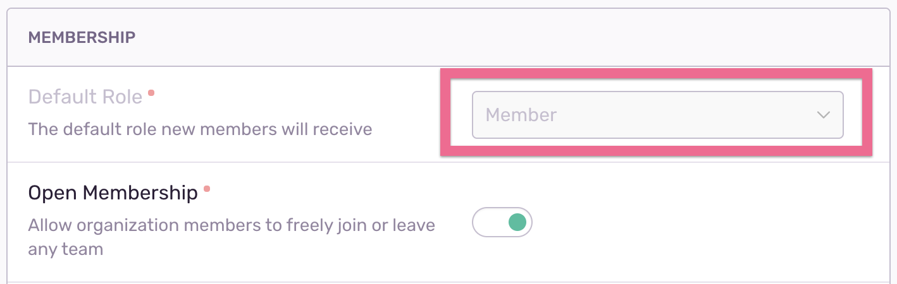

<Alert level="info">
  <strong>ten·et (noun)</strong>

  _a principle or belief, especially one of the main principles of a religion or philosophy._
</Alert>

This document outlines fundamental product design principles that Sentry aims to follow. It is recommended reading for all employees contributing to product.

## Disable (and explain), don't hide

If a user doesn't have permission to modify a value or take a specific action, the preference should be to disable the input element and provide affordances to the user indicating why it is disabled. Avoid hiding or removing the element in such cases.

Why disable (grey out)?
- Educates the user on capabilities they don't have permission for (yet)
- Informs of the current value (read access)

<Alert level="info">
  Bonus: where it makes sense, consider <Link href="https://blog.sentry.io/how-we-grew-sentrys-monthly-active-users-by-rethinking-invitations/" remote>prompting the user to request access</Link>.
</Alert>

  
In this example, the current user does not have access to modify the "Default Role", but the presence of the setting and the current value is still visible.

## User navigation that changes visible data should go in URL

If a user navigates a UI element in such a way that new or altered content is redrawn (e.g. toggling a graph mode), ideally that state change should be reflected in the URL.

Why preserve state change in the URL?
- Preserves browser back and forward buttons
- Makes content shareable (user can share exact view with a teammate)

<Alert level="info">
  Ask yourself this question: "If I was sharing this page with my coworker on Slack, is it important that they see the exact view I'm looking at?" If the answer is "yes", then the state to regenerate that view should be present in the URL.
</Alert>

## Minimize content refreshes when navigating

When navigating between views or in-page state changes (see above), try to preserve as much content as possible between pages (e.g. header, sidebar, and so on).

Why minimize content refreshes?
- Better perceived performance
- Less rendering / data fetching for the browser
- Assists user navigation by preserving sense of state ("where am I?")

<Alert level="error">
  Note: while there are a few good examples of this in action in the app, we are actually pretty inconsistent applying this design principle.
</Alert>

## Use placeholders instead of loading spinners

Spinners should be used carefully. Having multiple spinners on the page is distracting. Reserve spinners for primary content that has an unknown height. Favor the usage of sized placeholder elements where the height of content is known, or the content is secondary to the main goal of the page.

Why use placeholders?
- Less layout shifts / render thrash (see video below)
- Better perceived performance
- Avoids having multiple loading spinner animations at once, which looks ugly

## Ensure that footer remains "sticky" at bottom of viewport

This generally happens with a loading state where the view that is loading has the CSS to render the layout. The loading indicator should be contained within the layout component e.g. `<PageContent>`.

This will avoid having the footer in the middle of the screen and then shifting to the bottom when the view renders.
