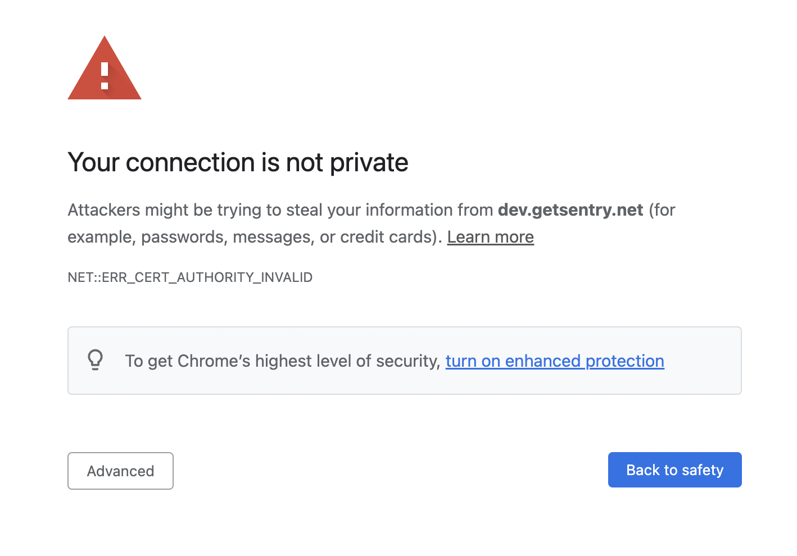
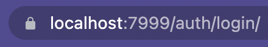

(*see also: [Backend Development Server](/backend/development-server/)*)

You have the ability to only run a frontend development server that will proxy all API requests to Sentry's production servers. In order to do so, run the following command:

```shell
yarn dev-ui
```

The development server can be viewed at [https://localhost:7999](https://localhost:7999) where you can then login with your Sentry.io credentials. Note that SSO-logins will *NOT* work. Alternatively, you may use our [Cookie Sync](https://github.com/getsentry/cookie-sync) browser extension to sync your sentry.io session cookies into your dev server host.

- [Get Cookie Sync for Chrome](https://chrome.google.com/webstore/detail/sentry-cookie-sync/kchlmkcdfohlmobgojmipoppgpedhijh)
- [Get Cookie Sync for Firefox](https://addons.mozilla.org/en-US/firefox/addon/sentry-cookie-sync/)

## Troubleshooting

### "Your connection is not private"

If you see an error similar to the below when accessing the development server:



You can either grant a temporary exception in your browser, or create and install a local certificate and use your OS to mark them as "trusted". The instructions below will show you how to create and install a local certificate.

We will be using [mkcert](https://github.com/FiloSottile/mkcert) to create and install a locally-trusted, development certificate. The following will install `mkcert` and then create and install the local certificates.

```shell
brew install mkcert
brew install nss # if you use Firefox
yarn mkcert-localhost
```

You can now run the dev server with `yarn dev-ui` and open [https://localhost:7999](https://localhost:7999). There should not see a warning about your connection not being private. You should also see a lock or similar icon in the address bar of your browser.



**NOTE**: For Firefox users that use the master password you will be prompted for it with this message: "Enter Password or Pin for "NSS Certificate DB":"

**NOTE**: Webpack outputs the IP from where the SPA is being served (e.g. `https://192.168.0.200:7999/`). Do not use it or you will still get the message above. The generated local certificates are only for `localhost`, `127.0.0.1` and `dev.getsentry.net`: Any of these values would work.
