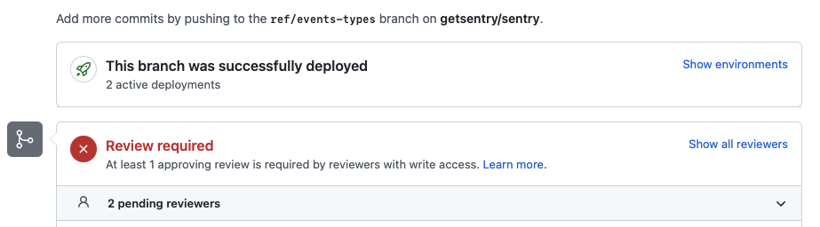

## What are preview builds?

When you open a pull request on GitHub in the sentry repository, Vercel can automatically build and deploy the frontend code in your branch into a preview URL. This allows you to see the new code as it would be in production.

This is very handy for:

- Previewing new frontend features that require complex interactions to understand how they work. This can be great if the specific feature you've built has a certain "feel" to it, that can only be expressed through actually using the interface in a web browser. The preview build will allow reviewers to **quickly** see how your feature works.

- Validating that a bug fix is actually working in production, and doesn't suffer from __worked on my machine__ syndrome.

- Sharing new features that are highly sought after by the community that have not yet been merged. Especially if the feature is still undergoing development it may even be possible to **get feedback from __real users__** before the feature is merged.

## How can I have preview builds on my Pull Request

When you open a Pull Request, the build preview will automatically start building and deploying through Vercel. When it is complete (after about 4 minutes) you will find the preview link in the panel above the GitHub Checks that says `This branch was successfully deployed`:

Click the `Show environments` toggle and then click `View deployment` for the `Preview - sentry` row

## Why don't my Pull Requests have build previews?

There are a few caveats to using the frontend preview builds:

1. Backend changes **will not be deployed in preview builds**. You may have a PR that includes both frontend and backend code changes, but **only frontend changes will be deployed**. It is important to remember this, because if your frontend preview depends on any API backend changes that are not already in production, your preview will inaccurately reflect the feature you've built. Preview builds use **the production API**.

2. `getsentry`'s (the repo) frontend components are not included in preview builds. Do not be alarmed when SaaS features (usually upsell features) are missing. 

3. Some features of Sentry are **not** supported as they are still served from the backend. This includes (but is not currently limited to):

    - SSO Authentication does **NOT** work at the moment. You will need to login to an account that is part of an organization that does not require SSO.
    - 2FA login does not currently work
    - SSO configuration pages do not have React views.
    - Integration installation will not work as the redirect URLs will be incorrect.
    - Various authentication frontends are missing (reset password, registration).

4. Only PRs made from branches inside the repository itself can create previews - a PR made from a fork will fail with the message “Authorization required to deploy.”

