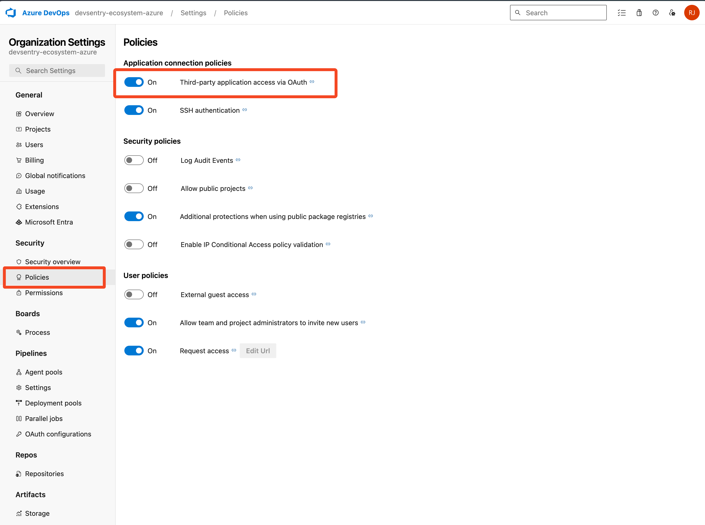
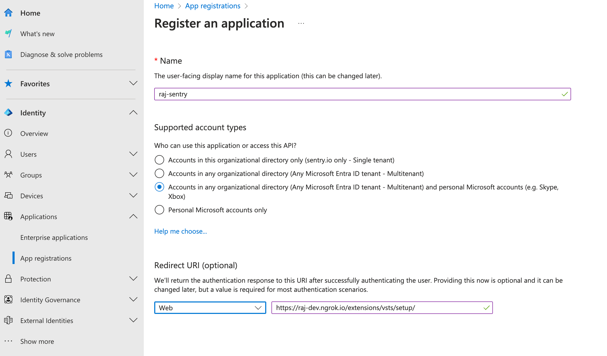
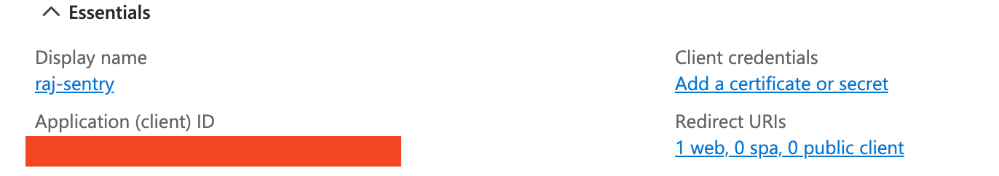
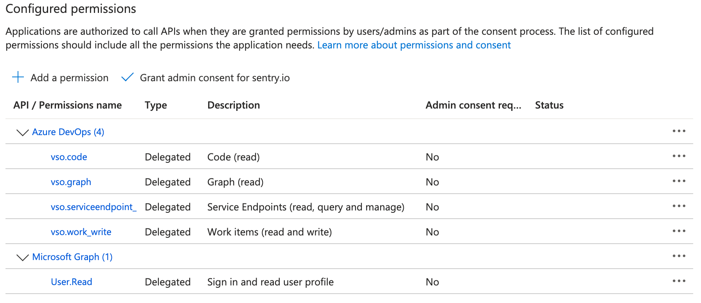
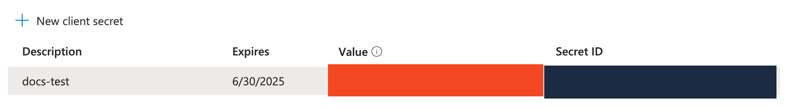

## Create an Azure Application

Log into your Azure DevOps account or create a new one, and ensure you have a project set up.

Make sure the organization has third-party access via OAuth enabled in the organization settings.



To use the Azure DevOps integration you'll need to create an application.

To start, you will need access to a [Microsoft Entra Admin Portal](https://entra.microsoft.com/#home)




When configuring the app, use the following values:

| Setting                         | Value                                                                                              |
| ------------------------------- | -------------------------------------------------------------------------------------------------- |
| Supported account types         | Accounts in any organizational directory |
| Redirect URI                    | `{YOUR_DOMAIN}/extensions/vsts/setup`                                                              |

<Alert>

Take note of your App ID as we'll need it later.


</Alert>

Next go to Manager -> API Permissions to add the following permissions:
* Azure DevOps (`vso.code`, `vso.graph`, `vso.work_item`, `vso.service_endpoint`)
* Microsoft Graph (`User.Read`) (This should be added by default)



Go to the "Certificates & secrets" tab and create a new client secret. Make sure you copy the secret as we'll need it later.



Add the App ID and Client Secret to `devlocal.py` like this:

```python
# Azure DevOps #
SENTRY_OPTIONS["vsts_new.client-id"] = your-app-id
SENTRY_OPTIONS["vsts_new.client-secret"] = your-client-secret
```

You can also add the App ID and Client Secret to `config.yml` like this:

```yml
# Azure DevOps #
vsts_new.client-id: your-app-id
vsts_new.client-secret: your-client-secret
```

You will also need to enable the feature flag to use the new Azure DevOps integration.
Enable the `migrate-azure-devops-integration` feature flag in your organization.
Add the following to your `devlocal.py` file:

```python
SENTRY_FEATURES["organizations:migrate-azure-devops-integration"] = True
```

<Alert title="Feature Flag">

This is a temporary measure until we fully migrate to the new Azure DevOps integration and remove references to the old one.

</Alert>

Follow our [documentation on installing and configuring the Azure DevOps integration](https://docs.sentry.io/organization/integrations/source-code-mgmt/azure-devops/) to finish installation and use the integration.
