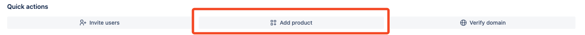
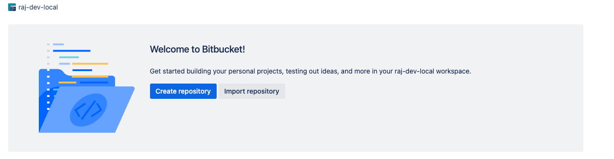

## Prerequisites

#### Create a Bitbucket "product"

To use Sentry’s Bitbucket integration you’ll need to create a Bitbucket "product" if you don’t already have one.

Go to [Bitbucket's Admin Console](http://admin.atlassian.com/) and click on __Add Product__. and select __Bitbucket__. Name your Bitbucket instance and click __Create__.

#### Create a Bitbucket Repo

Next, you'll need to create a Bitbucket repository. Click on __Create repository__ and fill in the details. You should now see your new repository in the list of repositories.

## Create a Bitbucket App

To use Sentry’s Bitbucket integration you’ll need to create a Bitbucket app. Navigate to [Bitbucket Apps](https://bitbucket.org/account/user/apps/create) and click __Create__.
Ensure [developer mode](https://support.atlassian.com/bitbucket-cloud/docs/enable-bitbucket-cloud-development-mode/) is enabled in your Atlassian account.

Follow our [documentation on configuring the Bitbucket integration](https://docs.sentry.io/product/integrations/bitbucket/#configure) to use the integration.
