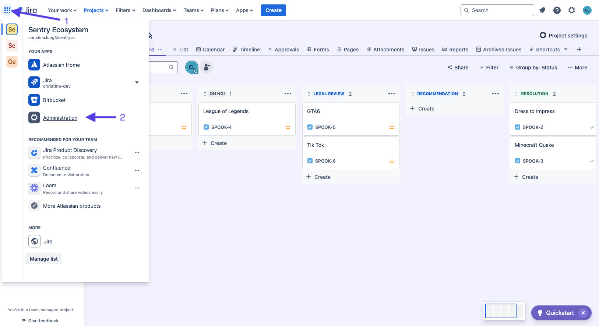
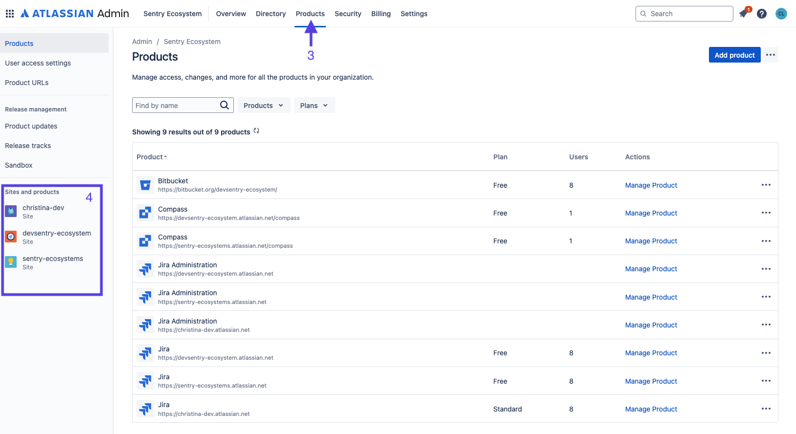
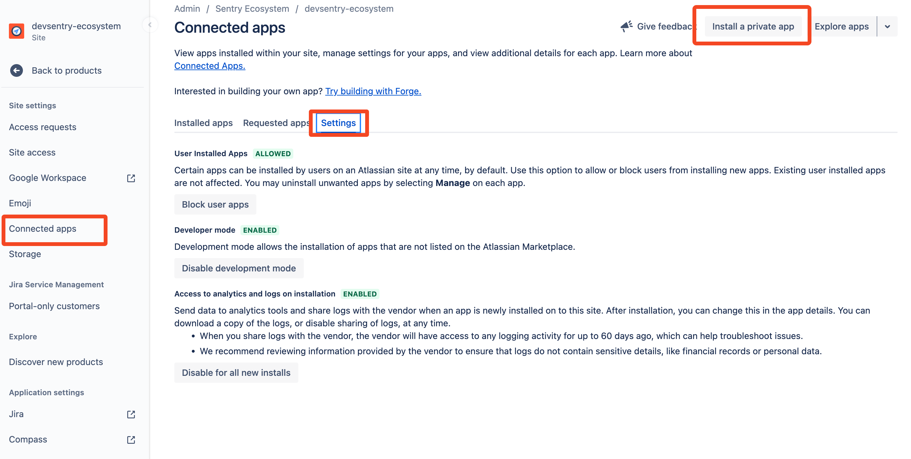
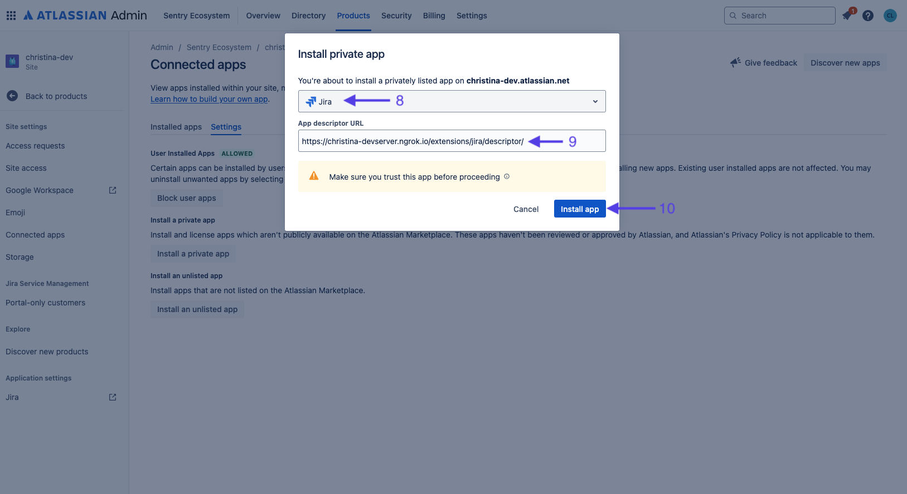
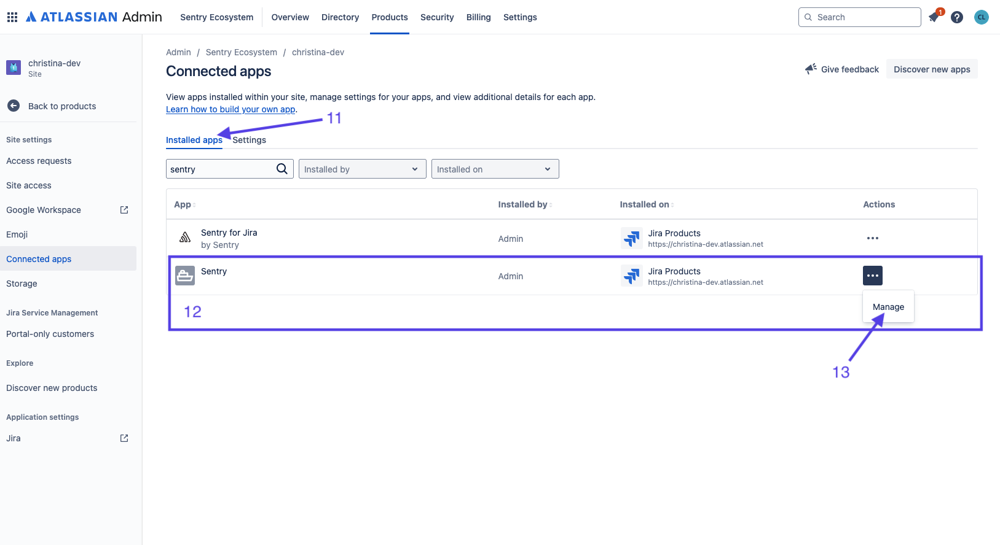
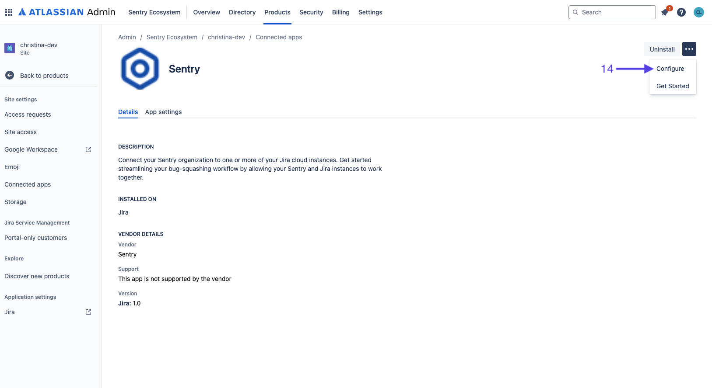
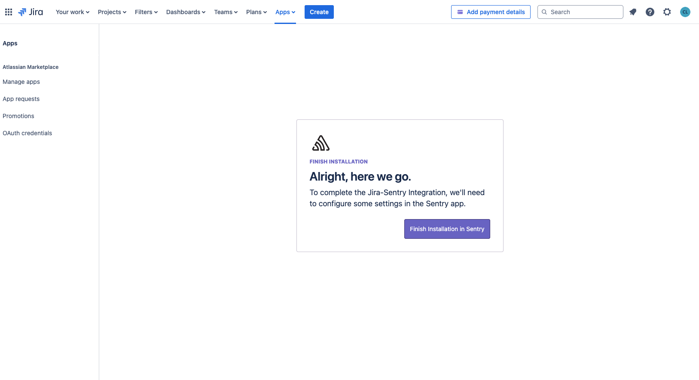

## Create an Atlassian Cloud Developer Instance

[Atlassian offers a development-specific org](http://go.atlassian.com/cloud-dev) option, different from simply having a personal Jira organization. Even if you already have a personal Jira org, it's worth creating a development org, because it will correctly set a number of necessary options for you automatically.

### Permissions for Certain Features

To enable issue-sync between Jira and a locally hosted Sentry Jira integration, you must set your email address permission to "Anyone". This setting can be found in the [Profile and visiblity](https://id.atlassian.com/manage-profile/profile-and-visibility) page under "Contact".

## Set Up ngrok

[Download](https://ngrok.com/download) and [set up](https://ngrok.com/docs/getting-started/) ngrok, then start an ngrok server. If you are using getsentry devserver, follow our [ngrok guide](https://develop.sentry.dev/development-infrastructure/ngrok/).

## Installing Local Jira App

1. If you don't have any projects in your Jira org yet, create a new project.
2. In the navigation bar at the top of the screen, click on the waffle icon (1), select the desired organization and click "Administration" (2).

3. In the navigation bar, click "Products" (3) and under "Sites and products" (4) select the appropriate site/product with your Jira project.

4. In the sidebar on the left, click on "Connected apps" (5) and then click on the Settings tab (6).
5. Click on the button labeled "Install a private app" (7).

6. In the new modal, select JIRA for the product to install the app on (8).
7. For the "App descriptor URL" (9), use the following URL, `https://{YOUR_SENTRY_DOMAIN}/extensions/jira/descriptor/`.
    * Note that if you are running a local devserver, `YOUR_SENTRY_DOMAIN` will be your ngrok (or other tunneling service) domain.
    * For self-hosted Sentry users: Replace `https://{YOUR_SENTRY_DOMAIN}` with your Sentry address.

8. Click "Install app" (10), now if you select the "Installed Apps" (11) tab next to "Settings", you should see your newly installed app listed under "Sentry" (12). (Note: that "Sentry for Jira" is the SaaS integration).
9. On the right the newly installed app click on the three dots and then click "Manage" (13).

10. In the app listing, click on the three dots in the top right and click "Configure" (14).

11. Click "Finish Installation in Sentry" and select the desired organization to install the Jira integration on.

From here follow our [documentation on installing and configuring the Jira integration](https://docs.sentry.io/product/integrations/issue-tracking/jira/) to use the integration (For reference: We just completed the equivalent to Step 4 under that page's "Install" section).
