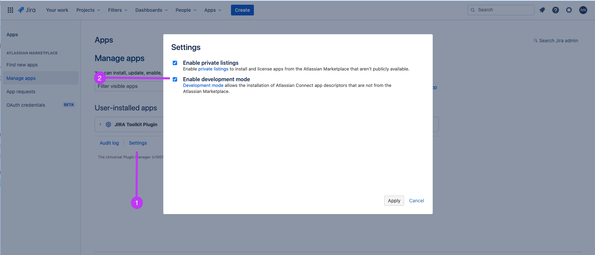
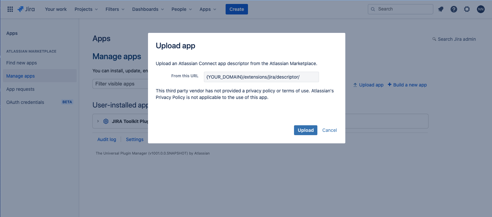

Create an [Atlassian Cloud Instance](http://go.atlassian.com/cloud-dev)

Configure Jira settings.
  1. Navigate to Jira settings (cog icon) > Apps > Manage apps.
  2. Scroll to the bottom of the Manage apps page, and click Settings (1).
  3. Select Enable development mode and Enable private listings (2), and click Apply.

Upload the Atlassian Connect descriptor to Jira. It can be found at `{YOUR_DOMAIN}/extensions/jira/descriptor/`

Follow our [documentation on configuring the Jira integration](https://docs.sentry.io/product/integrations/jira/#configure) to use the integration.