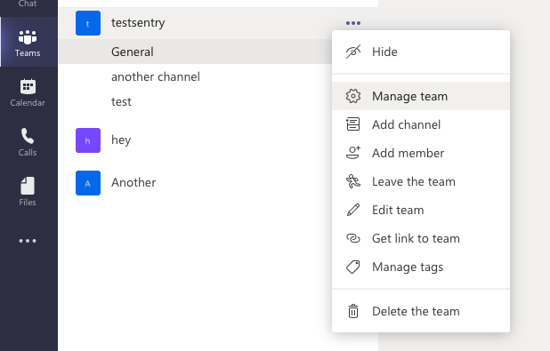

<Alert title="Admin Privileges" level="info">

You will need to be a Microsoft Teams Administrator to perform some of the required steps.

</Alert>

## Create the Sentry App

1. Visit the [Developer Portal](https://dev.teams.microsoft.com/apps). Note: You may have to sign up for the [MS 365 Developer Program](https://developer.microsoft.com/en-us/microsoft-365/dev-program) if you're having trouble accessing this. 
2. Click "New App".
3. Enter "Sentry" as the name.
4. Under "Basic Information" use the following values (the rest may be blank):

| Setting                   | Value                       |
| ------------------------- | --------------------------- |
| Short description         | enter anything              |
| Long description          | enter anything              |
| Developer or company name | Sentry                      |
| Website                   | https://www.sentry.io       |
| Privacy policy            | https://sentry.io/privacy/  |
| Terms of use              | https://www.sentry.io/terms/|


5. Hit "Save" at the bottom of the page.
6. On the left hand sidebar click "App features" >> "Bot" >> "Create a new bot" >> "New Bot". You may name this whatever you like.
7. Enter the bot endpoint address as `{YOUR_DOMAIN}/extensions/msteams/webhook/` and hit save. Take note of your bot ID (shown in the URL e.g. https://dev.teams.microsoft.com/bots/{BOT-ID}/configure).
8. Go to "Client secrets" and create a secret. Copy the secret as we'll use it later on.
9. To go back click "Apps" >> Sentry >> "App features" >> "Bot" >> and then choose the bot you just created from the "Select an existing bot" dropdown and hit Save. 
10. Click "Add a command" and call it anything you like e.g. `/sentry`. Select "Team" as the scope, add it, and again hit Save. 


## Set up config.yml

Take the values from before and add them to the `config.yml` file as shown below:

```yml
# Microsoft Teams #
msteams.client-id: 'your-bot-client-id'
msteams.client-secret: 'your-bot-secret'
```

## Installation

1. At the top right of the screen click "Preview in Teams".
2. Select "Add to a team" in the resulting popup, and choose the team(s) you want to install the app on.

You should see a message in the General channel that says "Welcome to Sentry for Microsoft Teams". If you do not get this message, it means was something went wrong and you'll need to uninstall, fix the problem, and re-install it.

Follow our [documentation on using the Microsoft Teams integration](https://docs.sentry.io/product/integrations/msteams/) to use the integration. 

## Troubleshooting

If you're having trouble with installation, try following these steps:
1. Click "Publish to org" in the sidebar.
2. Visit the [manage apps page](https://admin.teams.microsoft.com/policies/manage-apps), and find your app in the list by sorting by "Custom App".
3. Click the title of your app, in this case "Sentry".
4. Publish it to the org-wide app catalog. You should now see it under "Built for your org".


## Uninstallation

To uninstall the integration, you should uninstall it inside of Teams instead of uninstall it Sentry.

1. Find your Teams
2. Click on the three dotted lines to the right of your Team
3. Press "Manage team"

4. Click on "Apps"
5. Click the trash icon to the right of your custom app
6. Press "Uninstall" in the popup