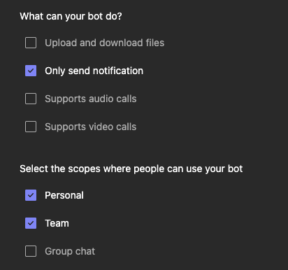
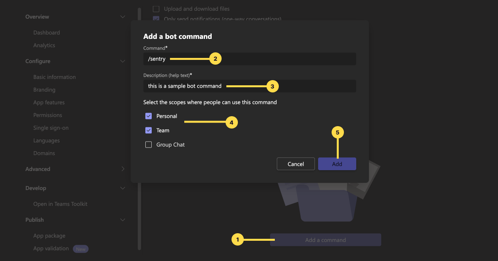

<Alert title="Prerequisites">
- You may need to be a Microsoft Teams Administrator to perform some of the required steps.
- In order for users to be able to install your application, the Microsoft Organization you are building under must have 'Custom apps' enabled in the [Microsoft Teams Admin Center](https://admin.teams.microsoft.com/). This setting can be managed by navigating to **Team apps > Manage apps > Actions (dropdown) > Org-wide app settings**.
</Alert>


## Create the Sentry App

1. Visit the [Developer Portal](https://dev.teams.microsoft.com/apps). Note: You may have to sign up for the [MS 365 Developer Program](https://developer.microsoft.com/en-us/microsoft-365/dev-program) if you're having trouble accessing this.
2. Click "New App".
3. Name your app (if you're an employee, add your name, `{Your Name}'s Sentry`).
4. Under "Basic Information" use the following values (all other fields are optional and may be left blank):

| Setting                   | Value                       |
| ------------------------- | --------------------------- |
| Short description         | enter anything              |
| Long description          | enter anything              |
| Developer or company name | Sentry                      |
| Website                   | https://sentry.io           |
| Privacy policy            | https://sentry.io/privacy/  |
| Terms of use              | https://sentry.io/terms/    |


5. Hit **Save** at the bottom of the page.
6. On the left hand sidebar click **App features** > **Bot** > **Create a new bot** > **New bot**. You may name this whatever you like.
7. Enter the bot **endpoint** address as `{YOUR_DOMAIN}/extensions/msteams/webhook/` and hit "Save". Take note of your bot ID (shown in the URL, e.g. https://dev.teams.microsoft.com/bots/{BOT-ID}/configure).
8. Go to **Client secrets** and create a secret. Copy the secret as we'll use it later on.
9. To go back, click **Apps** > _Your App Name_ > **App features** > **Bot**. Then choose the bot you just created from the "Select an existing bot" dropdown.
10. Enable your bot to "Only send notification" and select "Personal" and "Team" as the scopes.



11. Click **Create your first activity bot command**. If you're an employee, use a unique command name such as `/{name}-sentry`, otherwise `/sentry` is fine. Give your command a description, select *Personal* and *Team* as the scopes, then click **Add**.



12. Hit "Save" at the bottom of the page.


## Set up config.yml

Take the values from before and add them to the `config.yml` file as shown below:

```yml
# Microsoft Teams
msteams.client-id: your-bot-id # From Tools > Bots > Bot Management, NOT your App ID!
msteams.client-secret: your-bot-secret
```

If you need to enable Tenant installtions you can find your Microsoft Tenant ID from the [Entra Admin Center](https://entra.microsoft.com/). Add it to the `config.yml` as shown below:

```yml
msteams.tenant-id: your-tenant-id
```

## Previewing

If you are simply prototyping or testing if the application works as expected, it can be a good idea to preview before distribution, but this option may be restricted based on your Microsoft organization settings. If it isn't available, you'll need to skip ahead to formal distribution.

1. From your app's home page on the [Developer Portal](https://dev.teams.microsoft.com/apps/), click "Preview in Teams".
2. Microsoft Teams should open and navigate to the installation model, from there click "Add" to start the process.

Follow our [documentation on using the Microsoft Teams integration](https://docs.sentry.io/integrations/notification-incidents/msteams/) to further test out the integration.

## Distribution

When distributing the application to your organization, it will require a Microsoft Teams Admin approval before becoming available in your Teams Apps Store, regardless of which option you choose.

### Option 1: Manually Install via App Package

This option is great for quick changes or prototyping features, provided you are a Microsoft Teams Admin. This option should be used if you are a Sentry employee working on the integration. 

1. Click "Distribute" in the sidebar.
2. Click "Download the app package". A zip file should be downloaded soon after, corresponding to your App ID.
3. In Microsoft Teams navigate to **Apps > Manage your apps**.
4. Click "Upload an app" and "Upload an app to your organization's app catalogue", then select the zip file.
5. If you wish to re-distribute a new version, you must first remove it from your catalogue in the [Microsoft Teams Admin Center](https://admin.teams.microsoft.com/). Find it in **Teams apps > Manage apps**, then on it's management page select **Actions (dropdown) > Delete** and confirm to delete the listing.
6. You should now be able to see the published custom app under the "Built for your org" section in the MS Teams application store. You can now follow the [documentation on using the Microsoft Teams integration](https://docs.sentry.io/integrations/notification-incidents/msteams/).

### Option 2: Organiztion-wide App Catalog

This option should be selected if your self-hosted MS Teams integration will be used in production across your Microsoft Organization, though future updates to the application will take a few hours to distribute.

1. Click "Distribute" in the sidebar.
2. Click "Publish to your organization". If updating the application, be sure to modify the version first via **Configure > Basic Information**, then click "Submit app update" 
3. This step must be completed by a Microsoft Teams Admin for your organization. Visit the [manage apps page](https://admin.teams.microsoft.com/policies/manage-apps) in the Microsoft Teams Admin Center, find your app, and click into it.
4. Publish it (or approve the new version) to distribute it to the org-wide app catalog. If you are distributing a new version, it may take a few hours before your updated version is available for users in your organization to install.
5. You should now be able to see the published custom app under the "Built for your org" section in the MS Teams application store. You can now follow the [documentation on using the Microsoft Teams integration](https://docs.sentry.io/integrations/notification-incidents/msteams/).
