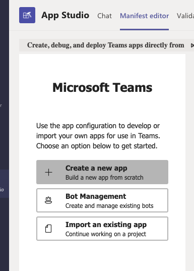

<Alert title="Admin Privileges" level="info">

You will need to be a Microsoft Teams Administrator to perform some of the required steps.

</Alert>

## Allow Third-Party Apps

Before you can create and install a custom Microsoft App, you will need to allow third party apps to be installed.

1. Visit the [Teams admin page](https://admin.teams.microsoft.com/policies/manage-apps)
2. Click the "Org-wide app settings" in the upper right hand corner
3. Enable all the settings on the page as shown below


## Create the Sentry App

Now you will need to create a Microsoft Teams app for the Sentry integration.

1. Visit your [Microsoft Teams page](https://teams.microsoft.com/)
2. Install the "App Studio" app from the Teams Store

3. Go to App Studio
4. Click on the "Manifest Editor" tab
5. Press "Crete new app"


## Fill out Manifest
1. Fill out the form on the "App details page" (put whatever you want, it doesn't impact functionality)
2. Click on the "Bots" tab on the sidebar
3. Press "Set up"
4. Fill out the form as shown below

5. Press "Generate new password" 
6. Store the password somewhere as it will be used as the `msteams.client-secret` later
7. Take note of the ID of your bot as shown below as that will be used the `msteams.client-id` later

8. Set the "Bot endpoint address" to `{YOUR_DOMAIN}/extensions/msteams/webhook/`

## Set up config.yml

Take the values from above and add them to the `config.yml` file as shown below

```yml
# Microsoft Teams #
msteams.client-id: your-client-id
msteams.client-secret: your-secret
```

## Installation

If you left App Studio, go back and go to the "Manifest editor" tab and select your app

1. Click on the "Test and distribute" tab on the left
2. Fix any errors shown on the right side below "Description"

3. Press "Install"
4. Press "Add to a team" in the popup that appears
5. Pick the team(s) you want to install the app on

You should see a message in the General channel that says "Welcome to Sentry for Microsoft Teams". If you do not get this message, it means was something went wrong and you'll need to uninstall, fix the problem, and re-install it.

Follow our [documentation on using the Microsoft Teams integration](https://docs.sentry.io/product/integrations/msteams/) to use the integration. 


## Uninstallation

To uninstall the integration, you should uninstall it inside of Teams instead of uninstall it Sentry.

1. Find your Teams
2. Click on the three dotted lines to the right of your Team
3. Press "Manage team"

4. Click on "Apps"
5. Click the trash icon to the right of your custom app
6. Press "Uninstall" in the popup