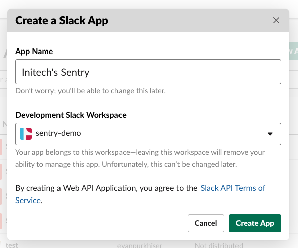
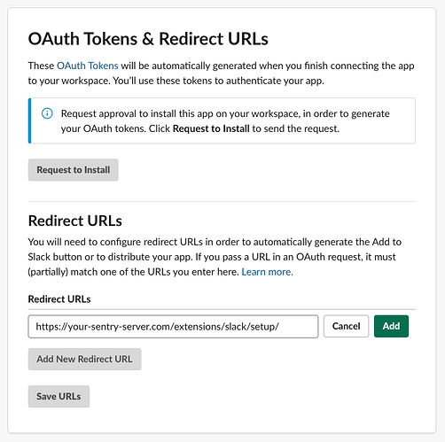
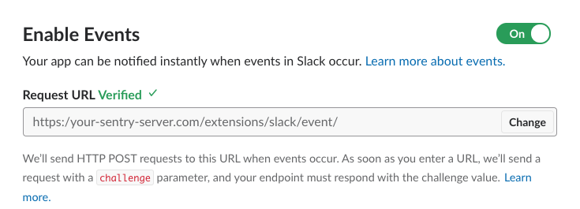
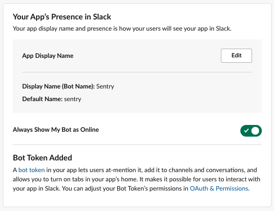

## Create a Slack App

To use Sentry’s Slack integration you’ll need to create a Slack app. Navigate to [Your Apps](https://api.slack.com/apps/) and click **Create New App**.



After naming your app and connecting your workspace, navigate to **Basic Information**. Here you’ll find your Client ID, Client Secret, and Verification token that lets your app access the Slack API.

Here’s where you’ll connect your self-hosted Sentry instance to your newly created Slack app.

Copy your Client ID, Client Secret, and Signing Secret and paste them into `~/.sentry/config.yml` or `~/.sentry/sentry.conf.py`.

```yaml
slack.client-id: <client id>
slack.client-secret: <client secret>
slack.signing-secret: <signing secret>
```

If you're a Sentry employee, you can set the `slack.client-id` and `slack.client-secret` in `devlocal.py` inside `getsentry` instead.

**NOTE**: If you're doing local Sentry development, you should use ngrok and install the Slack integration from the ngrok subdomain or it will fail to install. Refer to [Developing with Ngrok](https://develop.sentry.dev/development-infrastructure/ngrok/) for more information.

After you update the `config.yml`, `sentry.conf.py`, or `devlocal.py` you need to restart your Sentry server to continue configuring the Slack app.

<Alert title="Note (for self-hosted users)">
  After changing configuration files, re-run the <code>./install.sh</code> script, to rebuild and
  restart the containers. See the{" "}
  <Link to="/self-hosted/#configuration">configuration section</Link> for more information.
</Alert>

Now that you’ve created your app and updated your Sentry config, you can navigate to **Interactivity & Shortcuts** under **Features**.

Toggle on **Interactivity & Shortcuts**.

Now you’ll be able to enter your **Request URL** (this is the location of your self-hosted Sentry) and **Options Load URL**:

```
Request URL: {YOUR_DOMAIN}/extensions/slack/action/
Options Load URL: {YOUR_DOMAIN}/extensions/slack/options-load/
```

Navigate to **OAuth & Permissions** to configure the Redirect URLs.



Click **Add a new Redirect URL**, enter the URL, and click **Add**. Set the URL to:

```
{YOUR_DOMAIN}/extensions/slack/setup/
```

Click **Save URLs**.

## Scopes

On the same page under **Scopes** you'll need to add **Bot Scopes** and **User Scopes**.

Add the following scopes to **Bot Scopes**:

<Alert title="Note (for self-hosted users)">
  `channels:history`, `groups:history`, and `app_mentions:read` are used to trigger Seer which is
  not currently available for self-hosted, meaning they're not required permissions to add.
</Alert>

| Scope                  | Reason                                                                                                                                                                              |
| ---------------------- | ----------------------------------------------------------------------------------------------------------------------------------------------------------------------------------- |
| `app_mentions:read`    | Receive `app_mention` events when the bot is mentioned (e.g. @Sentry) in a message.                                                                                                 |
| `channels:read`        | List and validate public channels when configuring alert-rule destinations, and resolve channel names to IDs.                                                                       |
| `channels:history`     | (Optional) Allows Sentry to read messages from public channels. Sentry uses this to gather context of individual threads for conversations with Seer Explorer.                      |
| `chat:write`           | Send and update messages, such as alerts, notifications, and responses.                                                                                                             |
| `chat:write.customize` | Allow sending messages with a custom bot name and icon.                                                                                                                             |
| `chat:write.public`    | Post notifications to public channels the bot hasn't been invited to.                                                                                                               |
| `commands`             | Power the `/sentry` slash command: `link`/`unlink` (identity), `link team`/`unlink team` (channel-to-team mapping), and `help`.                                                     |
| `groups:read`          | Same as `channels:read` but for private channels.                                                                                                                                   |
| `groups:history`       | (Optional) Same as `channels:history` but for private channels.                                                                                                                     |
| `im:history`           | Receive `message.im` events for the bot's help responses in DMs, and fetch DM thread history for Seer Explorer context.                                                             |
| `im:read`              | Receive direct-message events and resolve DM channel metadata, enabling slash commands and messages sent directly to the bot.                                                       |
| `links:read`           | Receive `link_shared` events when a user pastes a Sentry URL in Slack so the integration can generate a rich preview.                                                               |
| `links:write`          | Attach rich unfurl previews (issues, Discover queries, metric alerts) to Sentry URLs shared in Slack.                                                                               |
| `team:read`            | Fetch the workspace name and icon during installation for display in the Sentry integration settings page.                                                                          |
| `users:read`           | Look up workspace users to validate alert-rule recipients, search by username/display name, and automatically link Sentry accounts to Slack identities by email after installation. |

Add the following scopes to **User Scopes**:

| Scope              | Reason                                                                           |
| ------------------ | -------------------------------------------------------------------------------- |
| `links:read`       | Show rich previews when you share Sentry links in Slack.                         |
| `users:read`       | Read your Slack profile to connect it with your Sentry account.                  |
| `users:read.email` | Use your Slack email address to find and link your Sentry account automatically. |

<Alert>
  You have the option to set 'Restrict API Token Usage' on this page if you want to limit use of
  your app’s OAuth tokens to a list of IP addresses and ranges you provide.
</Alert>

Navigate to **Event Subscriptions** and toggle “On”. Here you will enter another Request URL: `{YOUR_DOMAIN}/extensions/slack/event/`

You’ll see “Verified” when you’ve entered the correct URL.



<Alert>
When you enter the 'Request URL', Slack tries to verify it. The request will fail if you didn’t
configure the client keys/secret and restart Sentry to ensure those config changes were picked up.
If it fails to validate, first make sure your Sentry instance is running and Slack can talk to it.

<Link to="https://twitter.com/slackapi/status/567110311476350976?lang=en">
  <span>Slack doesn’t have an IP range.</span>
</Link>
</Alert>

Still on the **Event Subscription** page, go to **Subscribe to bot events** and add the following bot user events:

- `app_mention` (Not supported for self-hosted)
- `link_shared`
- `message.im`

and next go to **Subscribe to events on behalf of users** and add the following event:

- `link_shared`

Lastly, still on that page, go to **App Unfurl Domains**, click **Add Domain** to enter your domain and click Done.

At the bottom of the page, click **Save Changes**.

Navigate to **App Home**, under **Features**. Here is where you can edit your bot's display name (this is the name that will be displayed when alerts are triggered).



If you plan on having Slack alerts sent to specific users (`@person`) in addition to channels, toggle on the **Messages Tab** under **Show Tabs** in the **App Home** page.

Navigate to **Slash Commands** under **Features**. Click **Create New Command** and enter the following values:

| Setting     | Value                                      |
| ----------- | ------------------------------------------ |
| Command     | `/{yourname}-sentry`                       |
| Request URL | `{YOUR_DOMAIN}/extensions/slack/commands/` |

<Alert title="Note (for Sentry employees)">
  When creating the slash command avoid using `/sentry`, try something like `/{your_name}-sentry`,
  if using a shared test workspace. When multiple apps are installed with the same slash command,
  the most recently installed one takes precedence.
</Alert>

At the bottom of the page, click **Save**.

Now you can use Slack with Sentry! See our [documentation on installing and configuring the Slack integration for your projects](https://docs.sentry.io/product/integrations/notification-incidents/slack/) to take advantage of multi-channel Alert routing.
