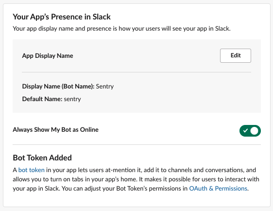

## Create a Slack App

To use Sentry’s Slack integration you’ll need to create a Slack app. Navigate to [Your Apps](https://api.slack.com/apps/) and click __Create New App__.


After naming your app and connecting your workspace, navigate to __Basic Information__. Here you’ll find your Client ID, Client Secret, and Verification token that lets your app access the Slack API.

Here’s where you’ll connect your self-hosted Sentry instance to your newly created Slack app.

Copy your Client ID, Client Secret, and Signing Secret and paste them into <code>config.yml</code>. 

```yaml
slack.client-id: <client id>
slack.client-secret: <client secret>
slack.signing-secret: <signing secret>
```

**NOTE**: If you're doing local Sentry development, you should use a tool like Ngrok and add `system.url-prefix: "https://<your_subdomain>.ngrok.io"` to your `~/.sentry/config.yml`, otherwise, installing the Slack APP will complain because the redirect URI points to `localhost:8000`. Also, install the Slack integration from the ngrok subdomain or it will fail to install.

After you update the <code>config.yml</code> you need to restart your Sentry server to continue configuring the Slack app.

<Alert title="Note" level="info">
    After changing configuration files, re-run the <code>./install.sh</code> script, to rebuild and restart the containers. See the <Link to="/self-hosted/#configuration">configuration section</Link> for more information.
</Alert>

Now that you’ve created your app and updated your Sentry config, you can navigate to __Interactivity & Shortcuts__ under __Features__.

Toggle on __Interactivity__.

Now you’ll be able to enter your **Request URL** (this is the location of your self-hosted Sentry) and **Options Load URL**:

```
Request URL: {YOUR_DOMAIN}/extensions/slack/action/
Options Load URL: {YOUR_DOMAIN}/extensions/slack/options-load/
```

Navigate to __OAuth & Permissions__ to configure the Redirect URLs.


Click __Add a new Redirect URL__, enter the URL, and click __Add__. Set the URL to:

```
{YOUR_DOMAIN}/extensions/slack/setup/
```

Click __Save URLs__.

On the same page under __Scopes__ you'll need to add __Bot Scopes__ and __User Scopes__.

Add the following scopes to __Bot Scopes__:

* `channels:read`
* `chat:write`
* `chat:write.customize`
* `chat:write.public`
* `commands`
* `groups:read`
* `im:history`
* `im:read`
* `links:read`
* `links:write`
* `team:read`
* `users:read`

Add the following scopes to __User Scopes__:

* `links:read`
* `users:read`
* `users:read.email`

<Alert level="info">
You have the option to set 'Restrict API Token Usage' on this page if you want to limit use of your app’s OAuth tokens to a list of IP addresses and ranges you provide.
</Alert>

Navigate to __Event Subscriptions__ and toggle “On”. Here you will enter another Request URL: `{YOUR_DOMAIN}/extensions/slack/event/`

You’ll see “Verified” when you’ve entered the correct URL.


<Alert level="info">
When you enter the 'Request URL', Slack tries to verify it. The request will fail if you didn’t configure the client keys/secret and restart Sentry to ensure those config changes were picked up. If it fails to validate, first make sure your Sentry instance is running and Slack can talk to it (Slack <Link to="https://twitter.com/slackapi/status/567110311476350976?lang=en">doesn’t have an IP range</Link>).
</Alert>

Still on the __Event Subscription__ page, go to __Subscribe to bot events__ and add the following bot user events:

* `link_shared`
* `message.im`

and next go to __Subscribe to events on behalf of users__ and add the following event:

* `link_shared`

Lastly, still on that page, go to __App Unfurl Domains__, click __Add Domain__ to enter your domain and click Done.

At the bottom of the page, click __Save Changes__.

Navigate to __App Home__, under __Features__. Here is where you can edit your bot's display name (this is the name that will be displayed when alerts are triggered).



If you plan on having Slack alerts sent to specific users (`@person`) in addition to channels, toggle on the __Messages Tab__ under __Show Tabs__ in the __App Home__ page.

Navigate to __Slash Commands__ under __Features__. Click __Create New Command__ and enter the following values:

| Setting                         | Value                                         |
| ------------------------------- | --------------------------------------------- |
| Command                         | `/sentry`                                     |
| Request URL                     | `{YOUR_DOMAIN}/extensions/slack/commands/` |

At the bottom of the page, click __Save__.

Now you can use Slack with Sentry! See our [documentation on installing and configuring the Slack integration for your projects](https://docs.sentry.io/product/integrations/notification-incidents/slack/) to take advantage of multi-channel Alert routing.
