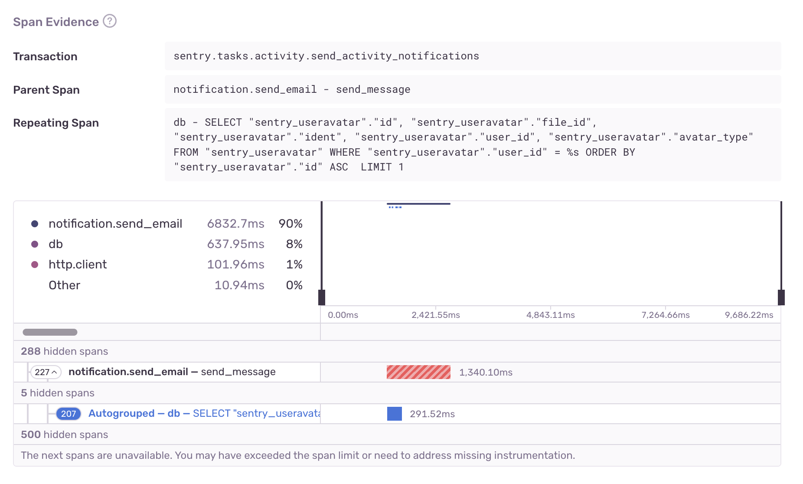
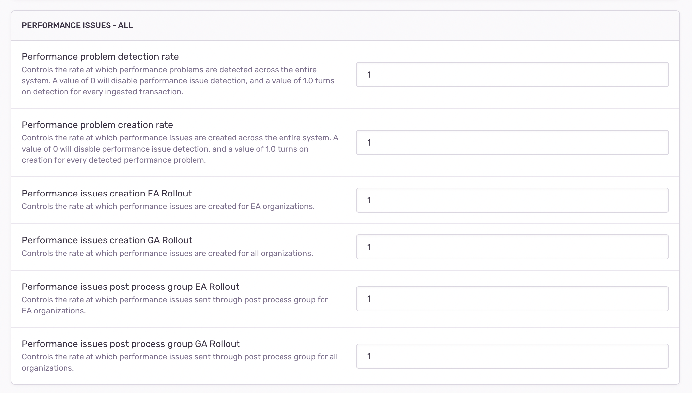
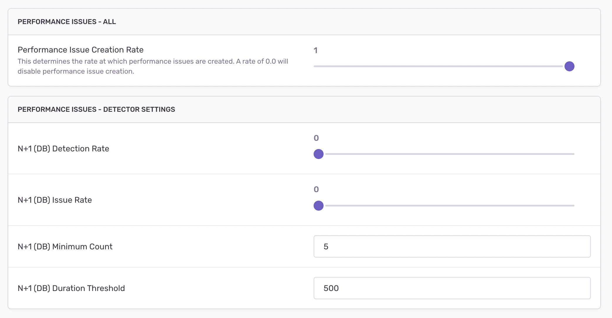

Issue detectors identify application issues by examining one or more datasets collected by Sentry, and report detected issue occurrences via the <Link to="/issue-platform/">Issue Platform</Link>. Detectors must fingerprint issues accurately and provide actionable information to developers.
# Considerations

## Fingerprinting

Error events are categorized using various strategies such as stack traces. Users have the flexibility to customize these strategies. Error fingerprinting is a complex and continuously evolving mechanism that has been in existence for many years.

For new types of issues, it is recommended to start with a simpler one-level grouping strategy. Fingerprinting strategies should be allowed to evolve gradually, as an incremental approach works best. It is difficult to anticipate all edge cases until actual data can be fingerprinted.

A fingerprint represents a unique problem. Each occurrence with that fingerprint has the same root cause and the same fix. For N+1 DB Query Issues, a fingerprint is a hash of parameterized repeated `db` span description, source span description, parent span description and a problem class (N+1 DB Query). <Link to="https://github.com/getsentry/sentry/blob/master/src/sentry/utils/performance_issues/detectors/n_plus_one_db_span_detector.py#L253-L258">Code</Link>.

If an issue has 3 events, it means that this specific problem has occurred 3 times with the same cause. Fixing this one issue should prevent all 3 instances from recurring.

### Risk: Loose grouping strategy

Suppose we group all N+1 DB Query problems based solely on the problem class. This violates the principle of "same problem, same fix". Different N+1 DB Queries would require different fixes.

### Risk: Strict grouping strategy

Suppose we group all N+1 DB Queries that have exactly the same span DB description (without parameterization). In this case, if a query contains dynamic fields like dates, it would result in too many separate issues. Although these issues have the same fix, they would not be grouped together. This also goes against the principles of fingerprinting.

### Risk: Fingerprinting only on mock events

Ensure that the fingerprinting strategy is tested with real data, not only from Sentry but also from other organizations!

### Example: N+1 DB Query fingerprinting brainstorm
Let's brainstorm an example of N+1 database query fingerprinting. Here's the breakdown:

- Problem: Our objective is to identify N+1 database queries.
- Contextual information available for analysis:
    - Problem Class: Identifying the specific problem class of N+1 database queries.
    - Repeated span operation and description: Analyzing the operation and description of the repeated spans.
    - Span that initiated repeated spans (preceding span): Examining the span that triggered the occurrence of repeated spans.
    - Parent span of repeated and preceding spans: Understanding the relationship and hierarchy between the parent span and the repeated/preceding spans.
    - Transaction name: Considering the transaction name associated with the query, noting that different transactions can exhibit the same N+1 problem.
    - Tags: Exploring any relevant tags associated with the query.
    - SDKs: Taking into account the SDKs type or version in the transaction.
- Unique aspects relevant to the problem:
    - Problem Class: Capturing the specific problem class of N+1 database queries.
    - Repeated span operation and description: Identifying the repeated span operation and description that characterizes the issue.
    - Span that initiated repeated spans (preceding span): Analyzing the span responsible for initiating the occurrence of repeated spans.
    - Parent span of repeated and preceding spans: Considering the parent span that encompasses both the repeated and preceding spans.
    - Transaction name: Recognizing that different transactions can manifest the same N+1 problem.
    - Tags: Taking into account any tags associated with the query.
    - Any dynamic fields: Considering the presence of dynamic fields within the query.
- Creation of resulting fingerprint:
    - Problem Class: Incorporating the problem class of N+1 database queries into the fingerprint.
    - Parameterized repeated span description: Using parameterized descriptions of the repeated span in the fingerprint.
    - Parameterized source span description: Including parameterized descriptions of the source span in the fingerprint.
    - Parameterized parent span description + parent operation: Incorporating parameterized descriptions of the parent span, along with the parent operation, in the fingerprint.

By utilizing this fingerprinting approach, we can effectively identify and classify N+1 database queries based on their unique characteristics and contextual information, ensuring effective grouping.

## Actionability/Usefulness

Once you have figured out the fingerprinting process and know how to group instances of the same problem with the same fix, the next step is to provide users with all the necessary information to fix the issue. The quality of an issue lies not only in its accurate detection but also in its actionability.

N+1 DB Query detection relies heavily on span analysis to identify problematic spans and guide users toward a potential fix.

Reporting circumstantial data is not useful! This is a crucial distinction between issues and alerts. Issues should pinpoint root problems and help resolve them.


## Signal vs. Noise

With every new issue type, we could be adding more and more noise to the Issues product. New issues fatigue is real for our customers. This is why it’s important to understand how a new detector you want to ship affects the overall noise of the Issue Stream.

Accurate detection of truly valuable problems and correct grouping can transform "noise" into "signal." Every detector should be evaluated against this standard. There is an option to [define a custom noise config](https://develop.sentry.dev/issue-platform/#register-an-issue-type) when creating a new detector.

# Development

## Bits’n’Bobs

Performance issues affect many parts of the system, and it’s easy to overlook something. Here are a few places to look to make sure your issues are working well:

- **UI edges**. Do your issues look correct in the issue stream? Check the severity level, title, description, and hover card content.
- **Email notifications**. Does the UI match the issue details page for your new detector’s issues?
- **Slack notifications**. Do the notifications for your issue make sense?
- **Integrations**. Does converting your issue to a Jira/Linear/GitLab task work nicely?
- **Searching**. Is is possible to search for your issue by type in the issue stream?
- **Alpha and Beta badges**.  Did you add Alpha or Beta badges to the issue details page as appropriate?
- **Public documentation**. Does your detector have a corresponding page on [docs.sentry.io](https://docs.sentry.io)?

## Testing

Whenever possible, conduct tests using real data. It's advised to use actual transaction event JSON files to perform unit testing for Performance Detectors.

Another tool that we used for validating and testing detector changes is a [CLI script](https://github.com/getsentry/sentry/pull/39727):

```shell
sentry performance detect /path/to/event.json
```

## Deployment

A safe rollout strategy will depend on your team's implementation of detection and issue creation. However, there are general considerations to keep in mind:

- Dry run detectors
    - Validate detection accuracy on real data
    - Check detection in the production environment. An example of how to conduct an audit is [here](https://www.notion.so/How-To-Audit-Performance-Detector-Dry-Runs-5d2c056b55f44e9d8eac1fd1834a4a20).
- Decouple detection and issue creation
    - Roll out detection and issue creation separately
- Options for rates, thresholds
    There are two kinds of options we use at Sentry, options usually refers to “system-wide” `options`, and `projectoptions` refers to options set for specific projects. We are using a combination of these to allow us to opt in the following:
    - Detection rates
        - We have implemented separate detection rates, allowing us to add new detectors or adjust thresholds on existing detectors. This enables us to track and report these changes through metrics.
    - Thresholds
        - This capability allows us to fine-tune our detectors and observe their effects in real-time within the production environment. By adjusting the detection parameters and thresholds, we can monitor how these changes impact the detection accuracy and the number of detected issues.

```python
# projectoptions/defaults.py
key="sentry:performance_issue_creation_rate", default=1.0

key="sentry:performance_issue_settings",
default={
"n_plus_one_db_count": 5,
"n_plus_one_db_duration_threshold": 500,
}
```



- Per-project detection settings
    [Project settings:](https://sentry.io/settings/sentry/projects/sentry/performance/)

    
