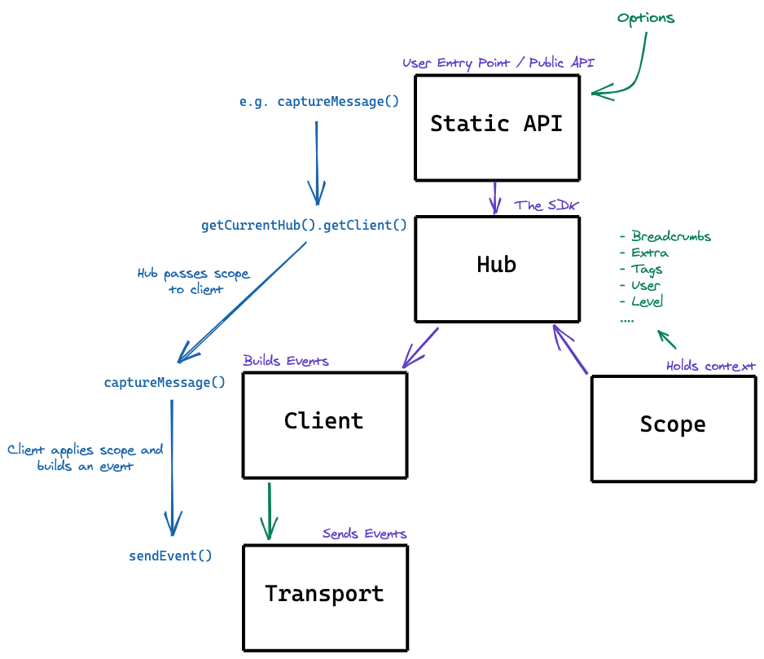

<SpecRfcAlert />

<SpecMeta />

## Overview

The Hub & Scope model was the original concurrency and context management system in Sentry SDKs, defined by the Unified API. It provided a way to propagate contextual data (tags, user, breadcrumbs) through an application and apply it to captured events.

This model has been **superseded** by the [Scopes](/sdk/foundations/state-management/scopes/) spec, which introduces three distinct scope types (global, isolation, current) aligned with OpenTelemetry's Context propagation. See [Migration](#migration) for the mapping from old to new APIs.

The decision to remove the Hub from all Sentry SDKs was confirmed on 2024-05-03 (see [RFC 0122](https://github.com/getsentry/rfcs/pull/122)).



---

## Concepts

- **Hub**: An object that manages a stack of `(Client, Scope)` pairs. A thread-local (or context-local) hub exists by default; hubs can also be created manually.

- **Scope**: A mutable container for contextual data (tags, breadcrumbs, user, contexts, extras, fingerprints, event processors) that is implicitly applied to all events captured through the hub.

- **Client**: A stateless object responsible for building Sentry events from captured data and dispatching them to the transport. Configured once and bound to a hub.

- **Transport**: An internal construct that handles event delivery — queueing, retrying, rate limiting, and optionally persisting unsent events across restarts.

- **Minimal/Facade Package**: A separate package that re-exports a subset of SDK functionality through interfaces or proxies, allowing libraries to record breadcrumbs and set context without a hard dependency on the SDK. All operations become no-ops if the SDK is not installed.

- **Hints**: SDK-specific metadata about the origin of an event (e.g., the original exception object). Passed as an optional parameter to capture and breadcrumb methods.

- **Event Processors**: Callbacks registered on a scope that run for every event. They receive an event and return a modified event or `null` to discard it.

- **Disabled SDK**: The SDK is considered disabled when the client has no transport. In this state, callbacks like `configure_scope` and event processors **SHOULD NOT** be invoked, and breadcrumbs **SHOULD NOT** be recorded.

---

## Behavior

<SpecSection id="hub-lifecycle" status="deprecated" since="1.0.0">

### Hub Lifecycle

The SDK **MUST** maintain two hub variables:

- **Main hub**: A global variable, set during `init()`. Used as the base for newly spawned threads.
- **Current hub**: A thread-local (or async-local/context-local) variable. Defaults to the main hub.

When a new thread or execution context is created, the current hub **SHOULD** be initialized as a clone of the main hub's top stack entry, giving it the same client and a copy of the scope.

The hub internally manages a stack of `(Client, Scope)` pairs:

- `push_scope()` pushes a new scope layer that inherits data from the previous scope. **SHOULD** return a disposable/guard for automatic cleanup.
- `pop_scope()` removes the top scope layer. **SHOULD** be avoided in favor of disposable patterns or `with_scope()`.
- `with_scope(callback)` pushes a scope, invokes the callback, then pops. Preferred over manual push/pop.
- `run(callback)` binds the hub as the current hub for the duration of the callback.

Hubs can be cloned via `Hub::new_from_top(hub)`, which copies the top stack entry (client reference + scope clone).

</SpecSection>

<SpecSection id="scope-data" status="deprecated" since="1.0.0">

### Scope Data Management

A scope holds contextual data that is implicitly applied to events. SDKs **MUST** support the following scope operations:

| Method | Description |
|---|---|
| `set_user(user)` | Shallow-merge user data (email, username, id, ip_address). Removing user data is SDK-defined. |
| `set_tag(key, value)` | Set a string tag for event searching. |
| `set_tags(tags)` | Convenience for multiple `set_tag` calls. |
| `set_context(key, value)` | Set structured context data (typed per SDK). |
| `set_extra(key, value)` | Set arbitrary extra data. *Deprecated in favor of `set_context`.* (since 1.2.0) |
| `set_extras(extras)` | Convenience for multiple `set_extra` calls. *Deprecated.* (since 1.2.0) |
| `set_level(level)` | Override the event level for all events in this scope. |
| `set_transaction(name)` | Set the transaction name. |
| `set_fingerprint(fingerprint[])` | Set the fingerprint for grouping. |
| `add_breadcrumb(breadcrumb)` | Add a breadcrumb to the scope. |
| `clear_breadcrumbs()` | Remove all breadcrumbs from the scope. |
| `clear()` | Reset the scope to defaults, keeping event processors. Does not affect parent or child scopes. |
| `add_event_processor(fn)` | Register a callback that processes every event. Returns modified event or `null` to discard. |
| `add_error_processor(fn)` | *(Optional)* Register a callback that receives both event and exception object. |
| `apply_to_event(event)` | Apply scope data to an event, invoking all event processors. |

The user-facing API for modifying the scope is `configure_scope(callback)`, which passes the current scope to the callback. If the SDK is disabled, the callback **SHOULD NOT** be invoked.

```javascript
Sentry.configureScope((scope) =>
  scope.setExtra("character_name", "Mighty Fighter")
);
```

</SpecSection>

<SpecSection id="static-api" status="deprecated" since="1.0.0">

### Static API

The static API is the primary user-facing surface. These functions are aliases for operations on the current hub. SDKs **MUST** export them in the top-level namespace.

| Function | Description |
|---|---|
| `init(options)` | Entry point. Creates/reinitializes the global hub, configures a client, binds it. **MUST** set up default integrations. Calling multiple times is permitted (for testing). |
| `capture_event(event)` | Dispatch an assembled event to the current hub. |
| `capture_exception(error)` | Report an exception. Platform-specific parameter variations allowed. |
| `capture_message(message, level?)` | Report a message. Level defaults to `info`. |
| `add_breadcrumb(crumb)` | Add a breadcrumb. If total exceeds `max_breadcrumbs`, remove the oldest. Ignored if SDK is disabled. |
| `configure_scope(callback)` | Invoke callback with the current scope for modification. |
| `last_event_id()` | Return the last event ID emitted by the current scope. |
| `start_session()` | Store and start tracking a session on the current scope. Implicitly ends any existing session. (since 1.3.0) |
| `end_session()` | End the current session, set status and duration, enqueue for sending. (since 1.3.0) |

</SpecSection>

<SpecSection id="concurrency" status="deprecated" since="1.0.0">

### Concurrency

SDKs **MUST** provide concurrency-safe context storage. The implementation depends on the platform:

- **Thread-bound hub**: Each thread gets its own hub with an internal scope stack. The thread that calls `init()` becomes the main hub. New threads get a hub cloned from the main hub.

- **Internally scoped hub**: On platforms with ambient data (e.g., .NET), the hub manages scopes internally using platform-native context propagation.

- **Singleton hub**: On platforms without inherent concurrency (some JavaScript environments), the hub may be a global singleton.

</SpecSection>

<SpecSection id="event-pipeline" status="deprecated" since="1.0.0">

### Event Pipeline

An event captured by `capture_event` is processed in order. The event **MAY** be discarded at any stage, stopping further processing.

1. **Disabled check**: If the SDK is disabled (no transport), discard immediately.
2. **Sampling**: Apply the configured sample rate. Events **MAY** be randomly discarded.
3. **Scope application**: Call `apply_to_event`, which applies scope data and invokes event processors in registration order. Any processor returning `null` discards the event.
4. **`before_send` hook**: Invoke the user-configured callback. Returning `null` discards the event.
5. **Transport**: Pass the event to the transport. The transport **MAY** discard due to missing DSN, full queue, or rate limiting.

</SpecSection>

<SpecSection id="client-api" status="deprecated" since="1.0.0">

### Client

The client is stateless — it receives the scope and delegates sending to the transport.

| Method | Description |
|---|---|
| `from_config(config)` | Constructor. Accepts options (DSN, etc.). |
| `capture_event(event, scope)` | Merge event with scope data, dispatch to transport. |
| `close(timeout)` | Flush the queue for up to `timeout` seconds. The client **SHOULD** be disabled/disposed after close. |
| `flush(timeout)` | Same as `close`, but the client remains usable. |

Hub methods for client management:

| Method | Description |
|---|---|
| `bind_client(client)` | Bind a client to the current hub. |
| `unbind_client()` | *(Optional)* Unbind the current client. |
| `client()` / `get_client()` | Return the current client or `null`. |

</SpecSection>

---

## Migration

The Hub & Scope model is superseded by the [Scopes](/sdk/foundations/state-management/scopes/) spec. The following table maps old APIs to new equivalents:

| Old API | New API | Notes |
|---|---|---|
| `getCurrentHub()` | *(removed)* | Use `getCurrentScope()`, `getIsolationScope()`, `getGlobalScope()` directly. A shim **MAY** be provided during migration. |
| `getCurrentHub().getScope()` | `getCurrentScope()` | |
| `getCurrentHub().getClient()` | `getClient()` | Walks scope chain; never returns `null` (NoOpClient before init). |
| `hub.run(callback)` | `withIsolationScope(callback)` | |
| `hub.withScope(callback)` | `withScope(callback)` | Now forks an execution context, not just a scope layer. |
| `hub.pushScope()` / `popScope()` | `withScope(callback)` | Prefer callback-based API. |
| `configureScope(callback)` — transaction-wide | `getIsolationScope()` | For data affecting the whole request/transaction. |
| `configureScope(callback)` — span-local | `getCurrentScope()` | For data affecting just the current span. |
| `hub.bindClient(client)` | `scope.setClient(client)` | |

See [Scopes: Backwards Compatibility](/sdk/foundations/state-management/scopes/#backwards-compatibility) for the migration phase strategy.

---

## Changelog

<SpecChangelog />
