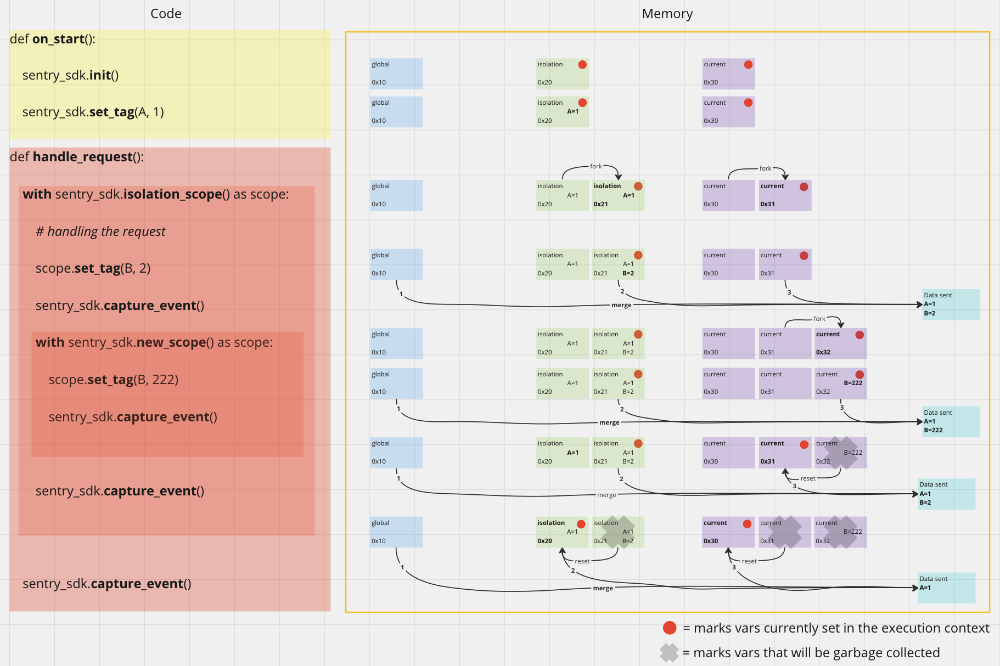

<SpecRfcAlert />

<SpecMeta />

## Overview

Scopes are the mechanism by which Sentry SDKs propagate contextual data (tags, breadcrumbs, user, contexts, attributes) through an application and apply it to captured events. Every SDK **MUST** implement three scope types — global, isolation, and current — each with a different propagation lifetime.

This model replaces the [Hub & Scope](/sdk/foundations/state-management/hub-and-scope/) model. The Hub is removed; its functionality is absorbed into the three scope types. The design aligns with [OpenTelemetry's Context](https://opentelemetry.io/docs/specs/otel/context/) propagation — an immutable, fork-on-write mechanism that carries execution-scoped values across API boundaries. See [RFC 0122](https://github.com/getsentry/rfcs/pull/122) for the original design.

Related specs:
- [Attributes](/sdk/foundations/state-management/scopes/attributes) — attribute type system for scope data
- [Breadcrumbs](/sdk/foundations/state-management/scopes/breadcrumbs/) — structured event trail on scopes
- [Hub & Scope](/sdk/foundations/state-management/hub-and-scope/) — deprecated predecessor

---

## Concepts

### Three Scope Types

| Scope | Lifetime | Storage | Who Forks It |
|---|---|---|---|
| **Global** | Entire process | Global variable | Never forked |
| **Isolation** | Request, tab, or user session | Context variable / thread-local / async-local | SDK integrations (automatically) |
| **Current** | Single span or `withScope` block | Context variable / thread-local / async-local | `withScope()` or starting a new span |

### Copy-on-Write

When a scope is forked, the new scope receives a copy of all data from the parent. Changes to the forked scope do not affect the parent, and changes to the parent after forking do not affect the fork.

This replaces the manual hub-cloning pattern from the old model. Users no longer need to manage scope isolation — it happens automatically when spans are created or `withScope()` is called.

### Scope Chain

Clients are resolved by walking the scope chain: current scope -> isolation scope -> global scope. If no client is found, a NoOpClient is used (see [Client Resolution](#client-resolution)).

---

## Behavior

<SpecSection id="global-scope" status="stable" since="1.0.0">

### Global Scope

The global scope is a process-wide singleton. Data set on the global scope **MUST** be applied to **all** events emitted by the SDK, regardless of thread, request, or execution context.

The global scope is typically used for application-wide data such as `release` and `environment`.

The global scope is **never** forked. There is exactly one global scope per process.

Before `Sentry.init()` is called, the global scope **MUST** exist with a NoOpClient. `Sentry.init()` replaces the NoOpClient with the configured client on the global scope.

</SpecSection>

<SpecSection id="isolation-scope" status="stable" since="1.0.0">

### Isolation Scope

The isolation scope **MUST** contain data specific to the current execution context: a single request (on a server), a single tab (in a browser), or a single user session (on mobile).

Top-level SDK APIs such as `Sentry.setTag()`, `Sentry.setUser()`, and `Sentry.setContext()` **MUST** write to the isolation scope.

The isolation scope **SHOULD** be implemented using a context variable, thread-local storage, async-local storage, or an equivalent mechanism appropriate for the platform.

SDK integrations **MUST** handle the forking of isolation scopes automatically. Users **MUST NOT** need to manage or think about isolation scope forking. SDKs **SHOULD NOT** fork isolation scopes more than necessary — excessive forking reintroduces the problems isolation scopes are designed to solve.

When the isolation scope is forked, the SDK **MUST** also fork the current scope at the same time. This avoids requiring users to call both `withScope` and `withIsolationScope`.

**When to fork isolation scope:**

SDKs **SHOULD** fork the isolation scope at natural isolation boundaries:
- Incoming HTTP request (server)
- New tab or navigation (browser)
- New user session (mobile)
- Queue job or background task
- In POTel SDKs, `Propagator.extract` is a natural fork point (see [OTel Context Alignment](#otel-context-alignment))

</SpecSection>

<SpecSection id="current-scope" status="stable" since="1.0.0">

### Current Scope

The current scope **MUST** maintain data for the active span. When a new span is started, the current scope of the parent span **MUST** be forked (duplicated), transferring all data from the parent scope to the new scope. This allows modifications specific to the new span without affecting the parent span.

Any changes made to the current scope after forking **MUST NOT** impact the parent scope. Any changes made to the parent scope after forking **MUST NOT** impact the forked scope.

The current scope **SHOULD** be implemented using a context variable, thread-local storage, async-local storage, or an equivalent mechanism appropriate for the platform.

Users **MAY** fork the current scope explicitly by invoking `Sentry.withScope()` or implicitly by starting a new span.

</SpecSection>

<SpecSection id="scope-data-application" status="stable" since="1.0.0">

### Applying Scope Data to Events

Data from all three scope types **MUST** be merged in a specific order before being applied to an event:

1. Data from the **global scope** is...
2. merged with data from the **isolation scope**, which is...
3. merged with data from the **current scope**, which is...
4. optionally merged with additional data (e.g., from `captureException(error, { tags })`)...
5. applied to the **event**

When the same key exists in multiple scopes, the more specific scope wins: current > isolation > global. Event-level data (from step 4) takes highest precedence.


</SpecSection>

<SpecSection id="copy-on-write" status="stable" since="1.3.0">

### Copy-on-Write Semantics

Scope forking implements copy-on-write:

- `withScope(callback)` forks the current scope for the duration of the callback. The forked scope is discarded when the callback returns.
- Starting a new span forks the current scope automatically.
- `withIsolationScope(callback)` forks both the isolation scope and the current scope.

After forking, the original and forked scopes are fully independent. Mutations to either do not affect the other.

This replaces the old model where users had to manually create hub clones to achieve isolation in async contexts. The new model handles this automatically — when OTel or the SDK forks a context (e.g., for a new span), the scope is forked with it.

</SpecSection>

### Scope Attributes

Users **MUST** be able to attach [attributes](/sdk/foundations/state-management/scopes/attributes/) to any scope. Attributes set on scopes follow scope precedence rules (current > isolation > global) and are applied to telemetry items at capture time. See the [Attributes](/sdk/foundations/state-management/scopes/attributes/) spec for the full data model, API, precedence rules, and examples.

### Scope Breadcrumbs

Breadcrumbs live on scopes and create a trail of events leading up to an issue. They are stored in a ring buffer and merged from all three scopes at capture time. See the [Breadcrumbs](/sdk/foundations/state-management/scopes/breadcrumbs/) spec for the full data model, types, ring buffer behavior, and automatic recording.

<SpecSection id="scope-data-methods" status="stable" since="1.0.0">

### Other Scope Data Methods

In addition to [attributes](/sdk/foundations/state-management/scopes/attributes/) and [breadcrumbs](/sdk/foundations/state-management/scopes/breadcrumbs/), users **MUST** be able to set the following data on any scope:

| Method | Description |
|---|---|
| `set_user(user)` | Set user context (email, username, id, ip_address). |
| `set_tag(key, value)` | Set a string tag for event searching. |
| `set_tags(tags)` | Convenience for multiple `set_tag` calls. |
| `set_context(key, value)` | Set structured context data. |
| `set_level(level)` | Override event severity level. |
| `set_fingerprint(fingerprint[])` | Set grouping fingerprint. |
| `add_event_processor(fn)` | Register an event processor callback. |
| `clear()` | Reset scope to defaults, keeping event processors. |

These methods have the same semantics as in the [Hub & Scope](/sdk/foundations/state-management/hub-and-scope/) spec. The difference is **which scope** they are called on — the scope type determines the propagation lifetime of the data.

</SpecSection>

<SpecSection id="client-resolution" status="stable" since="1.0.0">

### Client Resolution

A client **MUST** always be available — SDKs **MUST NOT** return `null` from `getClient()`.

Before `Sentry.init()` is called, a NoOpClient **MUST** be present on the global scope. `Sentry.init()` replaces it with the configured client.

Users **MAY** bind a different client to any of the three scopes. Client resolution walks the scope chain:

1. Check the current scope for a client
2. Check the isolation scope for a client
3. Check the global scope for a client
4. Fall back to the NoOpClient (should not happen if init was called)

</SpecSection>

<SpecSection id="otel-context-alignment" status="stable" since="1.4.0">

### OTel Context Alignment

The three-scope model is designed to align with OpenTelemetry's [Context](https://opentelemetry.io/docs/specs/otel/context/) propagation. OTel Context is immutable — mutations create a new Context (fork). Sentry scopes mirror this behavior.

SDKs that use OTel for instrumentation (POTel) **SHOULD** store scopes on the OTel Context to leverage OTel's propagation mechanisms (thread propagation, async propagation, reactive library support).

#### Storing Scopes

SDKs **SHOULD** store both isolation and current scope on the OTel Context. This allows the SDK to rely on OTel's context propagation instead of maintaining its own propagation for each platform.

If the language allows modifying OTel spans (e.g., adding attributes or references), the SDK **MAY** store scope references directly on spans. Otherwise, a global weak-reference map from OTel spans to Sentry scopes **SHOULD** be used to avoid memory leaks.

#### Forking Hooks

SDKs need a hook to fork scopes when OTel creates new spans or contexts. Available hooks vary by language:

- **Context forking**: Intercept `context.with(...)` calls
- **Context storing**: Intercept `context.makeCurrent()` calls
- **Span creation**: Intercept new span creation in `SpanProcessor.onStart`

SDKs **SHOULD** fork scopes when a new OTel span is created. If multiple hooks are available, SDKs **MAY** filter to only fork when the span changes, to reduce unnecessary forks.

#### Isolation Scope in POTel

SDKs **SHOULD** fork the isolation scope in `Propagator.extract`, which is called by auto-instrumentation for incoming server requests and message consumers. If this approach does not work for a given platform, the SDK **MAY** check `span.isRemote` to determine if a new isolation scope is needed.

#### SpanProcessor.onEnd Limitation

In `SpanProcessor.onEnd` and `SpanExporter.export`, `Context.current()` returns the **parent** context, not the context that was active during span execution. This is by design in OTel. SDKs **MUST** retrieve the scope associated with a span via the span itself (if the language supports it) or via the global weak-reference map — not from `Context.current()`.

</SpecSection>

<SpecSection id="propagation-context" status="stable" since="1.0.0">

### Propagation Context

The propagation context (trace ID, span ID, baggage/DSC) **MUST** be stored on the scope. It is used for:

- Generating `sentry-trace` and `baggage` headers for outgoing requests
- Connecting error events to the active trace (tracing without performance)

The isolation scope is the canonical location for the propagation context. When no active span exists, the propagation context from the isolation scope **MUST** be used. See [Tracing without Performance](/sdk/telemetry/traces/tracing-without-performance/) for details.

</SpecSection>

---

## Public API

SDKs **MUST** expose the following top-level functions for scope access and manipulation:

### Scope Accessors

| Function | Description |
|---|---|
| `getGlobalScope()` | Return the global scope singleton. |
| `getIsolationScope()` | Return the isolation scope for the current execution context. |
| `getCurrentScope()` | Return the current scope for the active span / execution context. |
| `getClient()` | Return the client by walking the scope chain. Never returns `null`. |

### Scope Forking

| Function | Description |
|---|---|
| `withScope(callback)` | Fork the current scope, invoke callback, discard the fork when done. |
| `withIsolationScope(callback)` | Fork both the isolation scope and current scope, invoke callback, discard the forks when done. |

### Top-Level Data Setters

These convenience functions write to the **isolation scope**:

| Function | Target Scope |
|---|---|
| `Sentry.setTag(key, value)` | Isolation scope |
| `Sentry.setUser(user)` | Isolation scope |
| `Sentry.setContext(key, value)` | Isolation scope |
| `Sentry.addBreadcrumb(breadcrumb)` | Isolation scope |
| `Sentry.setAttributes(attributes)` | Isolation scope |

### Capture Functions

Capture functions operate on the **current scope**:

| Function | Description |
|---|---|
| `Sentry.captureException(error)` | Capture an exception on the current scope. |
| `Sentry.captureMessage(message)` | Capture a message on the current scope. |
| `Sentry.captureEvent(event)` | Capture a raw event on the current scope. |

---

## Examples

### SDK API Usage

#### JavaScript

```javascript
// Global scope — applied to everything
Sentry.getGlobalScope().setAttributes({
  "app.version": "2.1.0",
});

// Isolation scope — per-request (automatic in server frameworks)
// Top-level APIs write here
Sentry.setTag("transaction", "GET /users");
Sentry.setUser({ id: "user-123" });

// Current scope — localized data
Sentry.withScope((scope) => {
  scope.setTag("operation", "db-query");
  scope.setContext("query", { sql: "SELECT * FROM users" });
  Sentry.captureException(error);
});
// scope is discarded here, "operation" tag does not leak
```

#### Python

```python
import sentry_sdk

# Global scope
sentry_sdk.get_global_scope().set_attributes({
    "app.version": "2.1.0",
})

# Isolation scope (automatic per-request in WSGI/ASGI)
sentry_sdk.set_tag("transaction", "GET /users")
sentry_sdk.set_user({"id": "user-123"})

# Current scope — localized
with sentry_sdk.new_scope() as scope:
    scope.set_tag("operation", "db-query")
    sentry_sdk.capture_exception(error)
```

### Scope Forking Behavior



The diagram shows how `withScope()` and `withIsolationScope()` fork scopes and how data flows between them.

---

<SpecSection id="backwards-compatibility" status="stable" since="1.2.0">

## Backwards Compatibility

During the migration from [Hub & Scope](/sdk/foundations/state-management/hub-and-scope/) to the three-scope model:

1. **Top-level APIs** (e.g., `Sentry.setTag()`) **SHOULD** write to **both** current and isolation scope during the migration phase. In a subsequent major version, they **MUST** write to isolation scope only.

2. **`getCurrentHub()`** **MAY** be provided as a compatibility shim that proxies to the new scope APIs. It **SHOULD** be marked deprecated.

3. **`configureScope(callback)`** **SHOULD** be deprecated. Users should migrate to calling `getIsolationScope()` or `getCurrentScope()` directly, depending on the intended scope lifetime.

4. **Hub-specific APIs** (`pushScope`, `popScope`, `bindClient`, `run`) **SHOULD** be shimmed to the new equivalents and marked deprecated.

See [Hub & Scope: Migration](/sdk/foundations/state-management/hub-and-scope/#migration) for the complete API mapping table.

</SpecSection>

---

## Changelog

<SpecChangelog />
