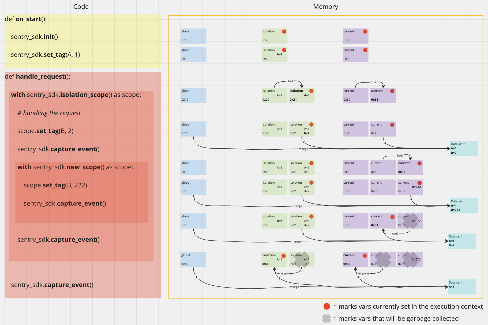

<Alert title="Note" level="info">
This is work in progress. 

Development has started in JS and Python, but we are still ironing out the wrinkles.
</Alert>

# Hub & Scope Refactoring

All of Sentry's SDKs use the so-called <Link to="/sdk/unified-api/">Unified API</Link> under the hood. This API has some limitations and therefore we are refactoring it. This is a massive undertaking.

## Why Are We Doing This?

There are two reasons we are doing this:
1. Being 100% compatible with OpenTelemetry (OTel) performance data.
2. Make Sentry concepts easier to understand and match the concepts of OpenTelemetry (OTel).

### Being 100% Compatible to OpenTelemetry

What Sentry calls a `Scope` is called <Link to="https://opentelemetry.io/docs/specs/otel/context/">`Context`</Link> in OTel. Contexts in OTel are immutable and thus whenever a context is mutated in OTel a new context is created (forked from the currently active scope). 
Whenever a new span is created in Otel a new context is forked. This leads to a lot of nested contexts and the Sentry scopes should be able to reproduce this.
This is necessary because the Sentry SDKs should be able to capture all spans from OTel with the correct data from the correct context applied to them before sending them to Sentry.

### Make Sentry Concepts Easier to Understand

We have different concepts like a `Hub` and `Scope`s in the Unified API and those concepts sometimes leak to the end user of our SDKs. Those concepts are complicated and the users should never need to think about what a `Hub` or a `Scope` is and if they should clone them or not. 

## What Is the Outcome of the Refactoring?

1. We want to make Sentry SDKs 100% compatible with OTel performance data, so users can choose to use OTel tooling for their performance monitoring and still see their data in Sentry. (And Sentry error events are still connected to the spans captured by OTel)
1. We want to make it easier for the users to do custom performance instrumentation with as little as possible mental overhead. The `Hub` will be gone.

This is why we started this journey with an <Link to="https://github.com/getsentry/rfcs/pull/122">RFC</Link>.

## What Is the Plan?

We will merge the functionality of the `Hub` and the `Scope` of the <Link to="/sdk/unified-api/">Unified API</Link> into the `Scope` and we will remove the `Hub`. We will add some new APIs that make it easier for the user to do custom instrumentation. We will update our auto instrumentation to fork a scope whenever a new span is created. This aligns us with what OTel does.

## The New Concepts

The `Hub` will be removed and only the `Scope`, the `Client`, and the `Transport` of the Unified API will remain. 

### Transport

The `Transport` is not touched. It will not change.

### Client

The `Client` stays the same. The only difference will be that there is always a client available. More on that later.

### Scope

This is where the most work needs to be done. The `Scope` will evolve and take over some functionality of the `Hub`. 
The scope now comes in three flavors:
- Global Scope
- Isolation Scope
- Current Scope

No matter the flavor of the scope, you still can add data (like tags, breadcrumbs, attachments, user, profile, ..) to it like before.
The scope still holds the propagation context containing tracing information.

The difference is in how the scope data is applied to events.

**Global Scope**

This is a simple global variable that is the same for the whole execution of the software. Data applied to this scope will end up in **all** events sent from the software. So the same for all users, threads, async tasks, everything. 

This scope is probably only used for process-wide data like the `release`.

**Isolation Scope**

This scope holds data only applicable to the current request (on a server), tab (in a browser), or user (on a mobile). The top-level APIs that manipulate data (like `sentry_sdk.set_tag()`, `sentry_sdk.set_context()` etc) write to the isolation scope.

The isolation scope is stored in a context variable, thread local, async local, or something similar (depending on the platform). 

The isolation scope is forked by our integrations, end users should not need to think about isolation scopes or forking of one. (See diagram below.)

**Current Scope**

This scope holds data for the currently active span. Whenever a new span is started the current scope of the parent span is forked (read: duplicated) giving the new span all the data from the parent span and making it possible to add/manipulate data that is just applied to the new span.

The current scope is stored in a context variable, thread local, async local, or something similar (depending on the platform). 

The current scope can be forked by the end user. Either explicitly or implicitly by starting a new span. (See diagram below.)

## How Is Scope Data Applied to Events?

Data from the different scope flavors is merged before it is applied to the event.

This is done in the following order:
1. take the data from the global scope
2. merge in the data from the isolation scope
3. merge in the data from the current scope
4. optional: merge in given additional data
4. apply the merged scope to the event

See the RFC for a <Link to="https://github.com/getsentry/rfcs/blob/fn/merge-hub-scope/text/0122-sdk-hub-scope-merge.md#applying-scopes">code example</Link>. 

See the diagram below for an illustration of how scope data is applied to events.

## What Does the New API Look Like?

There are now two new APIs for forking the current scope or forking the isolation scope (and at the same time the current scope.) They should be called `withIsolationScope(callback)` and `withScope(callback)` or something similar.

This image illustrates the behavior of these new APIs and how scope data is applied to scopes:

For a zoomable version visit the <a href="https://miro.com/app/board/uXjVNtPiOfI=/?share_link_id=140058397661" target="_blank">Miro Board</a>

<Alert title="TODO" level="info"><markdown>

- explain how trace propagation works
- explain the fact that there is now always a client

</markdown></Alert>
