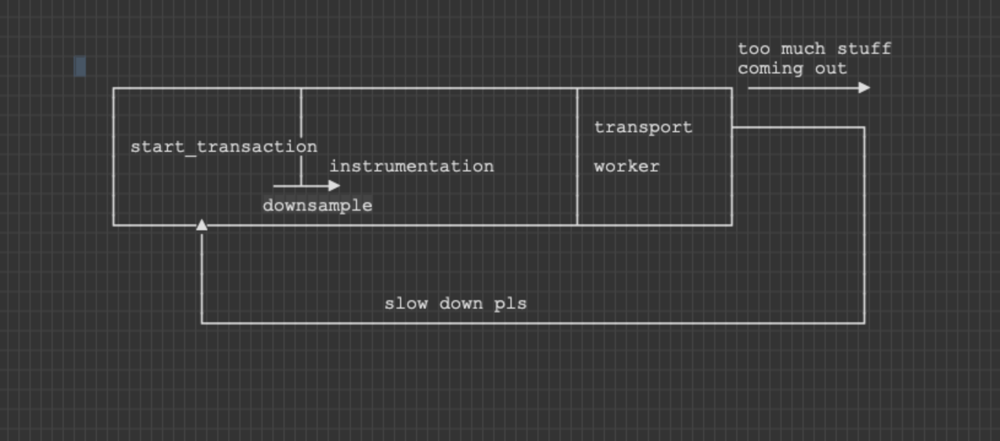

Backend SDKs that are typically used in server environments are expected to implement a component for backpressure management.

This component will periodically introspect the SDK for measures of throughput and if too high, will dynamically downsample transactions by halving the sample rate temporarily.
Once the system has recovered to a healthy state, the SDK will revert to the sample rate set by the user.

## Configuration

The SDK should expose a boolean config parameter called `enable_backpressure_handling` that controls whether this logic is active or not.

## Design

The backpressure component has two main responsibilities:

* Periodically schedule a [**health check**](#health-check-monitor) in an asynchronous way and update the unhealthy status.
* Use this unhealthy status to dynamically halve the effective sample rate for transactions before making the initial sampling decision.

## Health Check Monitor

### Interval

The health check is typically performed once every **10 seconds** by default. You can expose this interval as a config parameter if you wish on your SDK.

### Conditions

The health check on most SDKs currently tests the following conditions:
  * if the background worker queue is full
  * any rate limits are currently active

You can add more conditions of **high throughput** or **wasted work** if available and easily measurable on your platform.

### Implementation

The monitor should act asynchronously.  
This can be a new thread if supported by the language or a `setTimeout` in languages without threads like NodeJs.

See the [Python implementation](https://github.com/getsentry/sentry-python/blob/d9d87998029fb0ef2bfe933cea0b69bfee60ed51/sentry_sdk/monitor.py#L16-L123) as a reference.

## Downsampling

The monitor should update its internal health status and expose a `downsample_factor` which doubles every 10 seconds till the system is unhealthy.
Typically we only double a maximum of 10 times because the number is already too small then.

This creates an exponential backoff behavior and reduces load in the transaction pipeline.

In your SDKs `set_initial_sampling_decision` which is called as part of the `start_transaction` API, you should use this `downsample_factor` right before making the random number based sampling decision.

See the [Python implementation](https://github.com/getsentry/sentry-python/blob/d9d87998029fb0ef2bfe933cea0b69bfee60ed51/sentry_sdk/tracing.py#L888-L889) as a reference.

### Client Report

If possible, in `transaction.finish`, also record a client report with reason `backpressure` instead of `sample_rate` when the transaction is dropped so that we can track these backpressure outcome statistics.

See the [Python implementation](https://github.com/getsentry/sentry-python/blob/d9d87998029fb0ef2bfe933cea0b69bfee60ed51/sentry_sdk/tracing.py#L705-L711) as a reference.
