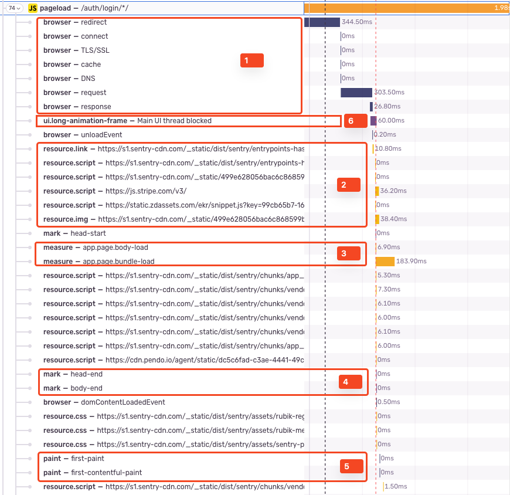
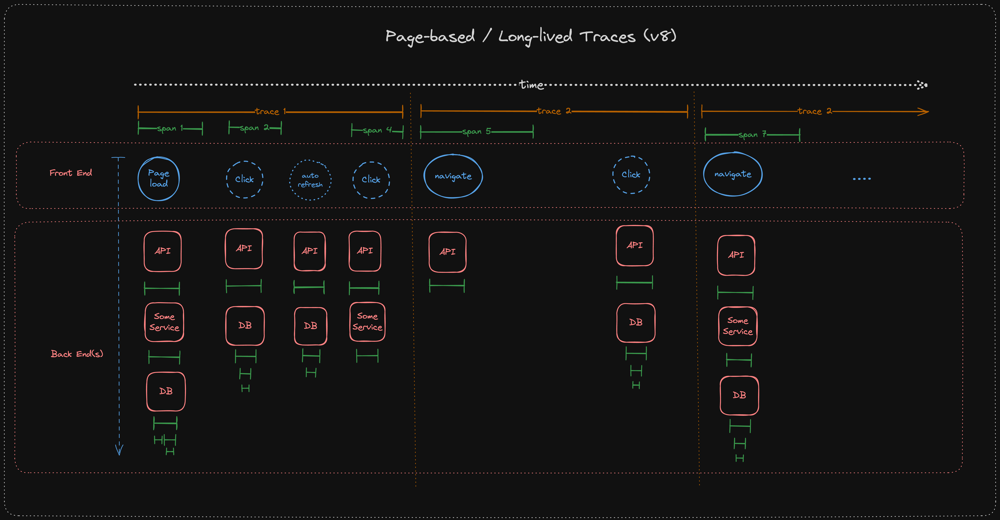

The tracing behavior in our browser SDKs is somewhat unique and significantly differs from tracing in the backend. This page collects the most important aspects.

<Alert>
  The aspects described in this document apply to all browser SDKs. This
  includes `@sentry/browser` and all SDKs building on top of it like
  `@sentry/react`, `@sentry/angular` or `@sentry/vue` but also the client-side
  parts of meta frameworks like `@sentry/nextjs`.
</Alert>

Please note that any kind of automatic tracing instrumentation in the browser requires the `browserTracingIntegration()` to be added to the SDK configuration.
The default configuration of the SDK does not include any performance or tracing-related instrumentation to save on [bundle size](../bundle-size) for errors-only users.

## Pageload and Navigation Spans

Browser SDKs automatically create spans for the initial pageload as well as for subsequent [soft navigations](#navigation-spans).

These spans however don't behave like conventional spans. We call them **idle spans** because they are started at some point (more on that later) but are not explicitly ended.
Instead, we use a couple of heuristics and parameters to debounce and end the spans automatically.
For example, we end an idle span after a certain time of inactivity, meaning no new spans are added to the span tree.
Also, there are maximum timeout parameters.
This idling mechanism is necessary because neither in pageload nor navigation scenarios we have a clear end point or event to explicitly end the span.

It's important to understand the idle span ending behavior to interpret its duration in a sensible way:

- When ending the idle span, we shorten its duration to the last ended child span.
- Sometimes, child spans that you'd intuitively not associate to the initial pageload might be started close enough to the expected end of the idle span to debounce ending it.
- In some cases, the idle span end can be debounced so often, that the maximum duration of the idle span is reached.
  At this point it is "forcefully" ended.

Therefore, the duration of the idle span does not reliably represent the actual time a pageload or navigation took.
It's important that we're also aware of this limitation in the product UI to avoid deriving performance scores or alerts based on the idle span duration.

Both, pageload and navigation spans are **always started as root spans**.

### Pageload Spans

The pageload span is started when the SDK initializes, more specifically, when the `browserTracingIntegration`'s `afterAllSetup` hook is called. This ensures that we start the
pageload span as early as possible. However, this still means that the span is only started once the SDK code is shipped to the browser. In reality though, the actual page load
starts with the browser making the request for the URL to the server. To account for this, we retroactively backdate the start time of the pageload span to the browser request
start time. We are able to backdate the start time because the browser provides this timing information.

The pageload span is **earliest** ended, when the browser emits `'interactive'` or `'complete'` in `WINDOW.document.readyState`. It might be very well prolonged by our instrumentation adding additional child spans to the pageload root span.

A pageload span:

- Always has the `sentry.op: 'pageload'` attribute
- Always is a root span
- [Continues a trace](#trace-continuation) picked up from `<meta>` tags in the initial HTML response or, if no tags are detected, starts a new trace.
- Contains various spans with specific ops that we retroactively create from browser Performance API entries (see image for example spans):
  1. `browser` - information about the pageload request lifecycle (entry type `navigation`).
  2. `resource.*` - resource timing information containing the duration of how long images, CSS, JS files etc. took to load.
  3. `measure` - custom time measurements. Some of them are set by our SDK, some by SDK users or 3rd parties, some by the browser.
  4. `mark` - custom time markers. Some of them are set by our SDK, some SDK users or 3rd parties, some by the browser.
  5. `paint` - paint timing information.
  6. `ui.long-animation-frame` - a span showing the duration of a long animation frame event detected by the browser.
- Contains [web vital](#web-vitals) as measurements.
- May contain child spans created from other instrumentations (e.g. `http.client`) spans or manually created spans.

Since the pageload span is automatically started at SDK initialization, **there's only one pageload span** started during the SDK lifecycle.

### Navigation Spans

Navigation spans are started when a "soft navigation" occurs.
A "soft navigation" means that the URL or history state of the page changes **without** a full page reload.
A typical example for a soft navigation is a single-page application (SPA) using a client-side router (for example React Router or Angular's Router).
While navigations in SPAs can appear like a normal page navigation to users, they do not trigger a full page load request.
Instead, they typically update the browser's history state, the URL and the content of the page dynamically.

By default, in `@sentry/browser` the SDK listens to the browser's `History` API to detect such navigations.
[Framework-specific SDKs and router instrumentations](#router-instrumentations-and-route-parameterization) might use other mechanisms to detect them.

Like a pageload span, navigation spans are idle spans and end themselves after a certain time of inactivity or after a maximum duration.

In contrast to pageload spans, navigation spans do not contain web vital measurements. Read more about the reason [here](#web-vitals).

### Router Instrumentations and Route Parameterization

Some frameworks like React, Angular or Vue have their own in-browser routing solutions (e.g. Angular Router).
Most of our framework SDKs therefore provide their own `browserTracingIntegration` that instruments this router to improve the quality of the pageload and navigation spans.

Router instrumentation allows us to:

1. Directly hook into the router to detect navigations and start navigation spans. Depending on the framework, this is more versatile than listening to the history API.
2. Extract parameterized route names, meaning, we can show and group spans by the actual route instead of individual raw urls (e.g. `/users/[id]` instead of `/users/12345`).
3. Depending on the instrumentation, extract route parameters or redirects and add them in a controlled manner to the span data.

## Web Vitals

The browser SDKs automatically capture Web Vitals during the initial pageload of the web application.
This document will not explain what Web Vitals are, but you can find more information on the [Web Vitals website](https://web.dev/vitals/).

Our goal is to capture web vitals in the same way that e.g. Google Analytics, Google search engine indexers, Lighthouse or the web vitals chrome extension do.
There are sometimes discrepancies between the values we capture and the values that other tools capture because these tools are not tied to the restrictions around defining an end of a page load like us.

Generally speaking, most web vitals are accumulated while the pageload span is active and captured when we _end_ the pageload span. This works well for vitals that stabilize themselves very early in the lifecycle but
it leads to discrepancies for vitals that are still changing after the pageload span ends. This is the case for `LCP` and `CLS` in particular.

<Alert>
  At the time of writing, we're transitioning to a [more sophisticated `LCP` and
  `CLS` capturing
  technique](https://github.com/getsentry/sentry-javascript/issues/12714) that
  should improve the accuracy of these metrics. It will essentially work like
  `INP` collection works today.
</Alert>

### Interaction To Next paint (INP)

The Interaction To Next Paint (INP) web vital is treated a bit differently.
It's not attached to the pageload span.
Instead, we listen to when the browser emits INP events (that is on page hide, for example when switching tabs) and capture them as standalone spans.

## Tracing Model

With the release of version 8 of the JS SDKs, the browser SDKs adopted a new trace lifetime model.
With this new model, traces last for the entire duration of one page or route.
This means that a trace id is created at the initial pageload and is used for all subsequent events until the user navigates to a new page or reloads the page.
For single-page applications (SPAs) using some kind of routing, the trace id is used for the entire duration of one route and changes on a soft navigation.

This tracing model has a couple of consequences that are important to understand:

- **Increased Context**: Let's start with the good stuff: Since the trace id remains constant for all events on a page or route, all events within one page or route belong to the same trace.
  This makes it easier to understand what happened prior to the error or span event users are looking at.
- **Multiple Root Spans**: A trace can have multiple root spans or events. For instance, if users enabled interaction spans or manually create spans, they will be associated with the same trace id of the prior pageload or navigation.
- **Quota Management**: Since the trace state does not change throughout a single page or route, the sampling decision of the initial span is carried over for all subsequent events. This means that the sampling decision is only made once per page or route and is not reevaluated for each event. Furthermore, subsequent http (`fetch` or `XmlHttpRequest`) also propagate this sampling decision to potential downstream services. This can lead to a higher number of events being sent to Sentry than before.
- **Long-lived Traces**: Not every web application features navigations (hard or soft). For pages where users simply remain on one page without making navigations (e.g. a chat application), the trace id will remain constant for the entire duration of the user journey. This can lead to very long-lived traces that can potentially grow very large.

<Alert>

As outlined above, some of the consequences have negative product or UX implications.
This is a known issue and we're working on an update to the trace lifetime model to address these issues.
However, this is a complex topic and we're still in the process of evaluating the best solution.

</Alert>

## Trace Propagation

The browser JS SDKs propagate traces like other SDKs by attaching headers to outgoing requests made with the `fetch` or `XmlHttpRequest` APIs.
However, we can't by default add the headers to all outgoing requests as downstream services might send error responses if their CORS policies don't allow arbitrary headers.
Therefore, the browser SDKs only attach headers to same-origin requests by default. Users have to opt into cross-origin tracing by setting the `tracePropagationTargets` option in the SDK configuration.

## Trace Continuation

The browser SDKs are able to continue a trace that was started on the server when the initial HTML page response is served.
For this to work, the server-side SDK has to render `<meta>` tags containing the `sentry-trace` and `baggage` tracing data into the HTML response.
These meta tags are picked up by the browser SDKs when it initializes (`Sentry.init`).

## Tracing Without performance

The browser SDKs support tracing without performance (TwP).
TwP means that the SDK attaches tracing headers to outgoing requests but does not start or send any spans.
This feature enables connecting frontend to backend errors in the UI without depleting users' span quota.

While in other SDKs, TwP is activated by default when neither `tracesSampleRate` nor `tracesSampler` are set, in browser, users still have to add `browserTracingIntegration`.
The reason for this is that our fetch and XHR instrumentation is not included in the default SDK bundle to save on [bundle size](../bundle-size).
So the only configuration to enable TwP is to register `browserTracingIntegration` but omit the sampling options completely (or set them to `undefined`).

TwP mode uses the same [tracing model](#tracing-model) as SDKs configured for regular tracing.
